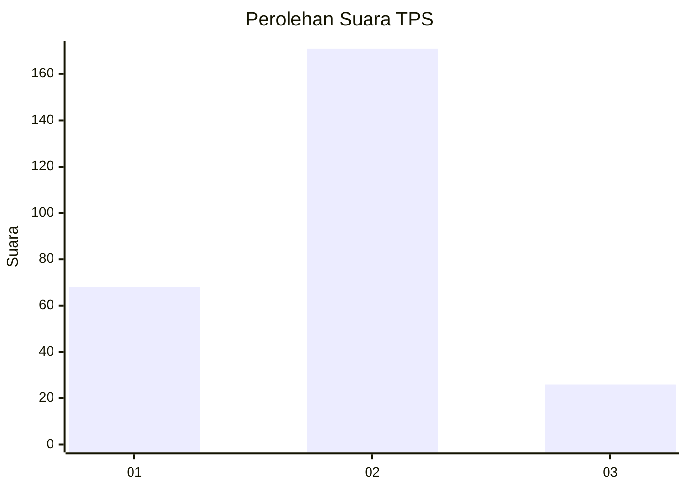
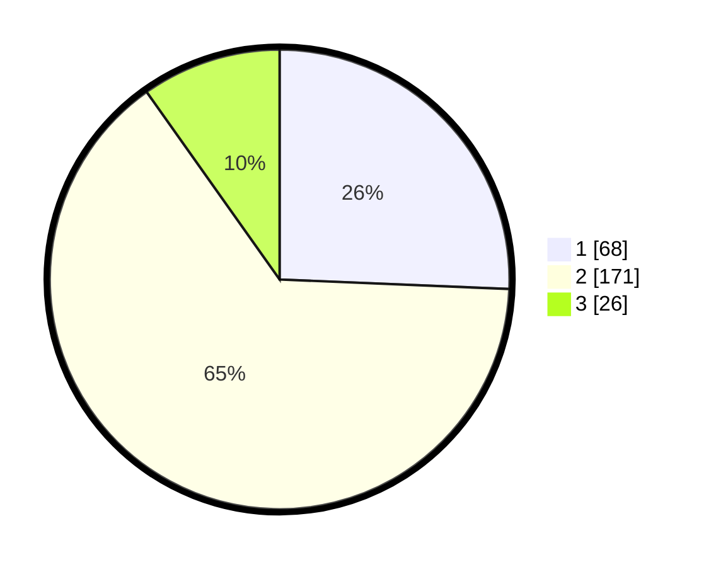

# Hasil

## Grafik

## Tabel

| No. | Nama Paslon    | Suara | Suara (raw) | Persentase |
|:--- |:-------------- | -----:| -----------:| ----------:|
| 1   | ANIES MUHAIMIN | 68    | [68][p-1]   | 25,66      |
| 2   | PRABOWO GIBRAN | 171   | [171][p-2]  | 64,53      |
| 3   | GANJAR MAHFUD  | 26    | [26][p-3]   | 9,81       |

[p-1]: https://github.com/gigit-pemilu/pemilu-2024-35-jawa-timur/blob/main/pilpres/hitung-suara/sub/35-jawa-timur/sub/13-probolinggo/sub/15-krejengan/sub/2015-gebangan/sub/002-tps/sub/paslon-1.txt
[p-2]: https://github.com/gigit-pemilu/pemilu-2024-35-jawa-timur/blob/main/pilpres/hitung-suara/sub/35-jawa-timur/sub/13-probolinggo/sub/15-krejengan/sub/2015-gebangan/sub/002-tps/sub/paslon-2.txt
[p-3]: https://github.com/gigit-pemilu/pemilu-2024-35-jawa-timur/blob/main/pilpres/hitung-suara/sub/35-jawa-timur/sub/13-probolinggo/sub/15-krejengan/sub/2015-gebangan/sub/002-tps/sub/paslon-3.txt

## Foto C Plano

https://sirekap-obj-formc.kpu.go.id/189b/pemilu/ppwp/35/13/15/20/15/3513152015002-20240215-110742--e82c1e82-e756-4203-8d44-4307f9ccc999.jpg

https://sirekap-obj-formc.kpu.go.id/189b/pemilu/ppwp/35/13/15/20/15/3513152015002-20240215-110853--c961b243-5183-4a1f-957b-743b5a4595d1.jpg

https://sirekap-obj-formc.kpu.go.id/189b/pemilu/ppwp/35/13/15/20/15/3513152015002-20240215-004900--982d6001-61fa-4a88-a755-c93052aa484d.jpg

## Metadata

| Key        | Value               |
| ---------- | ------------------- |
| Time Stamp | 2024-02-24 22:31:28 |

