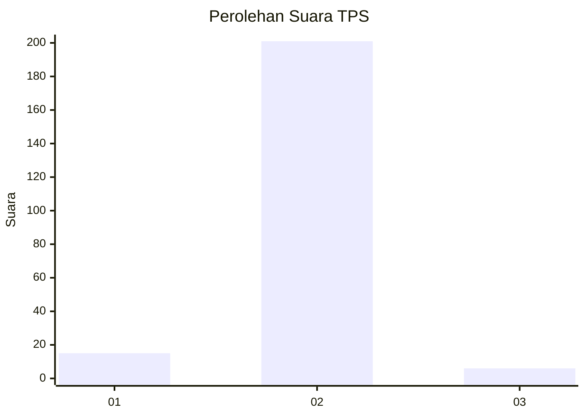
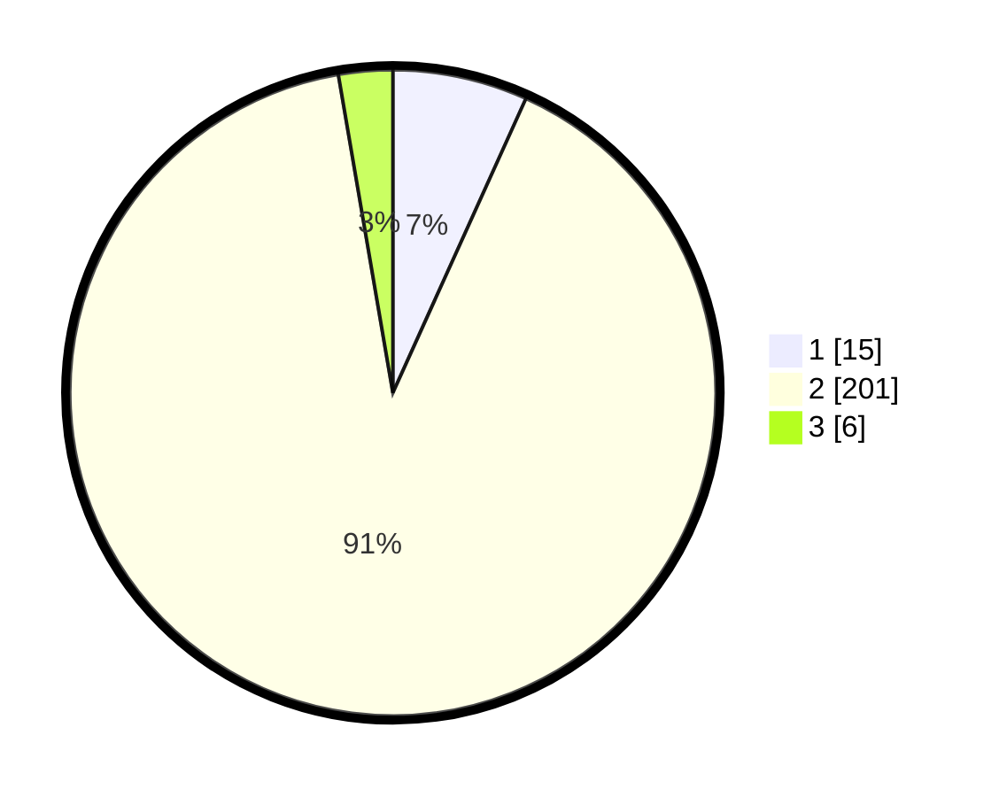

# Hasil

## Grafik

## Tabel

| No. | Nama Paslon    | Suara | Suara (raw) | Persentase |
|:--- |:-------------- | -----:| -----------:| ----------:|
| 1   | ANIES MUHAIMIN | 15    | [15][p-1]   | 6,76       |
| 2   | PRABOWO GIBRAN | 201   | [201][p-2]  | 90,54      |
| 3   | GANJAR MAHFUD  | 6     | [6][p-3]    | 2,70       |

[p-1]: https://github.com/gigit-pemilu/pemilu-2024/blob/main/pilpres/hitung-suara/sub/35-jawa-timur/sub/13-probolinggo/sub/15-krejengan/sub/2015-gebangan/sub/004-tps/sub/paslon-1.txt
[p-2]: https://github.com/gigit-pemilu/pemilu-2024/blob/main/pilpres/hitung-suara/sub/35-jawa-timur/sub/13-probolinggo/sub/15-krejengan/sub/2015-gebangan/sub/004-tps/sub/paslon-2.txt
[p-3]: https://github.com/gigit-pemilu/pemilu-2024/blob/main/pilpres/hitung-suara/sub/35-jawa-timur/sub/13-probolinggo/sub/15-krejengan/sub/2015-gebangan/sub/004-tps/sub/paslon-3.txt

## Foto C Plano

https://sirekap-obj-formc.kpu.go.id/fbb5/pemilu/ppwp/35/13/15/20/15/3513152015004-20240214-202326--0933626c-4f89-4ec9-a9fa-6c62ed76fdc6.jpg

https://sirekap-obj-formc.kpu.go.id/fbb5/pemilu/ppwp/35/13/15/20/15/3513152015004-20240215-165246--6de402c2-2f8e-414b-aa92-15128155250e.jpg

https://sirekap-obj-formc.kpu.go.id/fbb5/pemilu/ppwp/35/13/15/20/15/3513152015004-20240214-195838--9fb4adec-167f-4948-a5f6-36f4fb6c7ff5.jpg

## Metadata

| Key        | Value               |
| ---------- | ------------------- |
| Time Stamp | 2024-02-24 22:31:28 |

