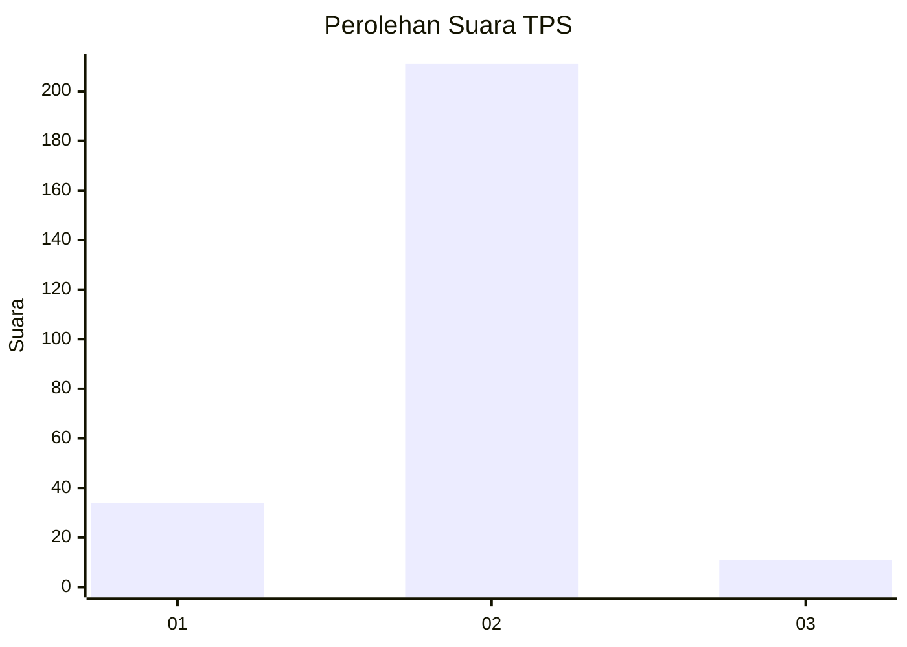
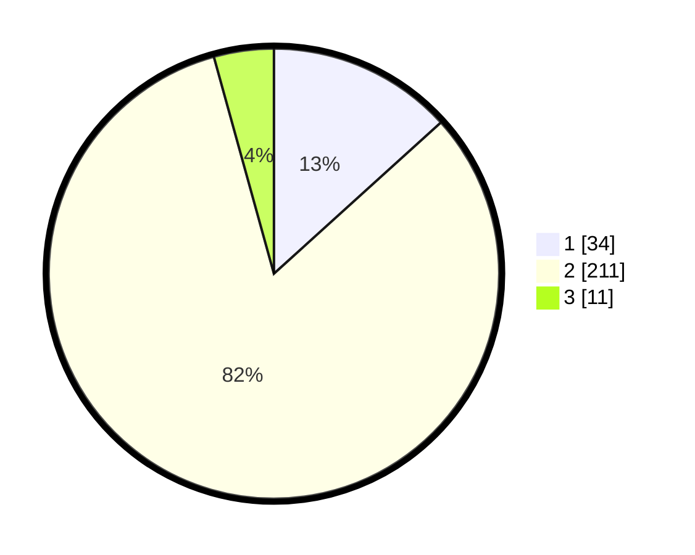

# Hasil

## Grafik

## Tabel

| No. | Nama Paslon    | Suara | Suara (raw) | Persentase |
|:--- |:-------------- | -----:| -----------:| ----------:|
| 1   | ANIES MUHAIMIN | 34    | [34][p-1]   | 13,28      |
| 2   | PRABOWO GIBRAN | 211   | [211][p-2]  | 82,42      |
| 3   | GANJAR MAHFUD  | 11    | [11][p-3]   | 4,30       |

[p-1]: https://github.com/gigit-pemilu/pemilu-2024/blob/main/pilpres/hitung-suara/sub/35-jawa-timur/sub/13-probolinggo/sub/16-pejarakan/sub/2001-selogudig-kulon/sub/002-tps/sub/paslon-1.txt
[p-2]: https://github.com/gigit-pemilu/pemilu-2024/blob/main/pilpres/hitung-suara/sub/35-jawa-timur/sub/13-probolinggo/sub/16-pejarakan/sub/2001-selogudig-kulon/sub/002-tps/sub/paslon-2.txt
[p-3]: https://github.com/gigit-pemilu/pemilu-2024/blob/main/pilpres/hitung-suara/sub/35-jawa-timur/sub/13-probolinggo/sub/16-pejarakan/sub/2001-selogudig-kulon/sub/002-tps/sub/paslon-3.txt

## Foto C Plano

https://sirekap-obj-formc.kpu.go.id/f432/pemilu/ppwp/35/13/16/20/01/3513162001002-20240215-042548--0a7ed298-c5d2-45cd-8af5-347905c21883.jpg

https://sirekap-obj-formc.kpu.go.id/f432/pemilu/ppwp/35/13/16/20/01/3513162001002-20240215-042748--1c578b10-d53f-4f42-80a8-4457f564e090.jpg

https://sirekap-obj-formc.kpu.go.id/f432/pemilu/ppwp/35/13/16/20/01/3513162001002-20240215-043320--6fee5590-8d24-4795-9a58-5c9927029d46.jpg

## Metadata

| Key        | Value               |
| ---------- | ------------------- |
| Time Stamp | 2024-02-15 17:00:25 |

