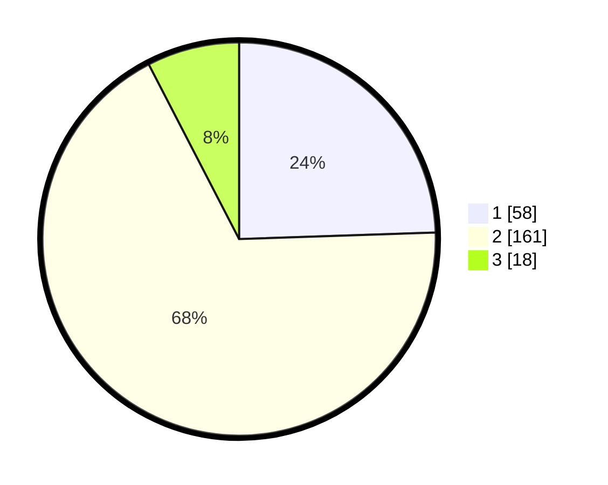

# Hasil

## Grafik

## Tabel

| No. | Nama Paslon    | Suara | Suara (raw) | Persentase |
|:--- |:-------------- | -----:| -----------:| ----------:|
| 1   | ANIES MUHAIMIN | 58    | [58][p-1]   | 24,47      |
| 2   | PRABOWO GIBRAN | 161   | [161][p-2]  | 67,93      |
| 3   | GANJAR MAHFUD  | 18    | [18][p-3]   | 7,59       |

[p-1]: https://github.com/gigit-pemilu/pemilu-2024/blob/main/pilpres/hitung-suara/sub/35-jawa-timur/sub/13-probolinggo/sub/16-pejarakan/sub/2001-selogudig-kulon/sub/005-tps/sub/paslon-1.txt
[p-2]: https://github.com/gigit-pemilu/pemilu-2024/blob/main/pilpres/hitung-suara/sub/35-jawa-timur/sub/13-probolinggo/sub/16-pejarakan/sub/2001-selogudig-kulon/sub/005-tps/sub/paslon-2.txt
[p-3]: https://github.com/gigit-pemilu/pemilu-2024/blob/main/pilpres/hitung-suara/sub/35-jawa-timur/sub/13-probolinggo/sub/16-pejarakan/sub/2001-selogudig-kulon/sub/005-tps/sub/paslon-3.txt

## Foto C Plano

https://sirekap-obj-formc.kpu.go.id/f0de/pemilu/ppwp/35/13/16/20/01/3513162001005-20240214-223225--902a0055-9bf6-4333-9ae9-885e4ce170ef.jpg

https://sirekap-obj-formc.kpu.go.id/f0de/pemilu/ppwp/35/13/16/20/01/3513162001005-20240215-033731--d463fa46-aad5-4e37-9614-326202af8832.jpg

https://sirekap-obj-formc.kpu.go.id/f0de/pemilu/ppwp/35/13/16/20/01/3513162001005-20240215-024254--448f5e8e-4b05-4114-adea-d698391770d7.jpg

## Metadata

| Key        | Value               |
| ---------- | ------------------- |
| Time Stamp | 2024-02-19 06:16:00 |

