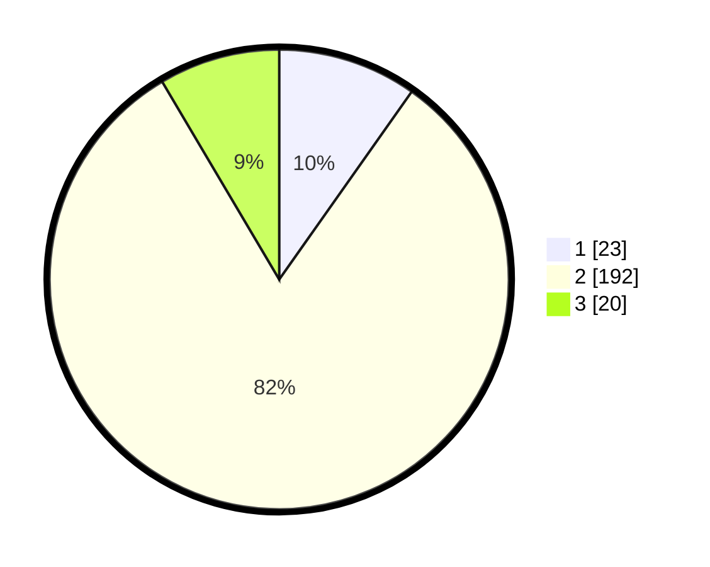

# Hasil

## Grafik

## Tabel

| No. | Nama Paslon    | Suara | Suara (raw) | Persentase |
|:--- |:-------------- | -----:| -----------:| ----------:|
| 1   | ANIES MUHAIMIN | 23    | [23][p-1]   | 9,79       |
| 2   | PRABOWO GIBRAN | 192   | [192][p-2]  | 81,70      |
| 3   | GANJAR MAHFUD  | 20    | [20][p-3]   | 8,51       |

[p-1]: https://github.com/gigit-pemilu/pemilu-2024/blob/main/pilpres/hitung-suara/sub/35-jawa-timur/sub/13-probolinggo/sub/16-pejarakan/sub/2008-tanjung/sub/003-tps/sub/paslon-1.txt
[p-2]: https://github.com/gigit-pemilu/pemilu-2024/blob/main/pilpres/hitung-suara/sub/35-jawa-timur/sub/13-probolinggo/sub/16-pejarakan/sub/2008-tanjung/sub/003-tps/sub/paslon-2.txt
[p-3]: https://github.com/gigit-pemilu/pemilu-2024/blob/main/pilpres/hitung-suara/sub/35-jawa-timur/sub/13-probolinggo/sub/16-pejarakan/sub/2008-tanjung/sub/003-tps/sub/paslon-3.txt

## Foto C Plano

https://sirekap-obj-formc.kpu.go.id/164e/pemilu/ppwp/35/13/16/20/08/3513162008003-20240215-013657--07268080-e9d1-48ae-822c-c4b54b952140.jpg

https://sirekap-obj-formc.kpu.go.id/164e/pemilu/ppwp/35/13/16/20/08/3513162008003-20240215-014333--eba476ca-058a-4277-9af5-73259925c34c.jpg

https://sirekap-obj-formc.kpu.go.id/164e/pemilu/ppwp/35/13/16/20/08/3513162008003-20240215-014518--bf456aeb-e963-44fe-a489-587f7b3076a7.jpg

## Metadata

| Key        | Value               |
| ---------- | ------------------- |
| Time Stamp | 2024-02-17 16:00:02 |

