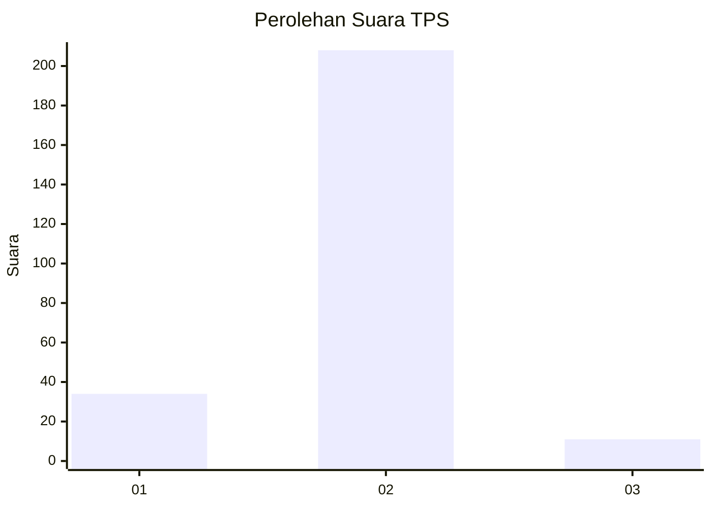
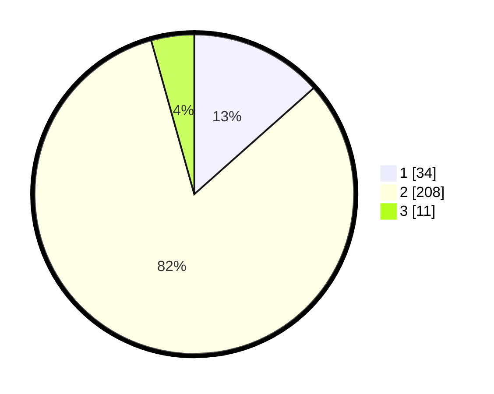

# Hasil

## Grafik

## Tabel

| No. | Nama Paslon    | Suara | Suara (raw) | Persentase |
|:--- |:-------------- | -----:| -----------:| ----------:|
| 1   | ANIES MUHAIMIN | 34    | [34][p-1]   | 13,44      |
| 2   | PRABOWO GIBRAN | 208   | [208][p-2]  | 82,21      |
| 3   | GANJAR MAHFUD  | 11    | [11][p-3]   | 4,35       |

[p-1]: https://github.com/gigit-pemilu/pemilu-2024-35-jawa-timur/blob/main/pilpres/hitung-suara/sub/35-jawa-timur/sub/13-probolinggo/sub/16-pejarakan/sub/2009-pejarakan-kulon/sub/001-tps/sub/paslon-1.txt
[p-2]: https://github.com/gigit-pemilu/pemilu-2024-35-jawa-timur/blob/main/pilpres/hitung-suara/sub/35-jawa-timur/sub/13-probolinggo/sub/16-pejarakan/sub/2009-pejarakan-kulon/sub/001-tps/sub/paslon-2.txt
[p-3]: https://github.com/gigit-pemilu/pemilu-2024-35-jawa-timur/blob/main/pilpres/hitung-suara/sub/35-jawa-timur/sub/13-probolinggo/sub/16-pejarakan/sub/2009-pejarakan-kulon/sub/001-tps/sub/paslon-3.txt

## Foto C Plano

https://sirekap-obj-formc.kpu.go.id/1c15/pemilu/ppwp/35/13/16/20/09/3513162009001-20240214-233151--98356d33-8ca6-4b10-a435-1c62db07d77a.jpg

https://sirekap-obj-formc.kpu.go.id/1c15/pemilu/ppwp/35/13/16/20/09/3513162009001-20240214-233234--3fe25d3c-668c-4211-8ae1-7cf12288edfc.jpg

https://sirekap-obj-formc.kpu.go.id/1c15/pemilu/ppwp/35/13/16/20/09/3513162009001-20240214-233357--c0a45494-172f-4850-883b-e6fb1510449d.jpg

## Metadata

| Key        | Value               |
| ---------- | ------------------- |
| Time Stamp | 2024-02-17 16:00:02 |

