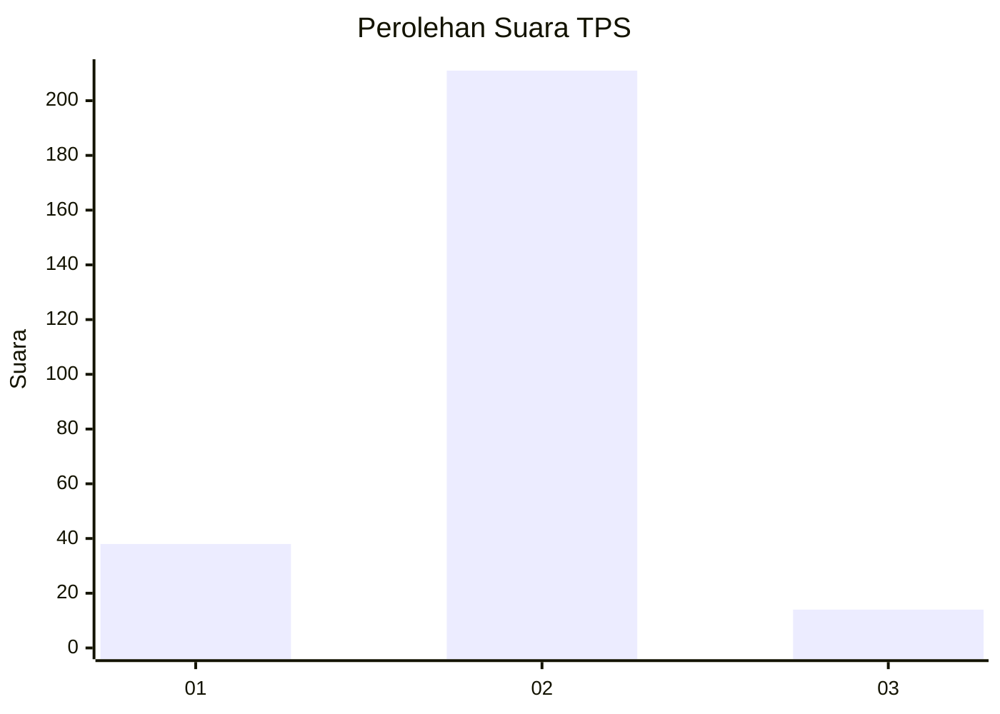
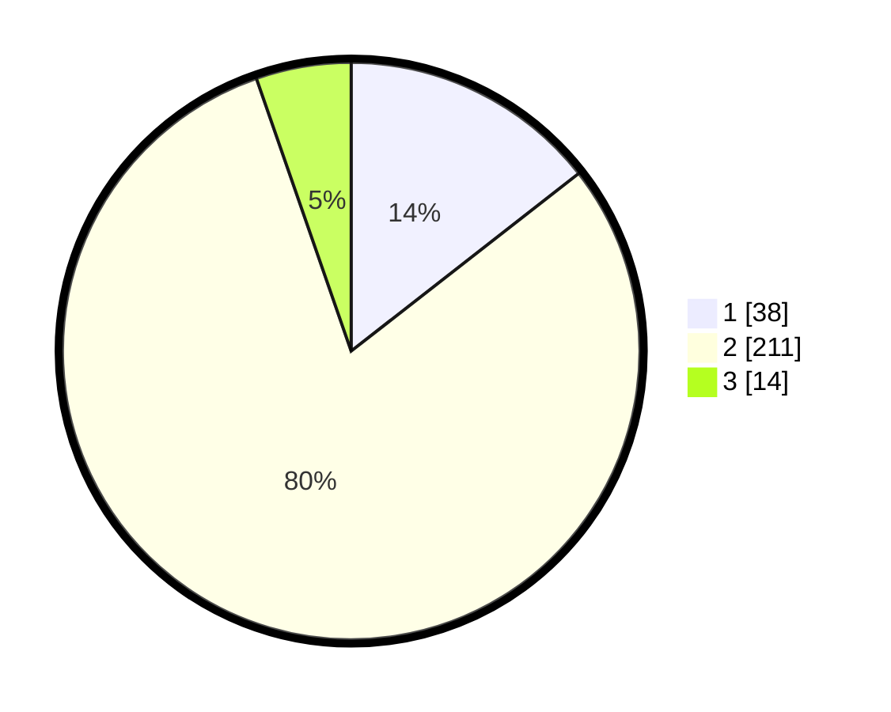

# Hasil

## Grafik

## Tabel

| No. | Nama Paslon    | Suara | Suara (raw) | Persentase |
|:--- |:-------------- | -----:| -----------:| ----------:|
| 1   | ANIES MUHAIMIN | 38    | [38][p-1]   | 14,45      |
| 2   | PRABOWO GIBRAN | 211   | [211][p-2]  | 80,23      |
| 3   | GANJAR MAHFUD  | 14    | [14][p-3]   | 5,32       |

[p-1]: https://github.com/gigit-pemilu/pemilu-2024/blob/main/pilpres/hitung-suara/sub/35-jawa-timur/sub/13-probolinggo/sub/18-gending/sub/2001-brumbungan-lor/sub/001-tps/sub/paslon-1.txt
[p-2]: https://github.com/gigit-pemilu/pemilu-2024/blob/main/pilpres/hitung-suara/sub/35-jawa-timur/sub/13-probolinggo/sub/18-gending/sub/2001-brumbungan-lor/sub/001-tps/sub/paslon-2.txt
[p-3]: https://github.com/gigit-pemilu/pemilu-2024/blob/main/pilpres/hitung-suara/sub/35-jawa-timur/sub/13-probolinggo/sub/18-gending/sub/2001-brumbungan-lor/sub/001-tps/sub/paslon-3.txt

## Foto C Plano

https://sirekap-obj-formc.kpu.go.id/2991/pemilu/ppwp/35/13/18/20/01/3513182001001-20240216-145912--21c330d9-5c0f-4728-a8f9-125091d288e8.jpg

https://sirekap-obj-formc.kpu.go.id/2991/pemilu/ppwp/35/13/18/20/01/3513182001001-20240216-145913--a4c3e125-2af4-4f2e-b219-bfbc12f81612.jpg

https://sirekap-obj-formc.kpu.go.id/2991/pemilu/ppwp/35/13/18/20/01/3513182001001-20240216-145913--03b620ad-c474-4071-bf0e-058c3570ad54.jpg

## Metadata

| Key        | Value               |
| ---------- | ------------------- |
| Time Stamp | 2024-02-22 12:00:00 |

## DATA PEMILIH TETAP

Jumlah pemilih dalam DPT: **292**.
 * L: **138**.
 * P: **154**.

## DATA PENGGUNA HAK PILIH

Jumlah pengguna hak pilih dalam DPT: **272**.
 * L: **123**.
 * P: **149**.

Jumlah pengguna hak pilih dalam DPTb: **1**.
 * L: **1**.
 * P: **0**.

Jumlah pengguna hak pilih dalam DPK: **4**.
 * L: **1**.
 * P: **3**.

Jumlah pengguna hak pilih: **277**.
 * L: **151**.
 * P: **126**.

## JUMLAH SUARA SAH DAN TIDAK SAH

JUMLAH SELURUH SUARA SAH: **263**.

JUMLAH SUARA TIDAK SAH: **14**.

JUMLAH SELURUH SUARA SAH DAN SUARA TIDAK SAH: **277**.

