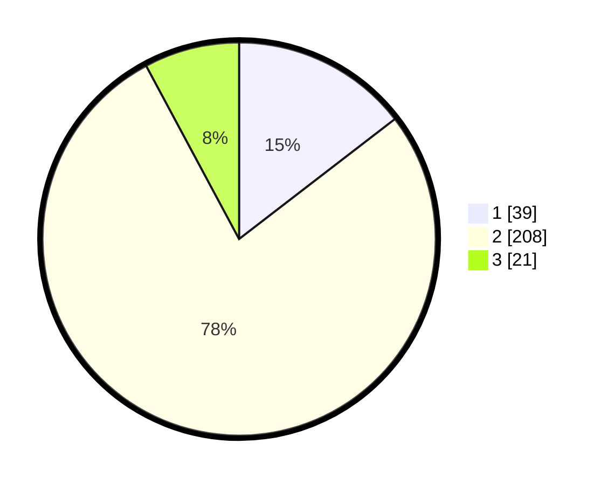

# Hasil

## Grafik

## Tabel

| No. | Nama Paslon    | Suara | Suara (raw) | Persentase |
|:--- |:-------------- | -----:| -----------:| ----------:|
| 1   | ANIES MUHAIMIN | 39    | [39][p-1]   | 14,55      |
| 2   | PRABOWO GIBRAN | 208   | [208][p-2]  | 77,61      |
| 3   | GANJAR MAHFUD  | 21    | [21][p-3]   | 7,84       |

[p-1]: https://github.com/gigit-pemilu/pemilu-2024-35-jawa-timur/blob/main/pilpres/hitung-suara/sub/35-jawa-timur/sub/13-probolinggo/sub/18-gending/sub/2001-brumbungan-lor/sub/004-tps/sub/paslon-1.txt
[p-2]: https://github.com/gigit-pemilu/pemilu-2024-35-jawa-timur/blob/main/pilpres/hitung-suara/sub/35-jawa-timur/sub/13-probolinggo/sub/18-gending/sub/2001-brumbungan-lor/sub/004-tps/sub/paslon-2.txt
[p-3]: https://github.com/gigit-pemilu/pemilu-2024-35-jawa-timur/blob/main/pilpres/hitung-suara/sub/35-jawa-timur/sub/13-probolinggo/sub/18-gending/sub/2001-brumbungan-lor/sub/004-tps/sub/paslon-3.txt

## Foto C Plano

https://sirekap-obj-formc.kpu.go.id/d9d1/pemilu/ppwp/35/13/18/20/01/3513182001004-20240217-220453--fe4bb42a-d919-4402-904a-b349b5fa693b.jpg

https://sirekap-obj-formc.kpu.go.id/d9d1/pemilu/ppwp/35/13/18/20/01/3513182001004-20240214-231322--c94e1c5d-2e91-4158-a90e-e57a370d89e0.jpg

https://sirekap-obj-formc.kpu.go.id/d9d1/pemilu/ppwp/35/13/18/20/01/3513182001004-20240214-231634--1b3e1d91-351b-4eea-bfa7-a580283e91ad.jpg

## Metadata

| Key        | Value               |
| ---------- | ------------------- |
| Time Stamp | 2024-02-19 06:16:00 |

