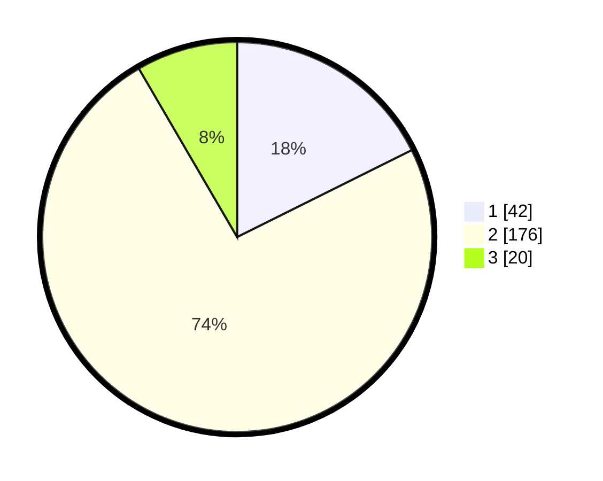

# Hasil

## Grafik

## Tabel

| No. | Nama Paslon    | Suara | Suara (raw) | Persentase |
|:--- |:-------------- | -----:| -----------:| ----------:|
| 1   | ANIES MUHAIMIN | 42    | [42][p-1]   | 17,65      |
| 2   | PRABOWO GIBRAN | 176   | [176][p-2]  | 73,95      |
| 3   | GANJAR MAHFUD  | 20    | [20][p-3]   | 8,40       |

[p-1]: https://github.com/gigit-pemilu/pemilu-2024-35-jawa-timur/blob/main/pilpres/hitung-suara/sub/35-jawa-timur/sub/13-probolinggo/sub/18-gending/sub/2002-jatiadi/sub/004-tps/sub/paslon-1.txt
[p-2]: https://github.com/gigit-pemilu/pemilu-2024-35-jawa-timur/blob/main/pilpres/hitung-suara/sub/35-jawa-timur/sub/13-probolinggo/sub/18-gending/sub/2002-jatiadi/sub/004-tps/sub/paslon-2.txt
[p-3]: https://github.com/gigit-pemilu/pemilu-2024-35-jawa-timur/blob/main/pilpres/hitung-suara/sub/35-jawa-timur/sub/13-probolinggo/sub/18-gending/sub/2002-jatiadi/sub/004-tps/sub/paslon-3.txt

## Foto C Plano

https://sirekap-obj-formc.kpu.go.id/edce/pemilu/ppwp/35/13/18/20/02/3513182002004-20240216-164337--b86f9f1a-1b7d-470f-93e7-f298c4073bf6.jpg

https://sirekap-obj-formc.kpu.go.id/edce/pemilu/ppwp/35/13/18/20/02/3513182002004-20240215-113245--8a0d4545-0614-48cb-a478-c7891d9bea8a.jpg

https://sirekap-obj-formc.kpu.go.id/edce/pemilu/ppwp/35/13/18/20/02/3513182002004-20240215-113254--73d800f6-d9a9-460f-ad9a-1483a1f76bee.jpg

## Metadata

| Key        | Value               |
| ---------- | ------------------- |
| Time Stamp | 2024-02-16 17:00:00 |

