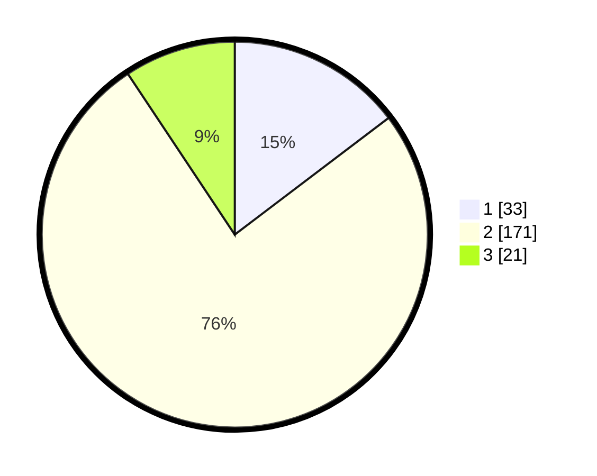

# Hasil

## Grafik

## Tabel

| No. | Nama Paslon    | Suara | Suara (raw) | Persentase |
|:--- |:-------------- | -----:| -----------:| ----------:|
| 1   | ANIES MUHAIMIN | 33    | [33][p-1]   | 14,67      |
| 2   | PRABOWO GIBRAN | 171   | [171][p-2]  | 76,00      |
| 3   | GANJAR MAHFUD  | 21    | [21][p-3]   | 9,33       |

[p-1]: https://github.com/gigit-pemilu/pemilu-2024/blob/main/pilpres/hitung-suara/sub/35-jawa-timur/sub/13-probolinggo/sub/18-gending/sub/2003-klaseman/sub/001-tps/sub/paslon-1.txt
[p-2]: https://github.com/gigit-pemilu/pemilu-2024/blob/main/pilpres/hitung-suara/sub/35-jawa-timur/sub/13-probolinggo/sub/18-gending/sub/2003-klaseman/sub/001-tps/sub/paslon-2.txt
[p-3]: https://github.com/gigit-pemilu/pemilu-2024/blob/main/pilpres/hitung-suara/sub/35-jawa-timur/sub/13-probolinggo/sub/18-gending/sub/2003-klaseman/sub/001-tps/sub/paslon-3.txt

## Foto C Plano

https://sirekap-obj-formc.kpu.go.id/0b0b/pemilu/ppwp/35/13/18/20/03/3513182003001-20240214-210438--e7d9cd7e-2401-441d-81dc-23f6bf20833c.jpg

https://sirekap-obj-formc.kpu.go.id/0b0b/pemilu/ppwp/35/13/18/20/03/3513182003001-20240215-204707--bfb0aff8-6a70-4de1-bcc4-dbf5957f345a.jpg

https://sirekap-obj-formc.kpu.go.id/0b0b/pemilu/ppwp/35/13/18/20/03/3513182003001-20240214-203607--91728590-e397-4b3e-809c-d00cc95bcd11.jpg

## Metadata

| Key        | Value               |
| ---------- | ------------------- |
| Time Stamp | 2024-02-25 12:00:00 |

