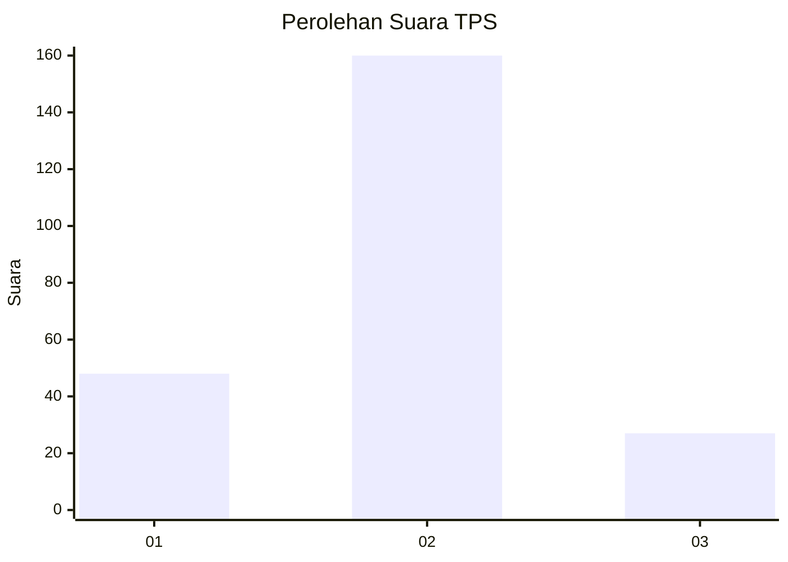
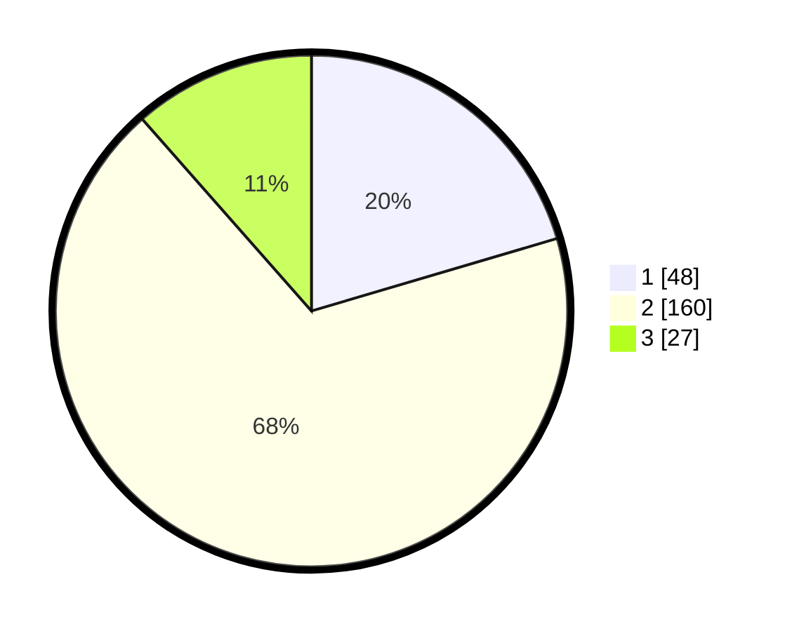

# Hasil

## Grafik

## Tabel

| No. | Nama Paslon    | Suara | Suara (raw) | Persentase |
|:--- |:-------------- | -----:| -----------:| ----------:|
| 1   | ANIES MUHAIMIN | 48    | [48][p-1]   | 20,43      |
| 2   | PRABOWO GIBRAN | 160   | [160][p-2]  | 68,09      |
| 3   | GANJAR MAHFUD  | 27    | [27][p-3]   | 11,49      |

[p-1]: https://github.com/gigit-pemilu/pemilu-2024/blob/main/pilpres/hitung-suara/sub/35-jawa-timur/sub/13-probolinggo/sub/18-gending/sub/2008-sebaung/sub/004-tps/sub/paslon-1.txt
[p-2]: https://github.com/gigit-pemilu/pemilu-2024/blob/main/pilpres/hitung-suara/sub/35-jawa-timur/sub/13-probolinggo/sub/18-gending/sub/2008-sebaung/sub/004-tps/sub/paslon-2.txt
[p-3]: https://github.com/gigit-pemilu/pemilu-2024/blob/main/pilpres/hitung-suara/sub/35-jawa-timur/sub/13-probolinggo/sub/18-gending/sub/2008-sebaung/sub/004-tps/sub/paslon-3.txt

## Foto C Plano

https://sirekap-obj-formc.kpu.go.id/4f8f/pemilu/ppwp/35/13/18/20/08/3513182008004-20240214-234712--f724a758-4cf2-43fe-90c2-896eb7a06b33.jpg

https://sirekap-obj-formc.kpu.go.id/4f8f/pemilu/ppwp/35/13/18/20/08/3513182008004-20240215-002917--65a4f504-7683-44cc-8ace-b7afda995799.jpg

https://sirekap-obj-formc.kpu.go.id/4f8f/pemilu/ppwp/35/13/18/20/08/3513182008004-20240214-234313--202f31e0-2cc0-48e7-8a36-58aa49c07ff4.jpg

## Metadata

| Key        | Value               |
| ---------- | ------------------- |
| Time Stamp | 2024-02-15 22:30:27 |

