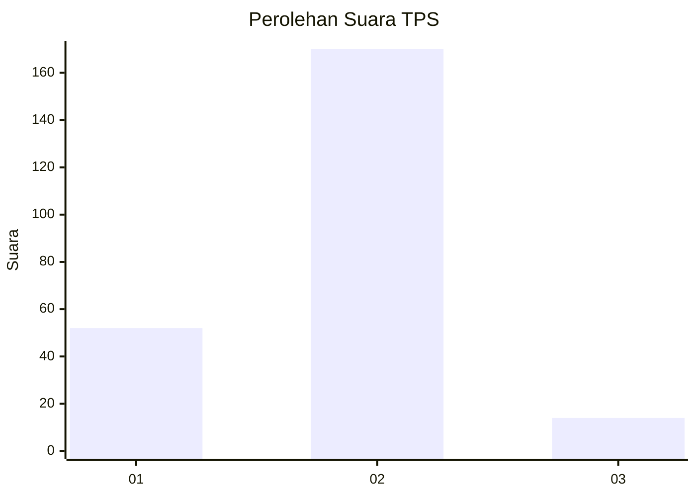

# Hasil

## Grafik

## Tabel

| No. | Nama Paslon    | Suara | Suara (raw) | Persentase |
|:--- |:-------------- | -----:| -----------:| ----------:|
| 1   | ANIES MUHAIMIN | 52    | [52][p-1]   | 22,03      |
| 2   | PRABOWO GIBRAN | 170   | [170][p-2]  | 72,03      |
| 3   | GANJAR MAHFUD  | 14    | [14][p-3]   | 5,93       |

[p-1]: https://github.com/gigit-pemilu/pemilu-2024/blob/main/pilpres/hitung-suara/sub/35-jawa-timur/sub/13-probolinggo/sub/18-gending/sub/2009-sumberkerang/sub/001-tps/sub/paslon-1.txt
[p-2]: https://github.com/gigit-pemilu/pemilu-2024/blob/main/pilpres/hitung-suara/sub/35-jawa-timur/sub/13-probolinggo/sub/18-gending/sub/2009-sumberkerang/sub/001-tps/sub/paslon-2.txt
[p-3]: https://github.com/gigit-pemilu/pemilu-2024/blob/main/pilpres/hitung-suara/sub/35-jawa-timur/sub/13-probolinggo/sub/18-gending/sub/2009-sumberkerang/sub/001-tps/sub/paslon-3.txt

## Foto C Plano

https://sirekap-obj-formc.kpu.go.id/65df/pemilu/ppwp/35/13/18/20/09/3513182009001-20240214-233535--fee99e60-33bc-48b8-9b22-2994c804ce63.jpg

https://sirekap-obj-formc.kpu.go.id/65df/pemilu/ppwp/35/13/18/20/09/3513182009001-20240214-234639--94898d65-da11-4a46-94e2-ff3cb0cd9e89.jpg

https://sirekap-obj-formc.kpu.go.id/65df/pemilu/ppwp/35/13/18/20/09/3513182009001-20240214-234823--4a6abfb1-81a8-4277-9bca-fe62458bb0d3.jpg

## Metadata

| Key        | Value               |
| ---------- | ------------------- |
| Time Stamp | 2024-02-15 22:30:27 |

