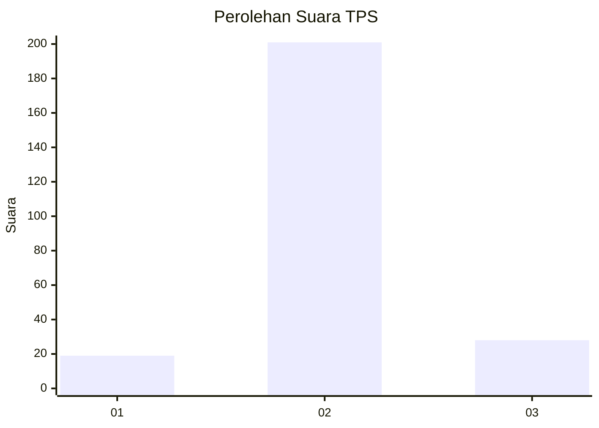
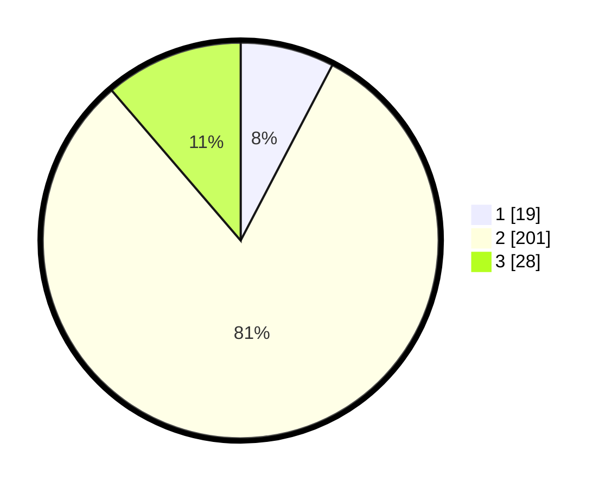

# Hasil

## Grafik

## Tabel

| No. | Nama Paslon    | Suara | Suara (raw) | Persentase |
|:--- |:-------------- | -----:| -----------:| ----------:|
| 1   | ANIES MUHAIMIN | 19    | [19][p-1]   | 7,66       |
| 2   | PRABOWO GIBRAN | 201   | [201][p-2]  | 81,05      |
| 3   | GANJAR MAHFUD  | 28    | [28][p-3]   | 11,29      |

[p-1]: https://github.com/gigit-pemilu/pemilu-2024/blob/main/pilpres/hitung-suara/sub/35-jawa-timur/sub/13-probolinggo/sub/18-gending/sub/2012-pajurangan/sub/006-tps/sub/paslon-1.txt
[p-2]: https://github.com/gigit-pemilu/pemilu-2024/blob/main/pilpres/hitung-suara/sub/35-jawa-timur/sub/13-probolinggo/sub/18-gending/sub/2012-pajurangan/sub/006-tps/sub/paslon-2.txt
[p-3]: https://github.com/gigit-pemilu/pemilu-2024/blob/main/pilpres/hitung-suara/sub/35-jawa-timur/sub/13-probolinggo/sub/18-gending/sub/2012-pajurangan/sub/006-tps/sub/paslon-3.txt

## Foto C Plano

https://sirekap-obj-formc.kpu.go.id/a948/pemilu/ppwp/35/13/18/20/12/3513182012006-20240216-125559--081cefd3-377a-411b-ad72-094221d7df2e.jpg

https://sirekap-obj-formc.kpu.go.id/a948/pemilu/ppwp/35/13/18/20/12/3513182012006-20240215-040201--300d0973-b658-4614-a21a-b2e1b27e4111.jpg

https://sirekap-obj-formc.kpu.go.id/a948/pemilu/ppwp/35/13/18/20/12/3513182012006-20240215-040206--3e93703a-0aff-4a34-8b3b-960c06082326.jpg

## Metadata

| Key        | Value               |
| ---------- | ------------------- |
| Time Stamp | 2024-02-16 13:00:29 |

