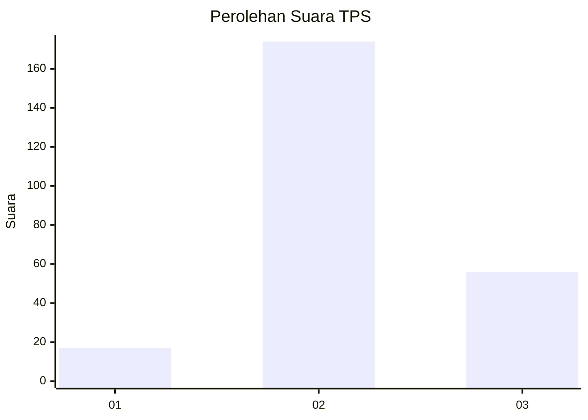
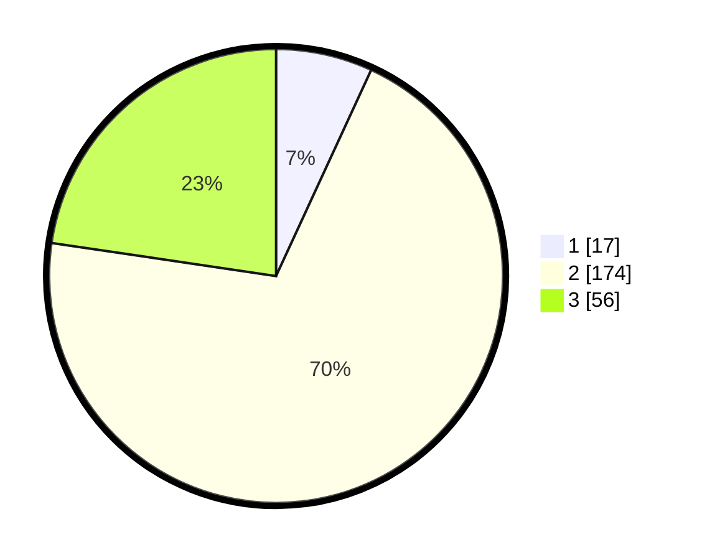

# Hasil

## Grafik

## Tabel

| No. | Nama Paslon    | Suara | Suara (raw) | Persentase |
|:--- |:-------------- | -----:| -----------:| ----------:|
| 1   | ANIES MUHAIMIN | 17    | [17][p-1]   | 6,88       |
| 2   | PRABOWO GIBRAN | 174   | [174][p-2]  | 70,45      |
| 3   | GANJAR MAHFUD  | 56    | [56][p-3]   | 22,67      |

[p-1]: https://github.com/gigit-pemilu/pemilu-2024-35-jawa-timur/blob/main/pilpres/hitung-suara/sub/35-jawa-timur/sub/13-probolinggo/sub/19-dringu/sub/2010-kedungdalem/sub/012-tps/sub/paslon-1.txt
[p-2]: https://github.com/gigit-pemilu/pemilu-2024-35-jawa-timur/blob/main/pilpres/hitung-suara/sub/35-jawa-timur/sub/13-probolinggo/sub/19-dringu/sub/2010-kedungdalem/sub/012-tps/sub/paslon-2.txt
[p-3]: https://github.com/gigit-pemilu/pemilu-2024-35-jawa-timur/blob/main/pilpres/hitung-suara/sub/35-jawa-timur/sub/13-probolinggo/sub/19-dringu/sub/2010-kedungdalem/sub/012-tps/sub/paslon-3.txt

## Foto C Plano

https://sirekap-obj-formc.kpu.go.id/df1c/pemilu/ppwp/35/13/19/20/10/3513192010012-20240217-085800--67806286-d61f-4462-be70-a64537a368eb.jpg

https://sirekap-obj-formc.kpu.go.id/df1c/pemilu/ppwp/35/13/19/20/10/3513192010012-20240216-223538--f16fae4e-8ec8-4c72-8461-8ba0006d282b.jpg

https://sirekap-obj-formc.kpu.go.id/df1c/pemilu/ppwp/35/13/19/20/10/3513192010012-20240216-222927--0b80e2fe-2af2-4088-b3b0-f405fcbc70c5.jpg

## Metadata

| Key        | Value               |
| ---------- | ------------------- |
| Time Stamp | 2024-02-17 09:00:02 |

