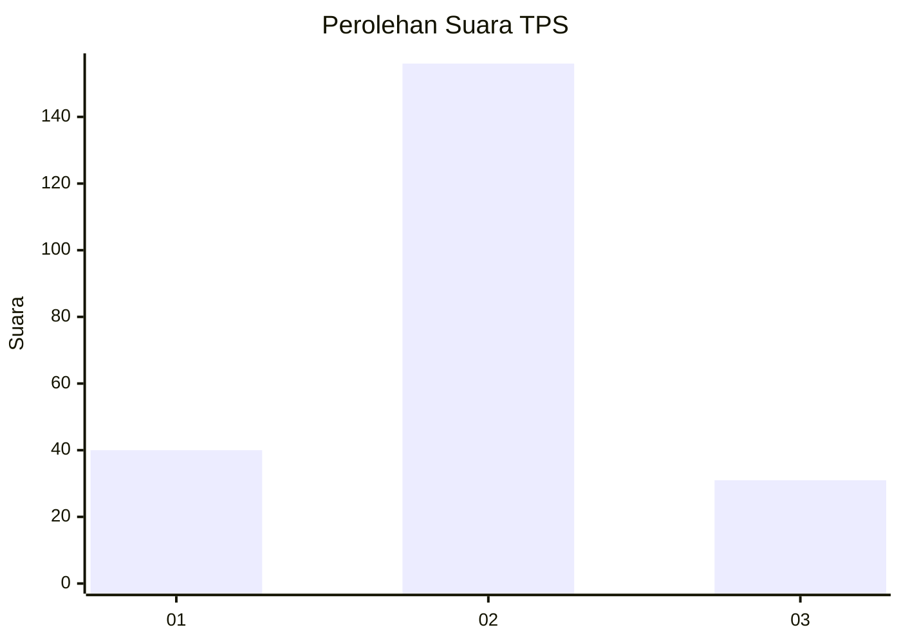
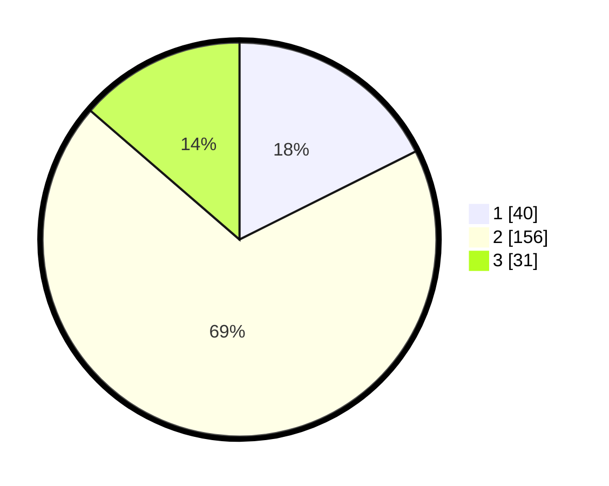

# Hasil

## Grafik

## Tabel

| No. | Nama Paslon    | Suara | Suara (raw) | Persentase |
|:--- |:-------------- | -----:| -----------:| ----------:|
| 1   | ANIES MUHAIMIN | 40    | [40][p-1]   | 17,62      |
| 2   | PRABOWO GIBRAN | 156   | [156][p-2]  | 68,72      |
| 3   | GANJAR MAHFUD  | 31    | [31][p-3]   | 13,66      |

[p-1]: https://github.com/gigit-pemilu/pemilu-2024/blob/main/pilpres/hitung-suara/sub/35-jawa-timur/sub/13-probolinggo/sub/20-tegalsiwalan/sub/2001-malesanwetan/sub/003-tps/sub/paslon-1.txt
[p-2]: https://github.com/gigit-pemilu/pemilu-2024/blob/main/pilpres/hitung-suara/sub/35-jawa-timur/sub/13-probolinggo/sub/20-tegalsiwalan/sub/2001-malesanwetan/sub/003-tps/sub/paslon-2.txt
[p-3]: https://github.com/gigit-pemilu/pemilu-2024/blob/main/pilpres/hitung-suara/sub/35-jawa-timur/sub/13-probolinggo/sub/20-tegalsiwalan/sub/2001-malesanwetan/sub/003-tps/sub/paslon-3.txt

## Foto C Plano

https://sirekap-obj-formc.kpu.go.id/3dc5/pemilu/ppwp/35/13/20/20/01/3513202001003-20240217-090942--45efa1ed-a000-42b3-b142-d3f261930350.jpg

https://sirekap-obj-formc.kpu.go.id/3dc5/pemilu/ppwp/35/13/20/20/01/3513202001003-20240217-090221--86383f41-b645-4f64-aae4-1f1a9c357b92.jpg

https://sirekap-obj-formc.kpu.go.id/3dc5/pemilu/ppwp/35/13/20/20/01/3513202001003-20240214-221440--63c1763e-f881-4ebc-b747-722e61e3e4ee.jpg

## Metadata

| Key        | Value               |
| ---------- | ------------------- |
| Time Stamp | 2024-02-17 09:30:03 |

