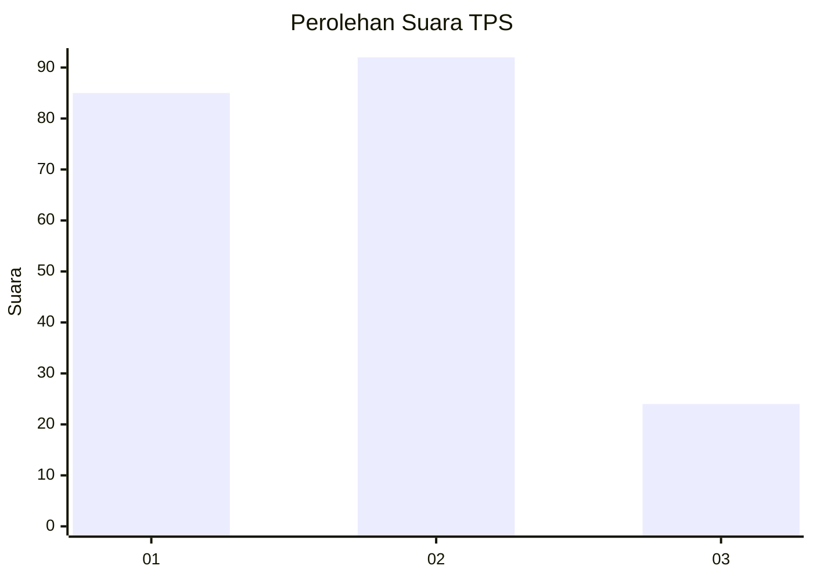
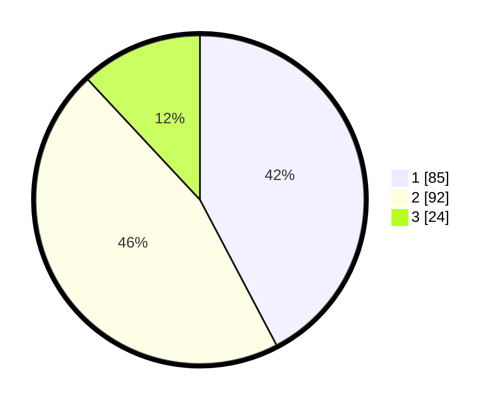

# Hasil

## Grafik

## Tabel

| No. | Nama Paslon    | Suara | Suara (raw) | Persentase |
|:--- |:-------------- | -----:| -----------:| ----------:|
| 1   | ANIES MUHAIMIN | 85    | [85][p-1]   | 42,29      |
| 2   | PRABOWO GIBRAN | 92    | [92][p-2]   | 45,77      |
| 3   | GANJAR MAHFUD  | 24    | [24][p-3]   | 11,94      |

[p-1]: https://github.com/gigit-pemilu/pemilu-2024-35-jawa-timur/blob/main/pilpres/hitung-suara/sub/35-jawa-timur/sub/13-probolinggo/sub/20-tegalsiwalan/sub/2003-tegalsono/sub/002-tps/sub/paslon-1.txt
[p-2]: https://github.com/gigit-pemilu/pemilu-2024-35-jawa-timur/blob/main/pilpres/hitung-suara/sub/35-jawa-timur/sub/13-probolinggo/sub/20-tegalsiwalan/sub/2003-tegalsono/sub/002-tps/sub/paslon-2.txt
[p-3]: https://github.com/gigit-pemilu/pemilu-2024-35-jawa-timur/blob/main/pilpres/hitung-suara/sub/35-jawa-timur/sub/13-probolinggo/sub/20-tegalsiwalan/sub/2003-tegalsono/sub/002-tps/sub/paslon-3.txt

## Foto C Plano

https://sirekap-obj-formc.kpu.go.id/1c73/pemilu/ppwp/35/13/20/20/03/3513202003002-20240217-104028--eaf7235a-d169-4cc6-b959-54bb7edac98f.jpg

https://sirekap-obj-formc.kpu.go.id/1c73/pemilu/ppwp/35/13/20/20/03/3513202003002-20240217-104107--cf4d4cb2-b3b7-49a7-9d9a-74826c8c7a5c.jpg

https://sirekap-obj-formc.kpu.go.id/1c73/pemilu/ppwp/35/13/20/20/03/3513202003002-20240217-104249--c360334f-222c-4e9c-b5f8-de3bed885f26.jpg

## Metadata

| Key        | Value               |
| ---------- | ------------------- |
| Time Stamp | 2024-02-19 12:00:00 |

