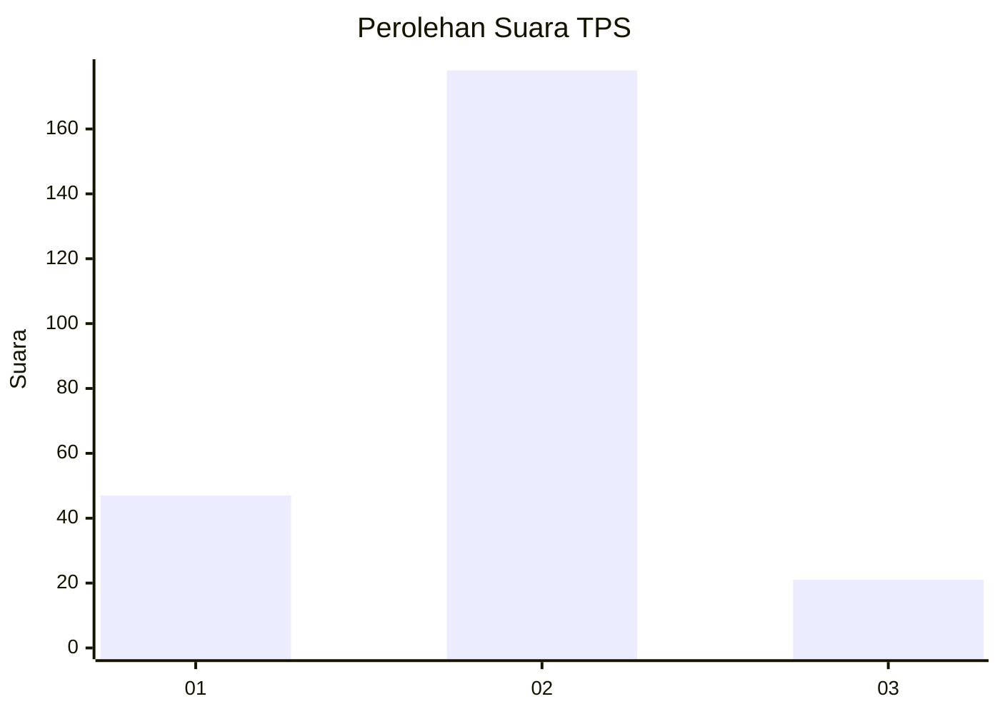
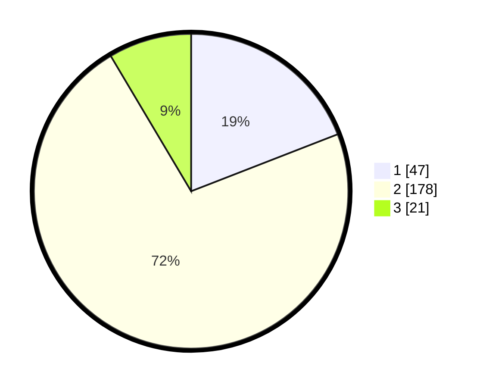

# Hasil

## Grafik

## Tabel

| No. | Nama Paslon    | Suara | Suara (raw) | Persentase |
|:--- |:-------------- | -----:| -----------:| ----------:|
| 1   | ANIES MUHAIMIN | 47    | [47][p-1]   | 19,11      |
| 2   | PRABOWO GIBRAN | 178   | [178][p-2]  | 72,36      |
| 3   | GANJAR MAHFUD  | 21    | [21][p-3]   | 8,54       |

[p-1]: https://github.com/gigit-pemilu/pemilu-2024/blob/main/pilpres/hitung-suara/sub/35-jawa-timur/sub/13-probolinggo/sub/20-tegalsiwalan/sub/2005-bulujaranlor/sub/006-tps/sub/paslon-1.txt
[p-2]: https://github.com/gigit-pemilu/pemilu-2024/blob/main/pilpres/hitung-suara/sub/35-jawa-timur/sub/13-probolinggo/sub/20-tegalsiwalan/sub/2005-bulujaranlor/sub/006-tps/sub/paslon-2.txt
[p-3]: https://github.com/gigit-pemilu/pemilu-2024/blob/main/pilpres/hitung-suara/sub/35-jawa-timur/sub/13-probolinggo/sub/20-tegalsiwalan/sub/2005-bulujaranlor/sub/006-tps/sub/paslon-3.txt

## Foto C Plano

https://sirekap-obj-formc.kpu.go.id/91e2/pemilu/ppwp/35/13/20/20/05/3513202005006-20240217-103428--4bb04246-fa8e-4de5-b233-63eb7253d066.jpg

https://sirekap-obj-formc.kpu.go.id/91e2/pemilu/ppwp/35/13/20/20/05/3513202005006-20240215-062006--91531ab1-460b-44a7-865f-2882101f7f6b.jpg

https://sirekap-obj-formc.kpu.go.id/91e2/pemilu/ppwp/35/13/20/20/05/3513202005006-20240215-062200--c6865f2f-b30a-48ea-980d-b74910532057.jpg

## Metadata

| Key        | Value               |
| ---------- | ------------------- |
| Time Stamp | 2024-02-19 12:00:00 |

