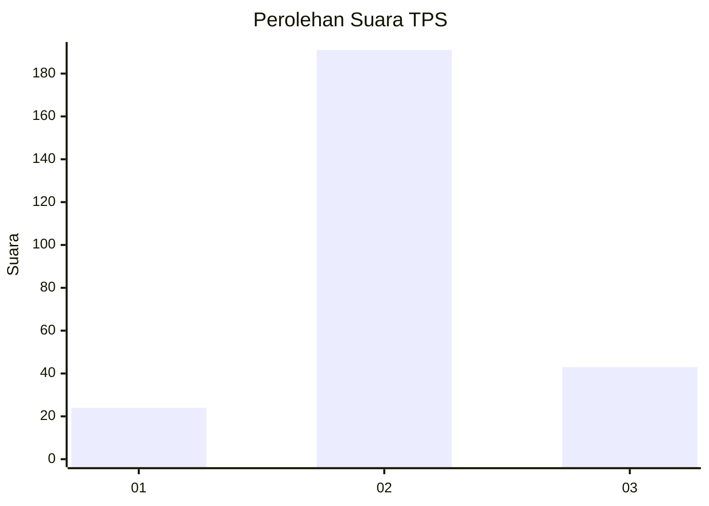
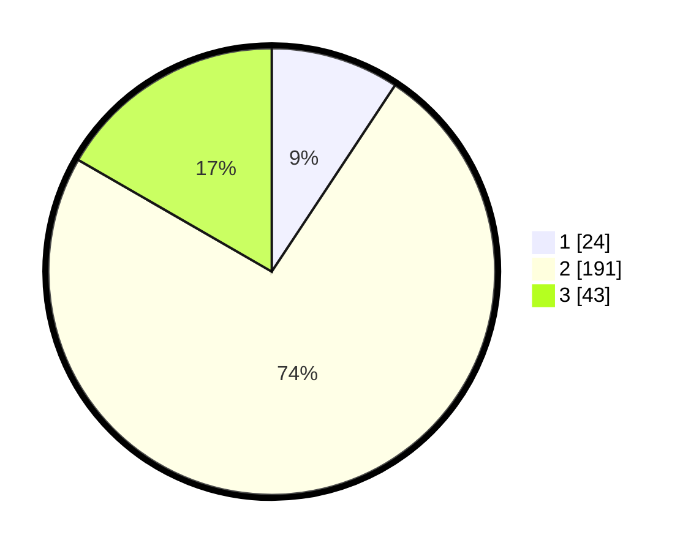

# Hasil

## Grafik

## Tabel

| No. | Nama Paslon    | Suara | Suara (raw) | Persentase |
|:--- |:-------------- | -----:| -----------:| ----------:|
| 1   | ANIES MUHAIMIN | 24    | [24][p-1]   | 9,30       |
| 2   | PRABOWO GIBRAN | 191   | [191][p-2]  | 74,03      |
| 3   | GANJAR MAHFUD  | 43    | [43][p-3]   | 16,67      |

[p-1]: https://github.com/gigit-pemilu/pemilu-2024-35-jawa-timur/blob/main/pilpres/hitung-suara/sub/35-jawa-timur/sub/13-probolinggo/sub/20-tegalsiwalan/sub/2007-tegalsiwalan/sub/005-tps/sub/paslon-1.txt
[p-2]: https://github.com/gigit-pemilu/pemilu-2024-35-jawa-timur/blob/main/pilpres/hitung-suara/sub/35-jawa-timur/sub/13-probolinggo/sub/20-tegalsiwalan/sub/2007-tegalsiwalan/sub/005-tps/sub/paslon-2.txt
[p-3]: https://github.com/gigit-pemilu/pemilu-2024-35-jawa-timur/blob/main/pilpres/hitung-suara/sub/35-jawa-timur/sub/13-probolinggo/sub/20-tegalsiwalan/sub/2007-tegalsiwalan/sub/005-tps/sub/paslon-3.txt

## Foto C Plano

https://sirekap-obj-formc.kpu.go.id/e94f/pemilu/ppwp/35/13/20/20/07/3513202007005-20240217-110947--1366fafe-657b-4c5c-950e-fc979d1f3957.jpg

https://sirekap-obj-formc.kpu.go.id/e94f/pemilu/ppwp/35/13/20/20/07/3513202007005-20240215-001927--7deba4e2-bd20-4bca-b512-aedeaa928ab6.jpg

https://sirekap-obj-formc.kpu.go.id/e94f/pemilu/ppwp/35/13/20/20/07/3513202007005-20240215-002230--2f3d5b4a-0506-4fb9-8cd4-acc5596d656f.jpg

## Metadata

| Key        | Value               |
| ---------- | ------------------- |
| Time Stamp | 2024-02-17 11:30:03 |

