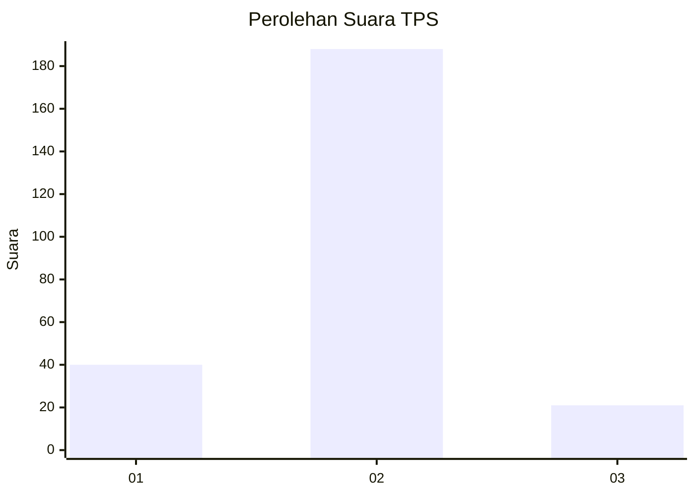
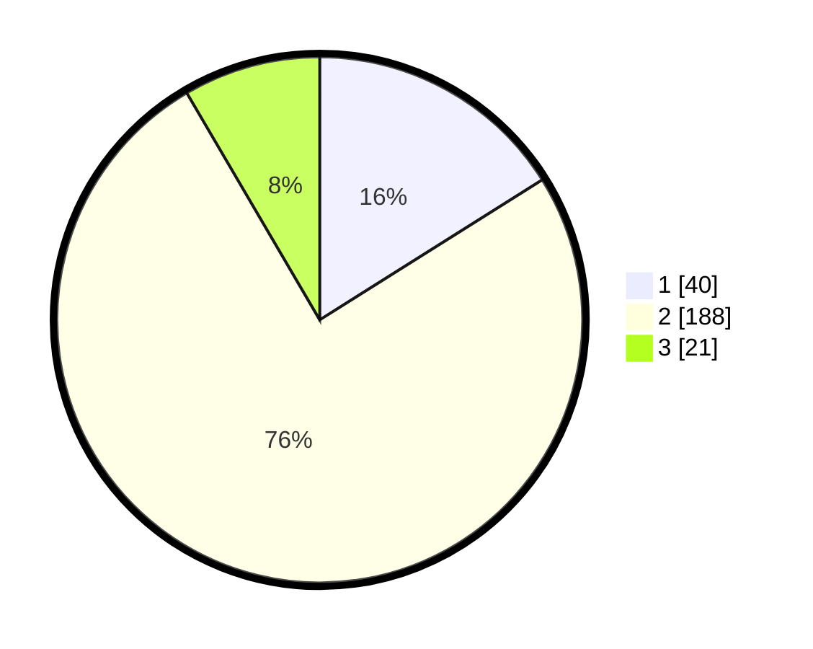

# Hasil

## Grafik

## Tabel

| No. | Nama Paslon    | Suara | Suara (raw) | Persentase |
|:--- |:-------------- | -----:| -----------:| ----------:|
| 1   | ANIES MUHAIMIN | 40    | [40][p-1]   | 16,06      |
| 2   | PRABOWO GIBRAN | 188   | [188][p-2]  | 75,50      |
| 3   | GANJAR MAHFUD  | 21    | [21][p-3]   | 8,43       |

[p-1]: https://github.com/gigit-pemilu/pemilu-2024/blob/main/pilpres/hitung-suara/sub/35-jawa-timur/sub/13-probolinggo/sub/20-tegalsiwalan/sub/2008-banjarsawah/sub/001-tps/sub/paslon-1.txt
[p-2]: https://github.com/gigit-pemilu/pemilu-2024/blob/main/pilpres/hitung-suara/sub/35-jawa-timur/sub/13-probolinggo/sub/20-tegalsiwalan/sub/2008-banjarsawah/sub/001-tps/sub/paslon-2.txt
[p-3]: https://github.com/gigit-pemilu/pemilu-2024/blob/main/pilpres/hitung-suara/sub/35-jawa-timur/sub/13-probolinggo/sub/20-tegalsiwalan/sub/2008-banjarsawah/sub/001-tps/sub/paslon-3.txt

## Foto C Plano

https://sirekap-obj-formc.kpu.go.id/3b67/pemilu/ppwp/35/13/20/20/08/3513202008001-20240214-210433--647de0e4-7397-46d0-bea7-067019d5f039.jpg

https://sirekap-obj-formc.kpu.go.id/3b67/pemilu/ppwp/35/13/20/20/08/3513202008001-20240214-210617--8536a430-49f0-441c-be47-377afa31f701.jpg

https://sirekap-obj-formc.kpu.go.id/3b67/pemilu/ppwp/35/13/20/20/08/3513202008001-20240214-210727--250e2c56-82b0-42f2-9054-f6e41cee5832.jpg

## Metadata

| Key        | Value               |
| ---------- | ------------------- |
| Time Stamp | 2024-02-19 06:16:00 |

