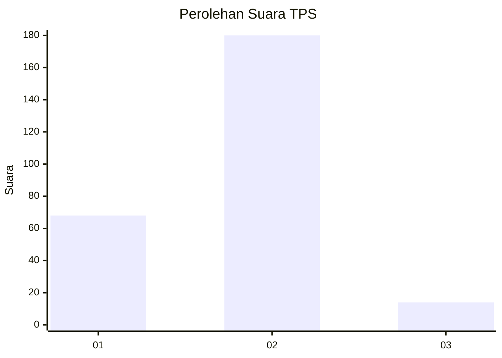
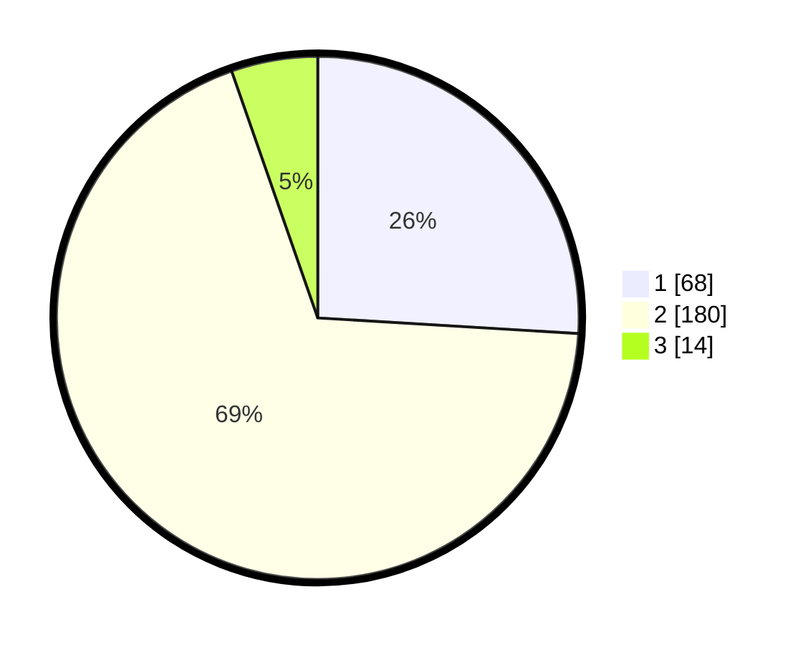

# Hasil

## Grafik

## Tabel

| No. | Nama Paslon    | Suara | Suara (raw) | Persentase |
|:--- |:-------------- | -----:| -----------:| ----------:|
| 1   | ANIES MUHAIMIN | 68    | [68][p-1]   | 25,95      |
| 2   | PRABOWO GIBRAN | 180   | [180][p-2]  | 68,70      |
| 3   | GANJAR MAHFUD  | 14    | [14][p-3]   | 5,34       |

[p-1]: https://github.com/gigit-pemilu/pemilu-2024-35-jawa-timur/blob/main/pilpres/hitung-suara/sub/35-jawa-timur/sub/13-probolinggo/sub/21-sumberasih/sub/2003-muneng/sub/002-tps/sub/paslon-1.txt
[p-2]: https://github.com/gigit-pemilu/pemilu-2024-35-jawa-timur/blob/main/pilpres/hitung-suara/sub/35-jawa-timur/sub/13-probolinggo/sub/21-sumberasih/sub/2003-muneng/sub/002-tps/sub/paslon-2.txt
[p-3]: https://github.com/gigit-pemilu/pemilu-2024-35-jawa-timur/blob/main/pilpres/hitung-suara/sub/35-jawa-timur/sub/13-probolinggo/sub/21-sumberasih/sub/2003-muneng/sub/002-tps/sub/paslon-3.txt

## Foto C Plano

https://sirekap-obj-formc.kpu.go.id/ec2c/pemilu/ppwp/35/13/21/20/03/3513212003002-20240214-200448--fb77b0ad-1aaf-4d3b-a6c3-8773bca5f73c.jpg

https://sirekap-obj-formc.kpu.go.id/ec2c/pemilu/ppwp/35/13/21/20/03/3513212003002-20240214-155315--71299fab-40d0-4986-bdc8-9ec25a579751.jpg

https://sirekap-obj-formc.kpu.go.id/ec2c/pemilu/ppwp/35/13/21/20/03/3513212003002-20240214-202809--b9aca19d-68b6-4fbb-8328-80db37cf753b.jpg

## Metadata

| Key        | Value               |
| ---------- | ------------------- |
| Time Stamp | 2024-02-25 15:00:00 |

