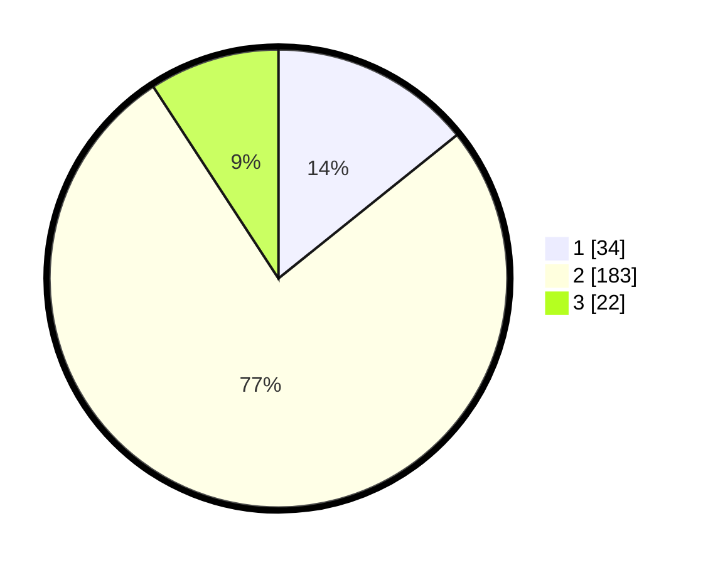

# Hasil

## Grafik

## Tabel

| No. | Nama Paslon    | Suara | Suara (raw) | Persentase |
|:--- |:-------------- | -----:| -----------:| ----------:|
| 1   | ANIES MUHAIMIN | 34    | [34][p-1]   | 14,23      |
| 2   | PRABOWO GIBRAN | 183   | [183][p-2]  | 76,57      |
| 3   | GANJAR MAHFUD  | 22    | [22][p-3]   | 9,21       |

[p-1]: https://github.com/gigit-pemilu/pemilu-2024-35-jawa-timur/blob/main/pilpres/hitung-suara/sub/35-jawa-timur/sub/13-probolinggo/sub/21-sumberasih/sub/2003-muneng/sub/008-tps/sub/paslon-1.txt
[p-2]: https://github.com/gigit-pemilu/pemilu-2024-35-jawa-timur/blob/main/pilpres/hitung-suara/sub/35-jawa-timur/sub/13-probolinggo/sub/21-sumberasih/sub/2003-muneng/sub/008-tps/sub/paslon-2.txt
[p-3]: https://github.com/gigit-pemilu/pemilu-2024-35-jawa-timur/blob/main/pilpres/hitung-suara/sub/35-jawa-timur/sub/13-probolinggo/sub/21-sumberasih/sub/2003-muneng/sub/008-tps/sub/paslon-3.txt

## Foto C Plano

https://sirekap-obj-formc.kpu.go.id/3313/pemilu/ppwp/35/13/21/20/03/3513212003008-20240216-105547--08ba913b-57c5-40f2-b338-4ffa0cb30298.jpg

https://sirekap-obj-formc.kpu.go.id/3313/pemilu/ppwp/35/13/21/20/03/3513212003008-20240216-105713--044d1d77-3fba-481f-b725-45be73bbf821.jpg

https://sirekap-obj-formc.kpu.go.id/3313/pemilu/ppwp/35/13/21/20/03/3513212003008-20240216-105820--fae81e61-df2e-435e-a34c-70076778cffd.jpg

## Metadata

| Key        | Value               |
| ---------- | ------------------- |
| Time Stamp | 2024-02-24 22:31:28 |

