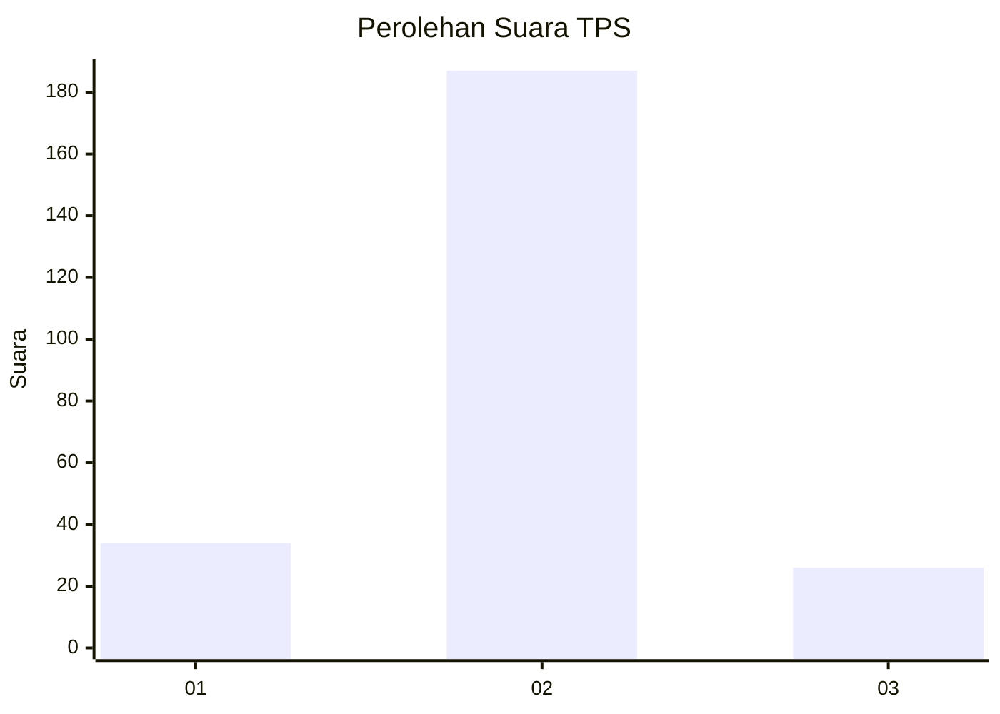
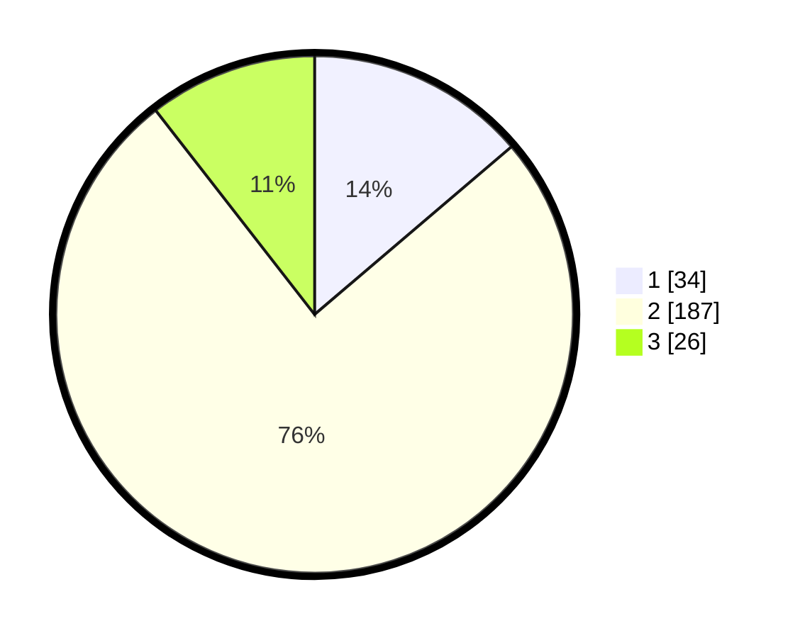

# Hasil

## Grafik

## Tabel

| No. | Nama Paslon    | Suara | Suara (raw) | Persentase |
|:--- |:-------------- | -----:| -----------:| ----------:|
| 1   | ANIES MUHAIMIN | 34    | [34][p-1]   | 13,77      |
| 2   | PRABOWO GIBRAN | 187   | [187][p-2]  | 75,71      |
| 3   | GANJAR MAHFUD  | 26    | [26][p-3]   | 10,53      |

[p-1]: https://github.com/gigit-pemilu/pemilu-2024-35-jawa-timur/blob/main/pilpres/hitung-suara/sub/35-jawa-timur/sub/13-probolinggo/sub/21-sumberasih/sub/2003-muneng/sub/012-tps/sub/paslon-1.txt
[p-2]: https://github.com/gigit-pemilu/pemilu-2024-35-jawa-timur/blob/main/pilpres/hitung-suara/sub/35-jawa-timur/sub/13-probolinggo/sub/21-sumberasih/sub/2003-muneng/sub/012-tps/sub/paslon-2.txt
[p-3]: https://github.com/gigit-pemilu/pemilu-2024-35-jawa-timur/blob/main/pilpres/hitung-suara/sub/35-jawa-timur/sub/13-probolinggo/sub/21-sumberasih/sub/2003-muneng/sub/012-tps/sub/paslon-3.txt

## Foto C Plano

https://sirekap-obj-formc.kpu.go.id/6a9e/pemilu/ppwp/35/13/21/20/03/3513212003012-20240215-095508--07f7f336-835a-4f03-a379-ac2038b55672.jpg

https://sirekap-obj-formc.kpu.go.id/6a9e/pemilu/ppwp/35/13/21/20/03/3513212003012-20240215-094853--63102939-e428-4435-a550-711c88b5ae13.jpg

https://sirekap-obj-formc.kpu.go.id/6a9e/pemilu/ppwp/35/13/21/20/03/3513212003012-20240215-095201--f0ec19bc-6e97-47d7-ac8b-823858520612.jpg

## Metadata

| Key        | Value               |
| ---------- | ------------------- |
| Time Stamp | 2024-02-24 22:31:28 |

