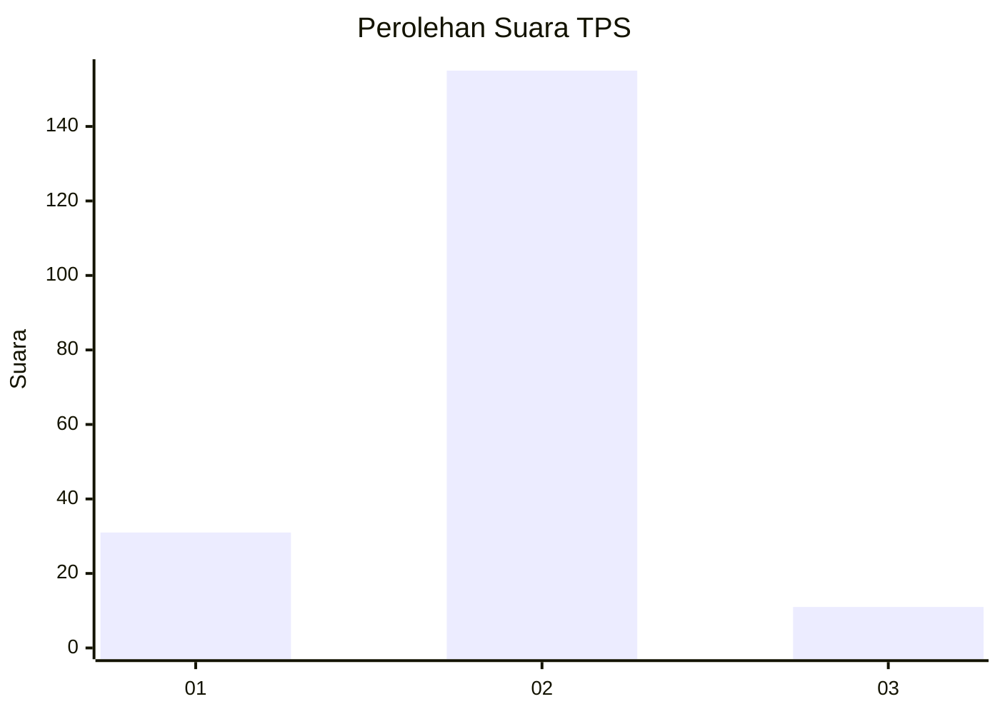
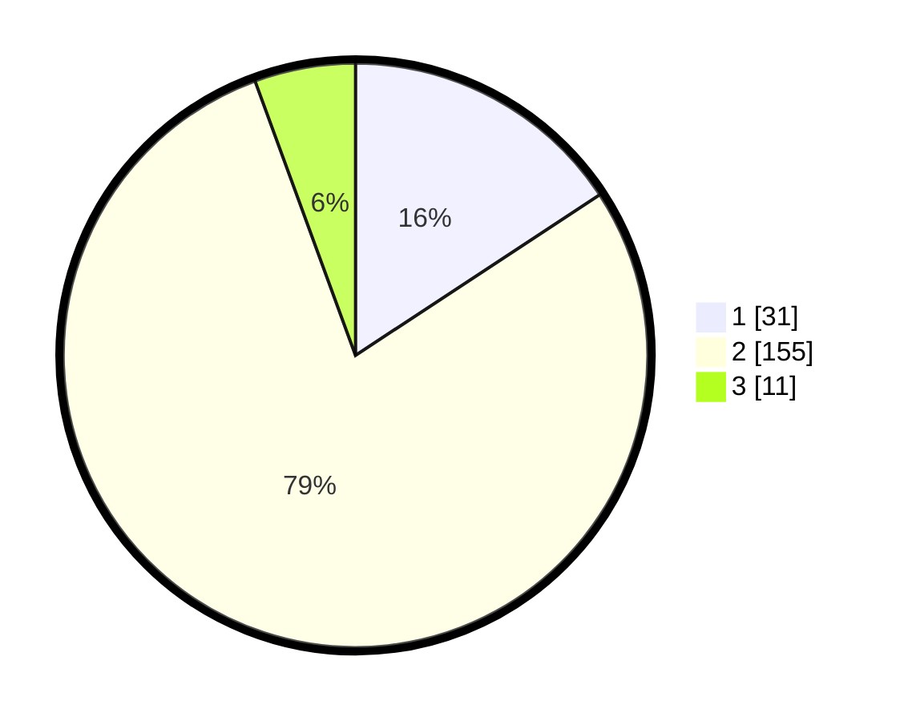

# Hasil

## Grafik

## Tabel

| No. | Nama Paslon    | Suara | Suara (raw) | Persentase |
|:--- |:-------------- | -----:| -----------:| ----------:|
| 1   | ANIES MUHAIMIN | 31    | [31][p-1]   | 15,74      |
| 2   | PRABOWO GIBRAN | 155   | [155][p-2]  | 78,68      |
| 3   | GANJAR MAHFUD  | 11    | [11][p-3]   | 5,58       |

[p-1]: https://github.com/gigit-pemilu/pemilu-2024/blob/main/pilpres/hitung-suara/sub/35-jawa-timur/sub/13-probolinggo/sub/21-sumberasih/sub/2003-muneng/sub/014-tps/sub/paslon-1.txt
[p-2]: https://github.com/gigit-pemilu/pemilu-2024/blob/main/pilpres/hitung-suara/sub/35-jawa-timur/sub/13-probolinggo/sub/21-sumberasih/sub/2003-muneng/sub/014-tps/sub/paslon-2.txt
[p-3]: https://github.com/gigit-pemilu/pemilu-2024/blob/main/pilpres/hitung-suara/sub/35-jawa-timur/sub/13-probolinggo/sub/21-sumberasih/sub/2003-muneng/sub/014-tps/sub/paslon-3.txt

## Foto C Plano

https://sirekap-obj-formc.kpu.go.id/fe14/pemilu/ppwp/35/13/21/20/03/3513212003014-20240219-135149--7ee0a997-f65b-4dcc-b5e5-a07779bb9154.jpg

https://sirekap-obj-formc.kpu.go.id/fe14/pemilu/ppwp/35/13/21/20/03/3513212003014-20240215-131032--8bdae4e9-72bc-4b20-b8f1-8f8fd62c1b38.jpg

https://sirekap-obj-formc.kpu.go.id/fe14/pemilu/ppwp/35/13/21/20/03/3513212003014-20240215-131209--07cb2205-7615-4e1b-b5ec-622207af9744.jpg

## Metadata

| Key        | Value               |
| ---------- | ------------------- |
| Time Stamp | 2024-02-24 22:31:28 |

