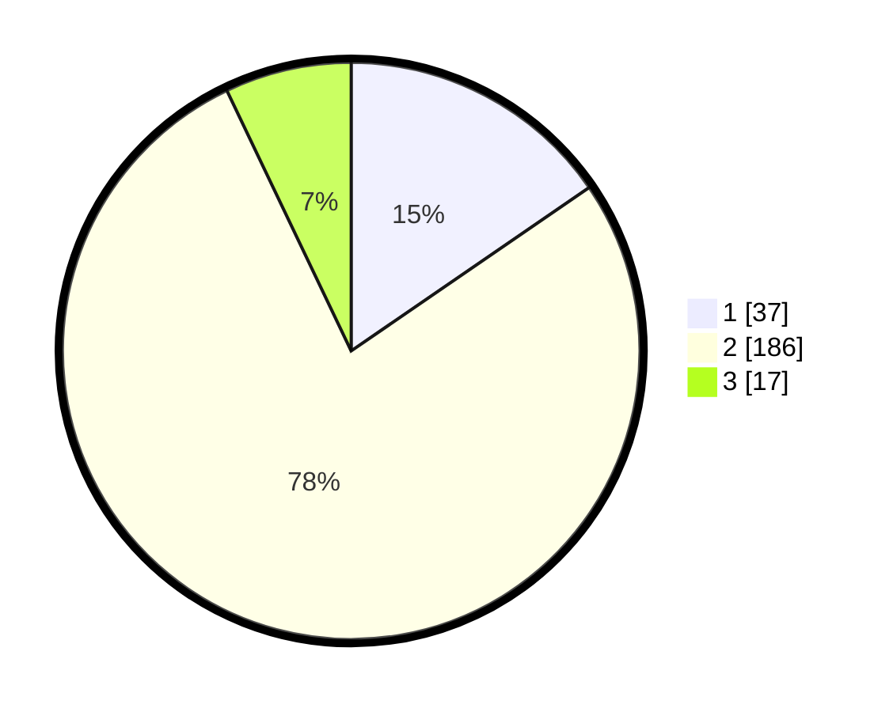

# Hasil

## Grafik

## Tabel

| No. | Nama Paslon    | Suara | Suara (raw) | Persentase |
|:--- |:-------------- | -----:| -----------:| ----------:|
| 1   | ANIES MUHAIMIN | 37    | [37][p-1]   | 15,42      |
| 2   | PRABOWO GIBRAN | 186   | [186][p-2]  | 77,50      |
| 3   | GANJAR MAHFUD  | 17    | [17][p-3]   | 7,08       |

[p-1]: https://github.com/gigit-pemilu/pemilu-2024/blob/main/pilpres/hitung-suara/sub/35-jawa-timur/sub/13-probolinggo/sub/21-sumberasih/sub/2005-pohsangit-leres/sub/003-tps/sub/paslon-1.txt
[p-2]: https://github.com/gigit-pemilu/pemilu-2024/blob/main/pilpres/hitung-suara/sub/35-jawa-timur/sub/13-probolinggo/sub/21-sumberasih/sub/2005-pohsangit-leres/sub/003-tps/sub/paslon-2.txt
[p-3]: https://github.com/gigit-pemilu/pemilu-2024/blob/main/pilpres/hitung-suara/sub/35-jawa-timur/sub/13-probolinggo/sub/21-sumberasih/sub/2005-pohsangit-leres/sub/003-tps/sub/paslon-3.txt

## Foto C Plano

https://sirekap-obj-formc.kpu.go.id/cfbc/pemilu/ppwp/35/13/21/20/05/3513212005003-20240219-203642--c4540fca-f243-4201-80b7-d7322e81bda0.jpg

https://sirekap-obj-formc.kpu.go.id/cfbc/pemilu/ppwp/35/13/21/20/05/3513212005003-20240219-203646--0346236c-9b0b-49b5-9468-bd88636ef7fb.jpg

https://sirekap-obj-formc.kpu.go.id/cfbc/pemilu/ppwp/35/13/21/20/05/3513212005003-20240219-203649--78f1975f-8044-4eea-afb3-739c8eddfead.jpg

## Metadata

| Key        | Value               |
| ---------- | ------------------- |
| Time Stamp | 2024-02-25 15:00:00 |

