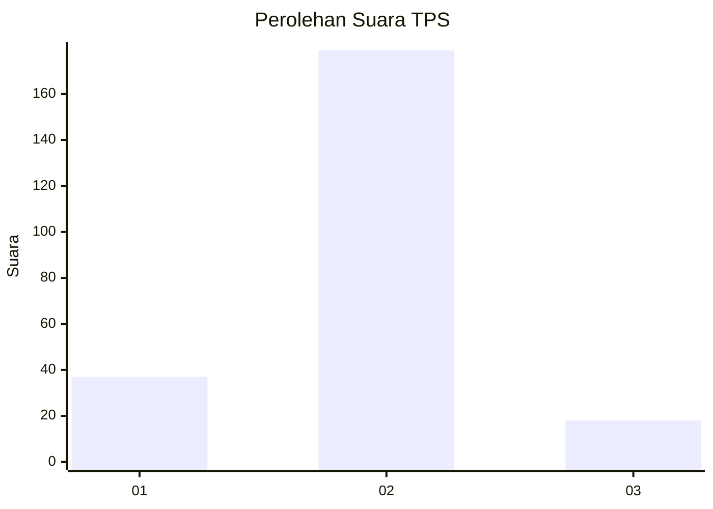
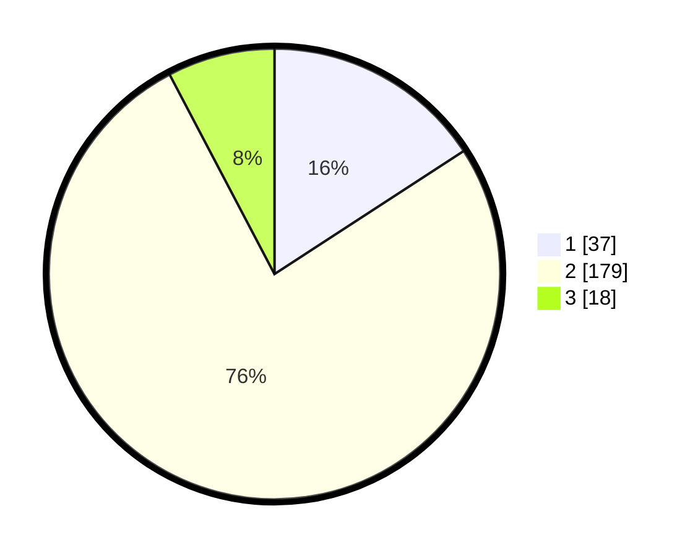

# Hasil

## Grafik

## Tabel

| No. | Nama Paslon    | Suara | Suara (raw) | Persentase |
|:--- |:-------------- | -----:| -----------:| ----------:|
| 1   | ANIES MUHAIMIN | 37    | [37][p-1]   | 15,81      |
| 2   | PRABOWO GIBRAN | 179   | [179][p-2]  | 76,50      |
| 3   | GANJAR MAHFUD  | 18    | [18][p-3]   | 7,69       |

[p-1]: https://github.com/gigit-pemilu/pemilu-2024/blob/main/pilpres/hitung-suara/sub/35-jawa-timur/sub/13-probolinggo/sub/21-sumberasih/sub/2005-pohsangit-leres/sub/005-tps/sub/paslon-1.txt
[p-2]: https://github.com/gigit-pemilu/pemilu-2024/blob/main/pilpres/hitung-suara/sub/35-jawa-timur/sub/13-probolinggo/sub/21-sumberasih/sub/2005-pohsangit-leres/sub/005-tps/sub/paslon-2.txt
[p-3]: https://github.com/gigit-pemilu/pemilu-2024/blob/main/pilpres/hitung-suara/sub/35-jawa-timur/sub/13-probolinggo/sub/21-sumberasih/sub/2005-pohsangit-leres/sub/005-tps/sub/paslon-3.txt

## Foto C Plano

https://sirekap-obj-formc.kpu.go.id/f834/pemilu/ppwp/35/13/21/20/05/3513212005005-20240216-174124--e9bb3f34-ab02-4d6d-9c0b-5d44f550209a.jpg

https://sirekap-obj-formc.kpu.go.id/f834/pemilu/ppwp/35/13/21/20/05/3513212005005-20240216-174307--91706552-2331-4d83-b2c3-57d260355f20.jpg

https://sirekap-obj-formc.kpu.go.id/f834/pemilu/ppwp/35/13/21/20/05/3513212005005-20240216-174548--c4dbacc8-42ee-4024-9673-a8403d07296e.jpg

## Metadata

| Key        | Value               |
| ---------- | ------------------- |
| Time Stamp | 2024-02-24 22:31:28 |

