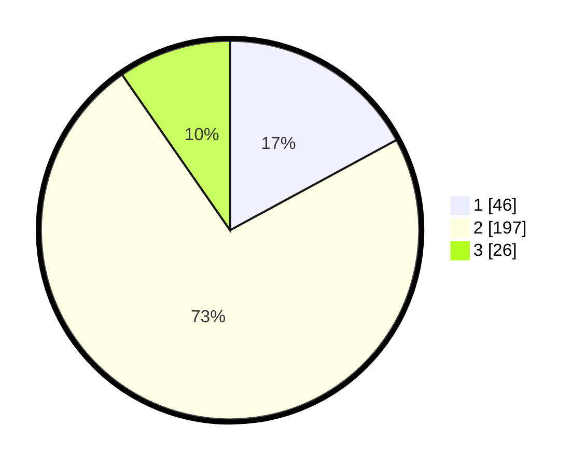

# Hasil

## Grafik

## Tabel

| No. | Nama Paslon    | Suara | Suara (raw) | Persentase |
|:--- |:-------------- | -----:| -----------:| ----------:|
| 1   | ANIES MUHAIMIN | 46    | [46][p-1]   | 17,10      |
| 2   | PRABOWO GIBRAN | 197   | [197][p-2]  | 73,23      |
| 3   | GANJAR MAHFUD  | 26    | [26][p-3]   | 9,67       |

[p-1]: https://github.com/gigit-pemilu/pemilu-2024-35-jawa-timur/blob/main/pilpres/hitung-suara/sub/35-jawa-timur/sub/13-probolinggo/sub/21-sumberasih/sub/2006-laweyan/sub/005-tps/sub/paslon-1.txt
[p-2]: https://github.com/gigit-pemilu/pemilu-2024-35-jawa-timur/blob/main/pilpres/hitung-suara/sub/35-jawa-timur/sub/13-probolinggo/sub/21-sumberasih/sub/2006-laweyan/sub/005-tps/sub/paslon-2.txt
[p-3]: https://github.com/gigit-pemilu/pemilu-2024-35-jawa-timur/blob/main/pilpres/hitung-suara/sub/35-jawa-timur/sub/13-probolinggo/sub/21-sumberasih/sub/2006-laweyan/sub/005-tps/sub/paslon-3.txt

## Foto C Plano

https://sirekap-obj-formc.kpu.go.id/a217/pemilu/ppwp/35/13/21/20/06/3513212006005-20240215-065504--a5699ac0-6125-461b-a5c8-9d54c63ae1ae.jpg

https://sirekap-obj-formc.kpu.go.id/a217/pemilu/ppwp/35/13/21/20/06/3513212006005-20240215-064937--78c30de5-3a53-4dce-90c6-f5cdf7b7c56a.jpg

https://sirekap-obj-formc.kpu.go.id/a217/pemilu/ppwp/35/13/21/20/06/3513212006005-20240215-065208--4d329054-142b-4142-b629-7019d04c6ec6.jpg

## Metadata

| Key        | Value               |
| ---------- | ------------------- |
| Time Stamp | 2024-02-19 22:00:00 |

