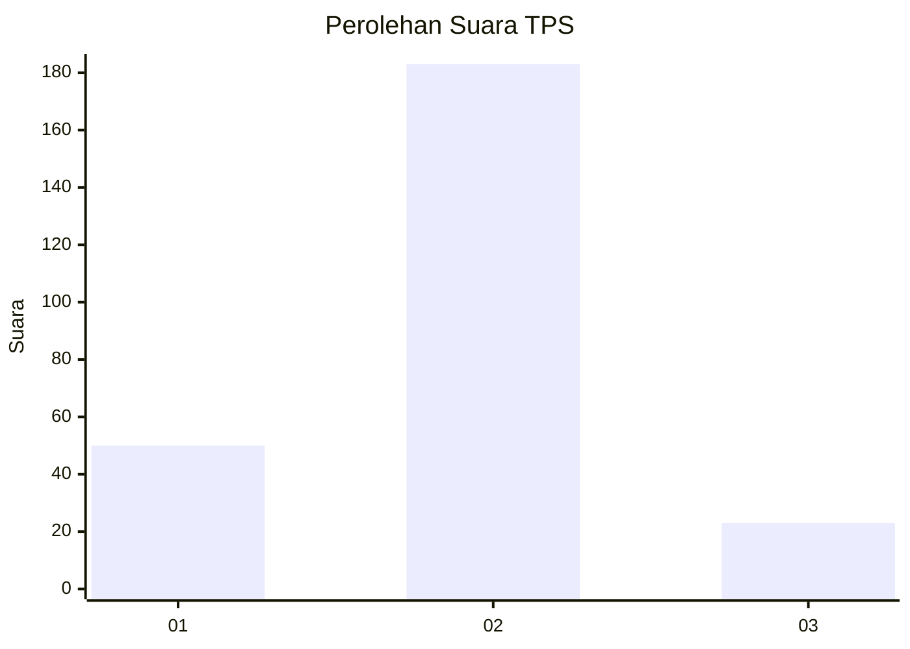
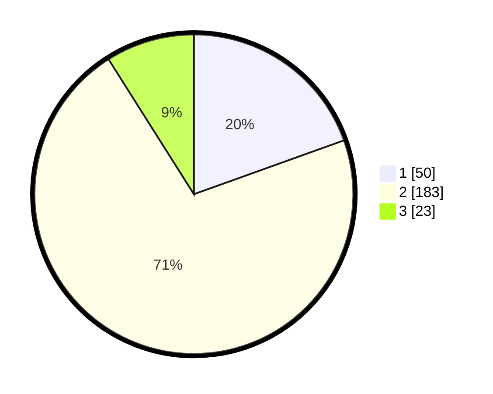

# Hasil

## Grafik

## Tabel

| No. | Nama Paslon    | Suara | Suara (raw) | Persentase |
|:--- |:-------------- | -----:| -----------:| ----------:|
| 1   | ANIES MUHAIMIN | 50    | [50][p-1]   | 19,53      |
| 2   | PRABOWO GIBRAN | 183   | [183][p-2]  | 71,48      |
| 3   | GANJAR MAHFUD  | 23    | [23][p-3]   | 8,98       |

[p-1]: https://github.com/gigit-pemilu/pemilu-2024/blob/main/pilpres/hitung-suara/sub/35-jawa-timur/sub/13-probolinggo/sub/21-sumberasih/sub/2006-laweyan/sub/011-tps/sub/paslon-1.txt
[p-2]: https://github.com/gigit-pemilu/pemilu-2024/blob/main/pilpres/hitung-suara/sub/35-jawa-timur/sub/13-probolinggo/sub/21-sumberasih/sub/2006-laweyan/sub/011-tps/sub/paslon-2.txt
[p-3]: https://github.com/gigit-pemilu/pemilu-2024/blob/main/pilpres/hitung-suara/sub/35-jawa-timur/sub/13-probolinggo/sub/21-sumberasih/sub/2006-laweyan/sub/011-tps/sub/paslon-3.txt

## Foto C Plano

https://sirekap-obj-formc.kpu.go.id/7ff7/pemilu/ppwp/35/13/21/20/06/3513212006011-20240215-134753--9089e053-5b20-4073-b475-7c7baafabb34.jpg

https://sirekap-obj-formc.kpu.go.id/7ff7/pemilu/ppwp/35/13/21/20/06/3513212006011-20240214-225229--f4a92a4c-258b-4e74-af0f-f6dfd5eab30a.jpg

https://sirekap-obj-formc.kpu.go.id/7ff7/pemilu/ppwp/35/13/21/20/06/3513212006011-20240214-225312--ba3f1d73-4868-4c7f-a46c-4e3aac635c45.jpg

## Metadata

| Key        | Value               |
| ---------- | ------------------- |
| Time Stamp | 2024-02-25 11:00:00 |

