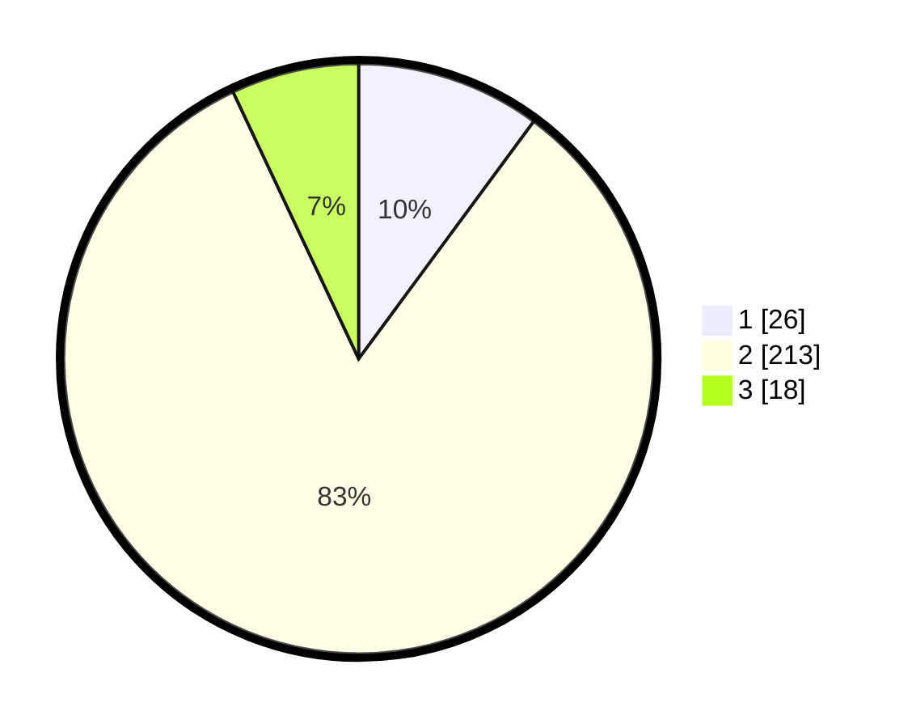

# Hasil

## Grafik

## Tabel

| No. | Nama Paslon    | Suara | Suara (raw) | Persentase |
|:--- |:-------------- | -----:| -----------:| ----------:|
| 1   | ANIES MUHAIMIN | 26    | [26][p-1]   | 10,12      |
| 2   | PRABOWO GIBRAN | 213   | [213][p-2]  | 82,88      |
| 3   | GANJAR MAHFUD  | 18    | [18][p-3]   | 7,00       |

[p-1]: https://github.com/gigit-pemilu/pemilu-2024-35-jawa-timur/blob/main/pilpres/hitung-suara/sub/35-jawa-timur/sub/13-probolinggo/sub/21-sumberasih/sub/2009-ambulu/sub/010-tps/sub/paslon-1.txt
[p-2]: https://github.com/gigit-pemilu/pemilu-2024-35-jawa-timur/blob/main/pilpres/hitung-suara/sub/35-jawa-timur/sub/13-probolinggo/sub/21-sumberasih/sub/2009-ambulu/sub/010-tps/sub/paslon-2.txt
[p-3]: https://github.com/gigit-pemilu/pemilu-2024-35-jawa-timur/blob/main/pilpres/hitung-suara/sub/35-jawa-timur/sub/13-probolinggo/sub/21-sumberasih/sub/2009-ambulu/sub/010-tps/sub/paslon-3.txt

## Foto C Plano

https://sirekap-obj-formc.kpu.go.id/ef51/pemilu/ppwp/35/13/21/20/09/3513212009010-20240215-014710--a1ba7c31-7378-41f3-b100-e476d00cb178.jpg

https://sirekap-obj-formc.kpu.go.id/ef51/pemilu/ppwp/35/13/21/20/09/3513212009010-20240215-014807--9076fafb-7aba-4756-8933-db7147d57694.jpg

https://sirekap-obj-formc.kpu.go.id/ef51/pemilu/ppwp/35/13/21/20/09/3513212009010-20240215-014837--08c2ad9e-8854-4c28-85c0-2163a7d8c00a.jpg

## Metadata

| Key        | Value               |
| ---------- | ------------------- |
| Time Stamp | 2024-02-24 22:31:28 |

