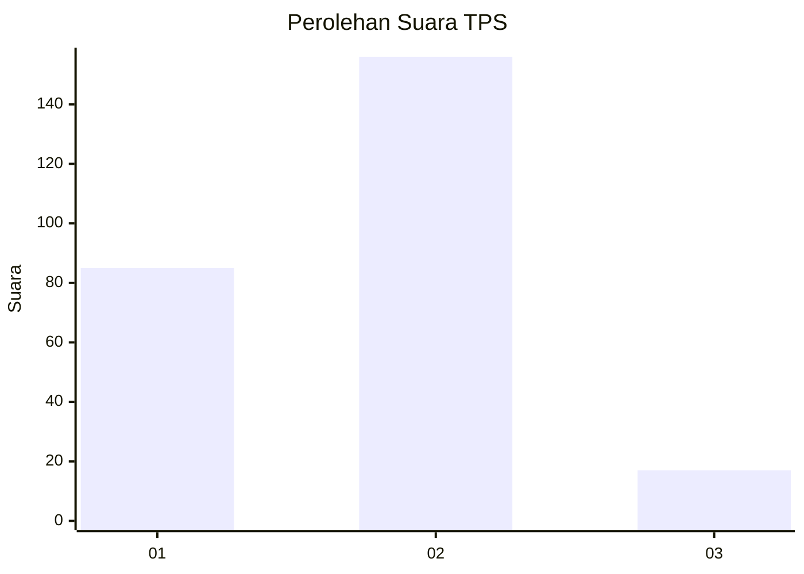
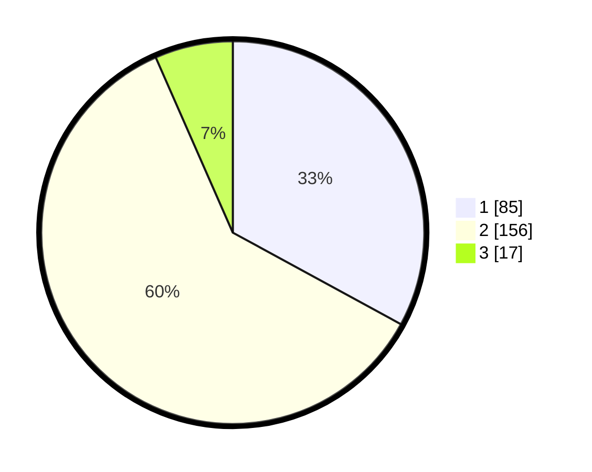

# Hasil

## Grafik

## Tabel

| No. | Nama Paslon    | Suara | Suara (raw) | Persentase |
|:--- |:-------------- | -----:| -----------:| ----------:|
| 1   | ANIES MUHAIMIN | 85    | [85][p-1]   | 32,95      |
| 2   | PRABOWO GIBRAN | 156   | [156][p-2]  | 60,47      |
| 3   | GANJAR MAHFUD  | 17    | [17][p-3]   | 6,59       |

[p-1]: https://github.com/gigit-pemilu/pemilu-2024-35-jawa-timur/blob/main/pilpres/hitung-suara/sub/35-jawa-timur/sub/13-probolinggo/sub/21-sumberasih/sub/2010-banjarsari/sub/013-tps/sub/paslon-1.txt
[p-2]: https://github.com/gigit-pemilu/pemilu-2024-35-jawa-timur/blob/main/pilpres/hitung-suara/sub/35-jawa-timur/sub/13-probolinggo/sub/21-sumberasih/sub/2010-banjarsari/sub/013-tps/sub/paslon-2.txt
[p-3]: https://github.com/gigit-pemilu/pemilu-2024-35-jawa-timur/blob/main/pilpres/hitung-suara/sub/35-jawa-timur/sub/13-probolinggo/sub/21-sumberasih/sub/2010-banjarsari/sub/013-tps/sub/paslon-3.txt

## Foto C Plano

https://sirekap-obj-formc.kpu.go.id/92b1/pemilu/ppwp/35/13/21/20/10/3513212010013-20240214-233049--6a811b40-8447-4eca-8012-f785aaa16dc2.jpg

https://sirekap-obj-formc.kpu.go.id/92b1/pemilu/ppwp/35/13/21/20/10/3513212010013-20240215-002429--581a1e3c-a33c-40bf-936c-b29347cd6052.jpg

https://sirekap-obj-formc.kpu.go.id/92b1/pemilu/ppwp/35/13/21/20/10/3513212010013-20240215-002608--5cd60ec5-9de1-49cb-bdea-ee0539671712.jpg

## Metadata

| Key        | Value               |
| ---------- | ------------------- |
| Time Stamp | 2024-02-15 21:30:27 |

