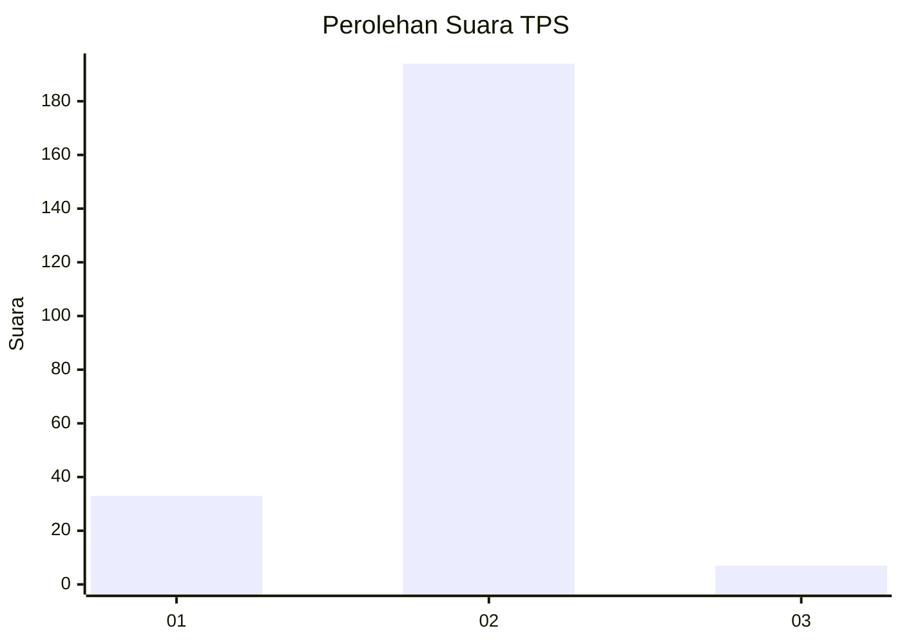
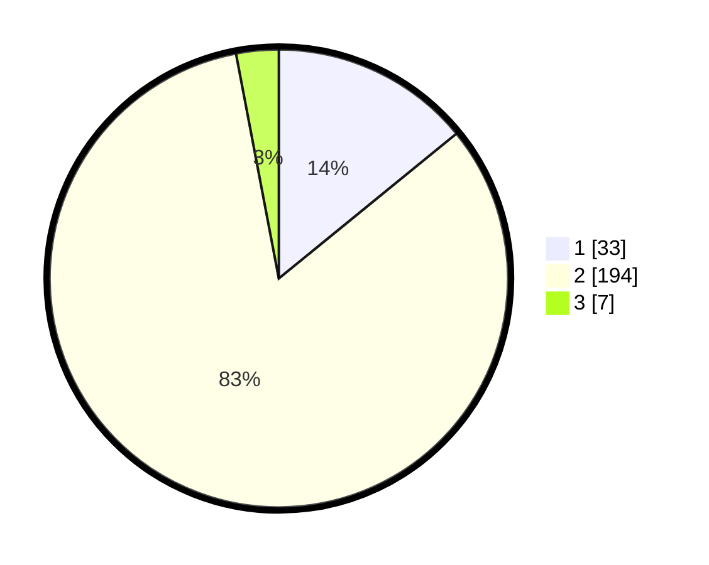

# Hasil

## Grafik

## Tabel

| No. | Nama Paslon    | Suara | Suara (raw) | Persentase |
|:--- |:-------------- | -----:| -----------:| ----------:|
| 1   | ANIES MUHAIMIN | 33    | [33][p-1]   | 14,10      |
| 2   | PRABOWO GIBRAN | 194   | [194][p-2]  | 82,91      |
| 3   | GANJAR MAHFUD  | 7     | [7][p-3]    | 2,99       |

[p-1]: https://github.com/gigit-pemilu/pemilu-2024/blob/main/pilpres/hitung-suara/sub/35-jawa-timur/sub/13-probolinggo/sub/21-sumberasih/sub/2012-pesisir/sub/007-tps/sub/paslon-1.txt
[p-2]: https://github.com/gigit-pemilu/pemilu-2024/blob/main/pilpres/hitung-suara/sub/35-jawa-timur/sub/13-probolinggo/sub/21-sumberasih/sub/2012-pesisir/sub/007-tps/sub/paslon-2.txt
[p-3]: https://github.com/gigit-pemilu/pemilu-2024/blob/main/pilpres/hitung-suara/sub/35-jawa-timur/sub/13-probolinggo/sub/21-sumberasih/sub/2012-pesisir/sub/007-tps/sub/paslon-3.txt

## Foto C Plano

https://sirekap-obj-formc.kpu.go.id/9bd3/pemilu/ppwp/35/13/21/20/12/3513212012007-20240214-201020--35d7983a-341d-4e74-a6a2-f9105b777c63.jpg

https://sirekap-obj-formc.kpu.go.id/9bd3/pemilu/ppwp/35/13/21/20/12/3513212012007-20240214-201045--f646f411-ccd8-4838-ab76-560713308b29.jpg

https://sirekap-obj-formc.kpu.go.id/9bd3/pemilu/ppwp/35/13/21/20/12/3513212012007-20240214-160140--bafd2ee6-7d4b-45d4-a461-90694e58d29c.jpg

## Metadata

| Key        | Value               |
| ---------- | ------------------- |
| Time Stamp | 2024-02-24 22:31:28 |

