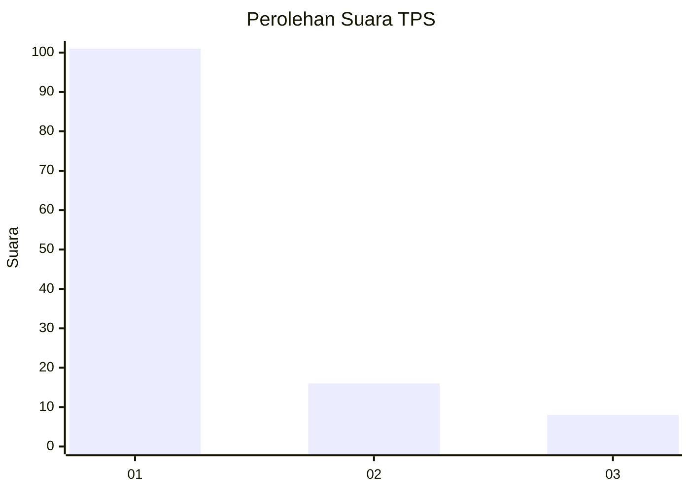
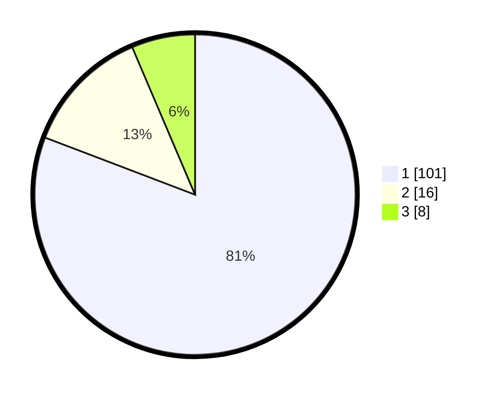

# Hasil

## Grafik

## Tabel

| No. | Nama Paslon    | Suara | Suara (raw) | Persentase |
|:--- |:-------------- | -----:| -----------:| ----------:|
| 1   | ANIES MUHAIMIN | 101   | [101][p-1]  | 80,80      |
| 2   | PRABOWO GIBRAN | 16    | [16][p-2]   | 12,80      |
| 3   | GANJAR MAHFUD  | 8     | [8][p-3]    | 6,40       |

[p-1]: https://github.com/gigit-pemilu/pemilu-2024/blob/main/pilpres/hitung-suara/sub/35-jawa-timur/sub/13-probolinggo/sub/21-sumberasih/sub/2013-gili-ketapang/sub/003-tps/sub/paslon-1.txt
[p-2]: https://github.com/gigit-pemilu/pemilu-2024/blob/main/pilpres/hitung-suara/sub/35-jawa-timur/sub/13-probolinggo/sub/21-sumberasih/sub/2013-gili-ketapang/sub/003-tps/sub/paslon-2.txt
[p-3]: https://github.com/gigit-pemilu/pemilu-2024/blob/main/pilpres/hitung-suara/sub/35-jawa-timur/sub/13-probolinggo/sub/21-sumberasih/sub/2013-gili-ketapang/sub/003-tps/sub/paslon-3.txt

## Foto C Plano

https://sirekap-obj-formc.kpu.go.id/1064/pemilu/ppwp/35/13/21/20/13/3513212013003-20240215-030754--b78da651-5493-4538-9d26-d464a8db2005.jpg

https://sirekap-obj-formc.kpu.go.id/1064/pemilu/ppwp/35/13/21/20/13/3513212013003-20240215-030942--f80fc1bd-7635-496d-9e50-7a2a47132470.jpg

https://sirekap-obj-formc.kpu.go.id/1064/pemilu/ppwp/35/13/21/20/13/3513212013003-20240215-042755--9c92b1c9-7346-455c-8f4d-dbb61295aad8.jpg

## Metadata

| Key        | Value               |
| ---------- | ------------------- |
| Time Stamp | 2024-02-24 22:31:28 |

