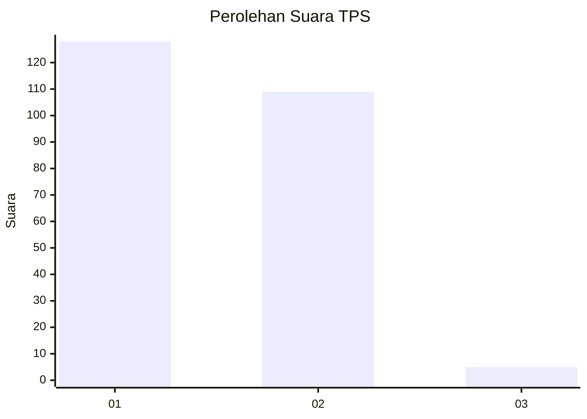
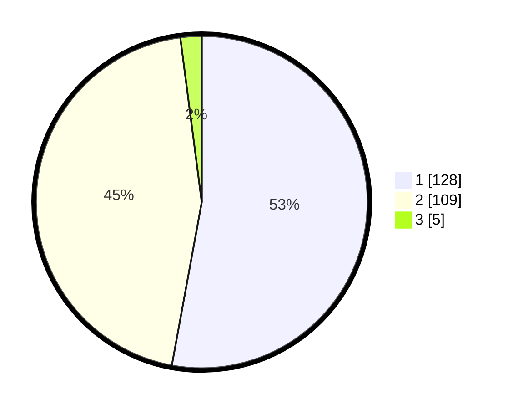

# Hasil

## Grafik

## Tabel

| No. | Nama Paslon    | Suara | Suara (raw) | Persentase |
|:--- |:-------------- | -----:| -----------:| ----------:|
| 1   | ANIES MUHAIMIN | 128   | [128][p-1]  | 52,89      |
| 2   | PRABOWO GIBRAN | 109   | [109][p-2]  | 45,04      |
| 3   | GANJAR MAHFUD  | 5     | [5][p-3]    | 2,07       |

[p-1]: https://github.com/gigit-pemilu/pemilu-2024/blob/main/pilpres/hitung-suara/sub/35-jawa-timur/sub/13-probolinggo/sub/21-sumberasih/sub/2013-gili-ketapang/sub/006-tps/sub/paslon-1.txt
[p-2]: https://github.com/gigit-pemilu/pemilu-2024/blob/main/pilpres/hitung-suara/sub/35-jawa-timur/sub/13-probolinggo/sub/21-sumberasih/sub/2013-gili-ketapang/sub/006-tps/sub/paslon-2.txt
[p-3]: https://github.com/gigit-pemilu/pemilu-2024/blob/main/pilpres/hitung-suara/sub/35-jawa-timur/sub/13-probolinggo/sub/21-sumberasih/sub/2013-gili-ketapang/sub/006-tps/sub/paslon-3.txt

## Foto C Plano

https://sirekap-obj-formc.kpu.go.id/394a/pemilu/ppwp/35/13/21/20/13/3513212013006-20240215-072031--5e9424da-d3f5-462a-8f45-77102eae9279.jpg

https://sirekap-obj-formc.kpu.go.id/394a/pemilu/ppwp/35/13/21/20/13/3513212013006-20240215-072207--6c91d1f4-36d0-42c8-ac03-a1d1ce526bf4.jpg

https://sirekap-obj-formc.kpu.go.id/394a/pemilu/ppwp/35/13/21/20/13/3513212013006-20240215-072339--fd4f139c-364c-4549-8a45-e973e7896722.jpg

## Metadata

| Key        | Value               |
| ---------- | ------------------- |
| Time Stamp | 2024-02-25 11:00:00 |

