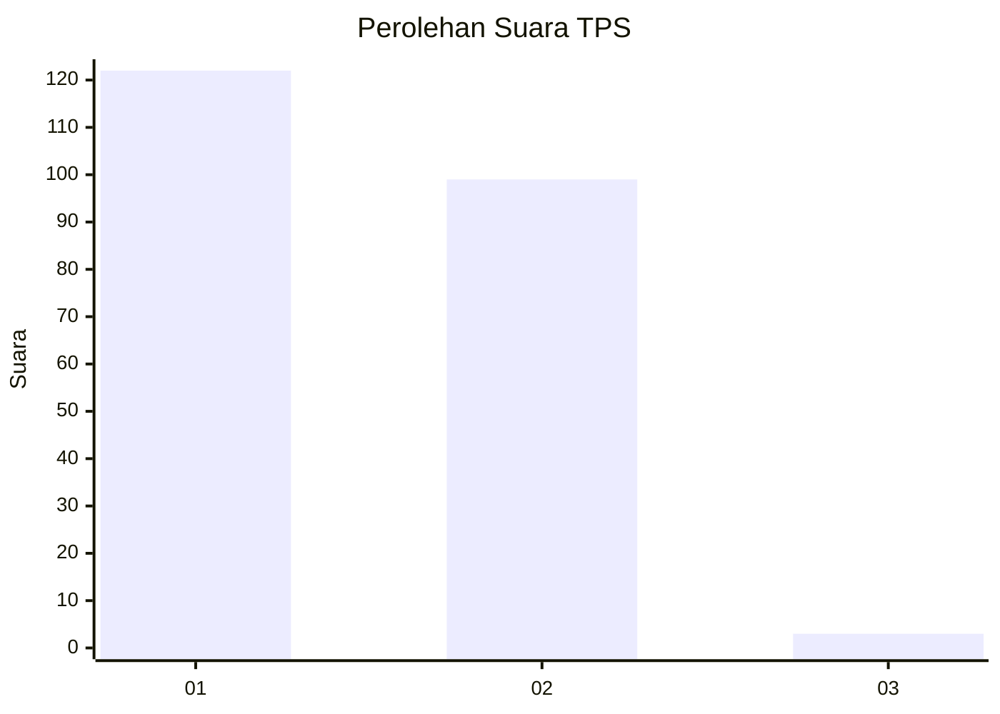
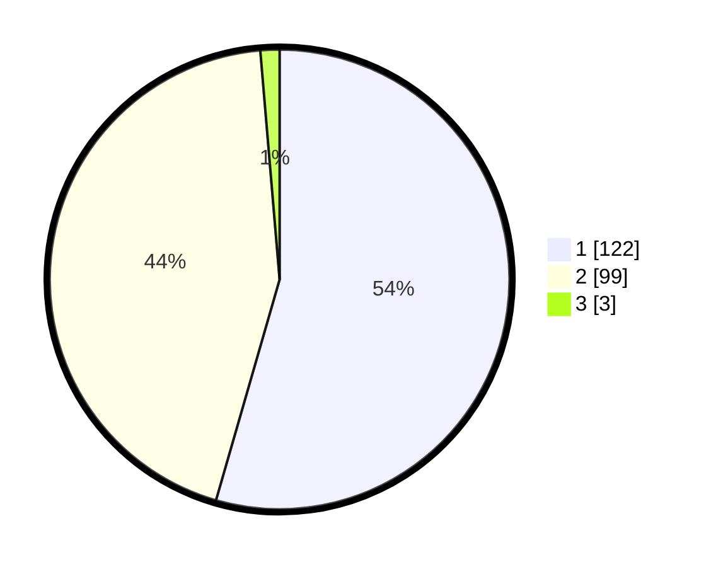

# Hasil

## Grafik

## Tabel

| No. | Nama Paslon    | Suara | Suara (raw) | Persentase |
|:--- |:-------------- | -----:| -----------:| ----------:|
| 1   | ANIES MUHAIMIN | 122   | [122][p-1]  | 54,46      |
| 2   | PRABOWO GIBRAN | 99    | [99][p-2]   | 44,20      |
| 3   | GANJAR MAHFUD  | 3     | [3][p-3]    | 1,34       |

[p-1]: https://github.com/gigit-pemilu/pemilu-2024-35-jawa-timur/blob/main/pilpres/hitung-suara/sub/35-jawa-timur/sub/13-probolinggo/sub/21-sumberasih/sub/2013-gili-ketapang/sub/007-tps/sub/paslon-1.txt
[p-2]: https://github.com/gigit-pemilu/pemilu-2024-35-jawa-timur/blob/main/pilpres/hitung-suara/sub/35-jawa-timur/sub/13-probolinggo/sub/21-sumberasih/sub/2013-gili-ketapang/sub/007-tps/sub/paslon-2.txt
[p-3]: https://github.com/gigit-pemilu/pemilu-2024-35-jawa-timur/blob/main/pilpres/hitung-suara/sub/35-jawa-timur/sub/13-probolinggo/sub/21-sumberasih/sub/2013-gili-ketapang/sub/007-tps/sub/paslon-3.txt

## Foto C Plano

https://sirekap-obj-formc.kpu.go.id/ff36/pemilu/ppwp/35/13/21/20/13/3513212013007-20240215-030145--4255519d-57f5-4118-89d6-39ac64178352.jpg

https://sirekap-obj-formc.kpu.go.id/ff36/pemilu/ppwp/35/13/21/20/13/3513212013007-20240215-030509--60f01b4f-8f77-4c1c-bde5-9fcc6fd38980.jpg

https://sirekap-obj-formc.kpu.go.id/ff36/pemilu/ppwp/35/13/21/20/13/3513212013007-20240215-030712--4213edb8-3403-4d00-9714-2284eb9d8f52.jpg

## Metadata

| Key        | Value               |
| ---------- | ------------------- |
| Time Stamp | 2024-02-25 15:00:00 |

