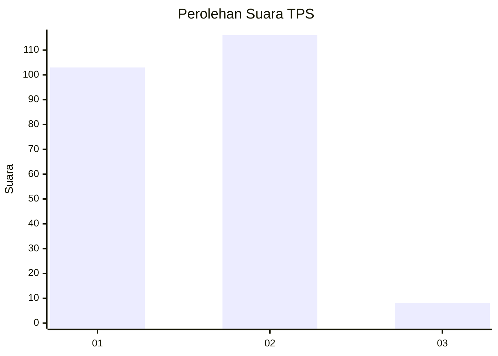
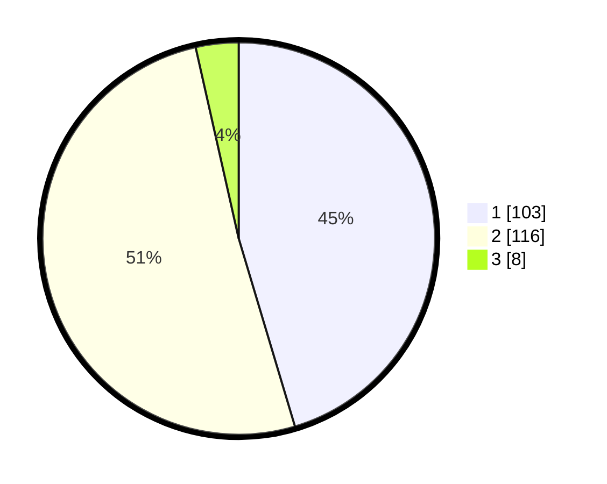

# Hasil

## Grafik

## Tabel

| No. | Nama Paslon    | Suara | Suara (raw) | Persentase |
|:--- |:-------------- | -----:| -----------:| ----------:|
| 1   | ANIES MUHAIMIN | 103   | [103][p-1]  | 45,37      |
| 2   | PRABOWO GIBRAN | 116   | [116][p-2]  | 51,10      |
| 3   | GANJAR MAHFUD  | 8     | [8][p-3]    | 3,52       |

[p-1]: https://github.com/gigit-pemilu/pemilu-2024-35-jawa-timur/blob/main/pilpres/hitung-suara/sub/35-jawa-timur/sub/13-probolinggo/sub/21-sumberasih/sub/2013-gili-ketapang/sub/019-tps/sub/paslon-1.txt
[p-2]: https://github.com/gigit-pemilu/pemilu-2024-35-jawa-timur/blob/main/pilpres/hitung-suara/sub/35-jawa-timur/sub/13-probolinggo/sub/21-sumberasih/sub/2013-gili-ketapang/sub/019-tps/sub/paslon-2.txt
[p-3]: https://github.com/gigit-pemilu/pemilu-2024-35-jawa-timur/blob/main/pilpres/hitung-suara/sub/35-jawa-timur/sub/13-probolinggo/sub/21-sumberasih/sub/2013-gili-ketapang/sub/019-tps/sub/paslon-3.txt

## Foto C Plano

https://sirekap-obj-formc.kpu.go.id/b35e/pemilu/ppwp/35/13/21/20/13/3513212013019-20240215-041636--108e866d-bef8-45c2-8b12-676492d3f792.jpg

https://sirekap-obj-formc.kpu.go.id/b35e/pemilu/ppwp/35/13/21/20/13/3513212013019-20240215-042225--3cba99f0-12f7-42e3-ac27-d52191eeeda3.jpg

https://sirekap-obj-formc.kpu.go.id/b35e/pemilu/ppwp/35/13/21/20/13/3513212013019-20240215-042334--c1f8f6e0-8101-4df2-863f-9220e8c65456.jpg

## Metadata

| Key        | Value               |
| ---------- | ------------------- |
| Time Stamp | 2024-02-24 22:31:28 |

