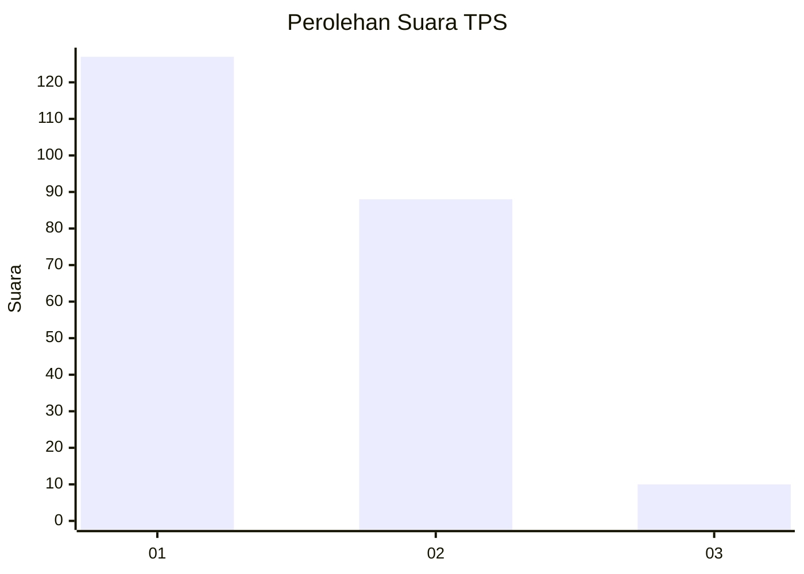
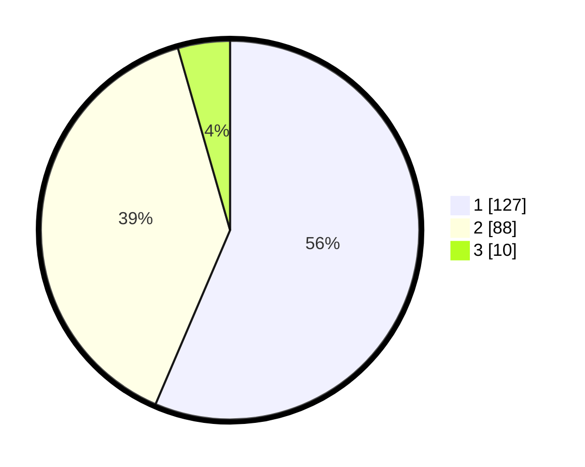

# Hasil

## Grafik

## Tabel

| No. | Nama Paslon    | Suara | Suara (raw) | Persentase |
|:--- |:-------------- | -----:| -----------:| ----------:|
| 1   | ANIES MUHAIMIN | 127   | [127][p-1]  | 56,44      |
| 2   | PRABOWO GIBRAN | 88    | [88][p-2]   | 39,11      |
| 3   | GANJAR MAHFUD  | 10    | [10][p-3]   | 4,44       |

[p-1]: https://github.com/gigit-pemilu/pemilu-2024-35-jawa-timur/blob/main/pilpres/hitung-suara/sub/35-jawa-timur/sub/13-probolinggo/sub/21-sumberasih/sub/2013-gili-ketapang/sub/022-tps/sub/paslon-1.txt
[p-2]: https://github.com/gigit-pemilu/pemilu-2024-35-jawa-timur/blob/main/pilpres/hitung-suara/sub/35-jawa-timur/sub/13-probolinggo/sub/21-sumberasih/sub/2013-gili-ketapang/sub/022-tps/sub/paslon-2.txt
[p-3]: https://github.com/gigit-pemilu/pemilu-2024-35-jawa-timur/blob/main/pilpres/hitung-suara/sub/35-jawa-timur/sub/13-probolinggo/sub/21-sumberasih/sub/2013-gili-ketapang/sub/022-tps/sub/paslon-3.txt

## Foto C Plano

https://sirekap-obj-formc.kpu.go.id/8a8e/pemilu/ppwp/35/13/21/20/13/3513212013022-20240214-233732--7f0fffe3-2a14-45ef-82b5-dede89576bea.jpg

https://sirekap-obj-formc.kpu.go.id/8a8e/pemilu/ppwp/35/13/21/20/13/3513212013022-20240214-233856--6aba26ef-4c37-4a97-b720-a385a76c2f06.jpg

https://sirekap-obj-formc.kpu.go.id/8a8e/pemilu/ppwp/35/13/21/20/13/3513212013022-20240214-234022--c298f19d-2ca9-4637-8cb5-c1c26b011bd5.jpg

## Metadata

| Key        | Value               |
| ---------- | ------------------- |
| Time Stamp | 2024-03-01 22:00:00 |

