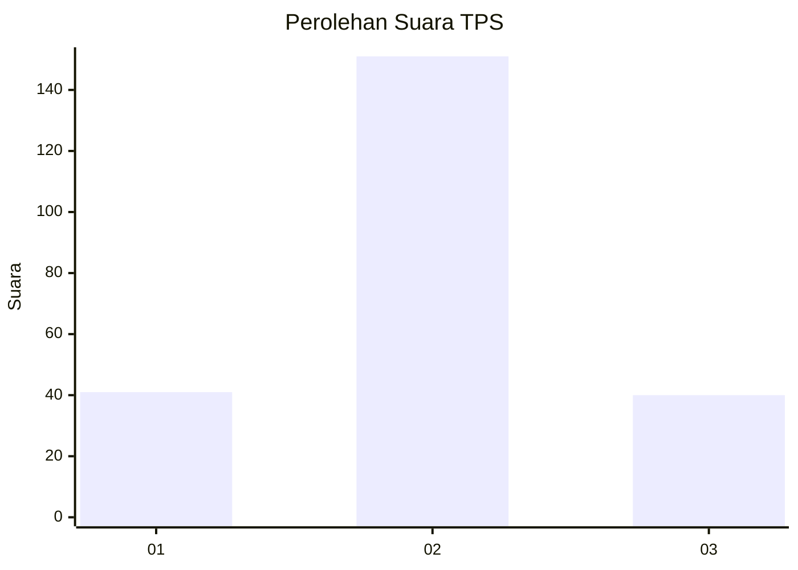
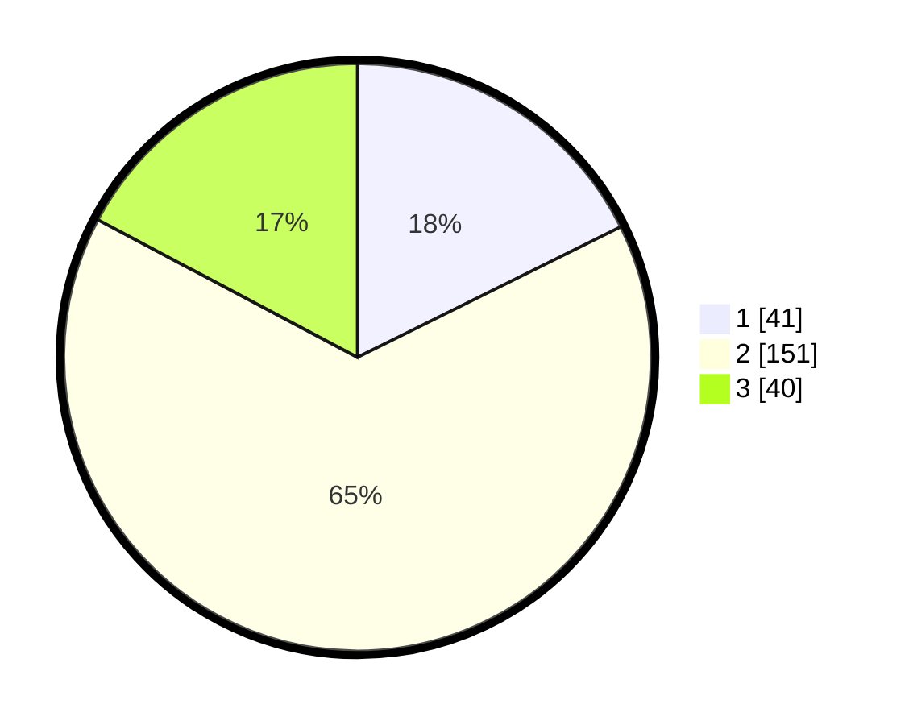

# Hasil

## Grafik

## Tabel

| No. | Nama Paslon    | Suara | Suara (raw) | Persentase |
|:--- |:-------------- | -----:| -----------:| ----------:|
| 1   | ANIES MUHAIMIN | 41    | [41][p-1]   | 17,67      |
| 2   | PRABOWO GIBRAN | 151   | [151][p-2]  | 65,09      |
| 3   | GANJAR MAHFUD  | 40    | [40][p-3]   | 17,24      |

[p-1]: https://github.com/gigit-pemilu/pemilu-2024-35-jawa-timur/blob/main/pilpres/hitung-suara/sub/35-jawa-timur/sub/13-probolinggo/sub/22-wonomerto/sub/2001-sumberkare/sub/001-tps/sub/paslon-1.txt
[p-2]: https://github.com/gigit-pemilu/pemilu-2024-35-jawa-timur/blob/main/pilpres/hitung-suara/sub/35-jawa-timur/sub/13-probolinggo/sub/22-wonomerto/sub/2001-sumberkare/sub/001-tps/sub/paslon-2.txt
[p-3]: https://github.com/gigit-pemilu/pemilu-2024-35-jawa-timur/blob/main/pilpres/hitung-suara/sub/35-jawa-timur/sub/13-probolinggo/sub/22-wonomerto/sub/2001-sumberkare/sub/001-tps/sub/paslon-3.txt

## Foto C Plano

https://sirekap-obj-formc.kpu.go.id/a1c0/pemilu/ppwp/35/13/22/20/01/3513222001001-20240215-094240--d5974553-742c-419a-9c73-a689713d0040.jpg

https://sirekap-obj-formc.kpu.go.id/a1c0/pemilu/ppwp/35/13/22/20/01/3513222001001-20240215-110431--0026f2a2-cc73-44c8-9c5e-30e06fab1624.jpg

https://sirekap-obj-formc.kpu.go.id/a1c0/pemilu/ppwp/35/13/22/20/01/3513222001001-20240215-110827--f6d4014f-405f-4382-b84f-dbcc354fc527.jpg

## Metadata

| Key        | Value               |
| ---------- | ------------------- |
| Time Stamp | 2024-02-15 19:00:26 |

