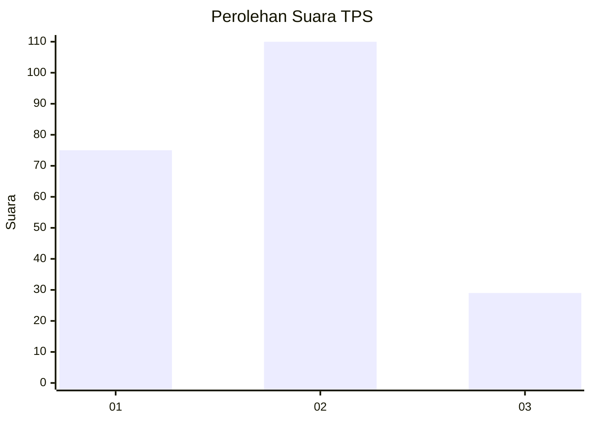
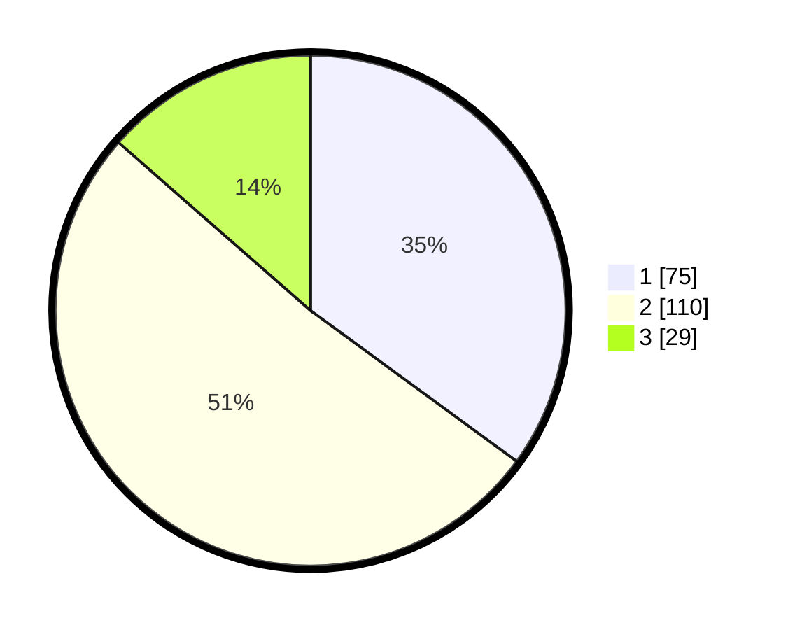

# Hasil

## Grafik

## Tabel

| No. | Nama Paslon    | Suara | Suara (raw) | Persentase |
|:--- |:-------------- | -----:| -----------:| ----------:|
| 1   | ANIES MUHAIMIN | 75    | [75][p-1]   | 35,05      |
| 2   | PRABOWO GIBRAN | 110   | [110][p-2]  | 51,40      |
| 3   | GANJAR MAHFUD  | 29    | [29][p-3]   | 13,55      |

[p-1]: https://github.com/gigit-pemilu/pemilu-2024-35-jawa-timur/blob/main/pilpres/hitung-suara/sub/35-jawa-timur/sub/13-probolinggo/sub/22-wonomerto/sub/2001-sumberkare/sub/002-tps/sub/paslon-1.txt
[p-2]: https://github.com/gigit-pemilu/pemilu-2024-35-jawa-timur/blob/main/pilpres/hitung-suara/sub/35-jawa-timur/sub/13-probolinggo/sub/22-wonomerto/sub/2001-sumberkare/sub/002-tps/sub/paslon-2.txt
[p-3]: https://github.com/gigit-pemilu/pemilu-2024-35-jawa-timur/blob/main/pilpres/hitung-suara/sub/35-jawa-timur/sub/13-probolinggo/sub/22-wonomerto/sub/2001-sumberkare/sub/002-tps/sub/paslon-3.txt

## Foto C Plano

https://sirekap-obj-formc.kpu.go.id/7a2f/pemilu/ppwp/35/13/22/20/01/3513222001002-20240215-124340--a6d30f6b-0216-4ed1-9a4a-95168fb2c71c.jpg

https://sirekap-obj-formc.kpu.go.id/7a2f/pemilu/ppwp/35/13/22/20/01/3513222001002-20240215-124423--6d3238a3-ae42-4c4a-a454-ffc0f344882f.jpg

https://sirekap-obj-formc.kpu.go.id/7a2f/pemilu/ppwp/35/13/22/20/01/3513222001002-20240215-124434--5766d1d1-ea9e-4c70-a294-7ab42f7c127e.jpg

## Metadata

| Key        | Value               |
| ---------- | ------------------- |
| Time Stamp | 2024-02-24 22:31:28 |

