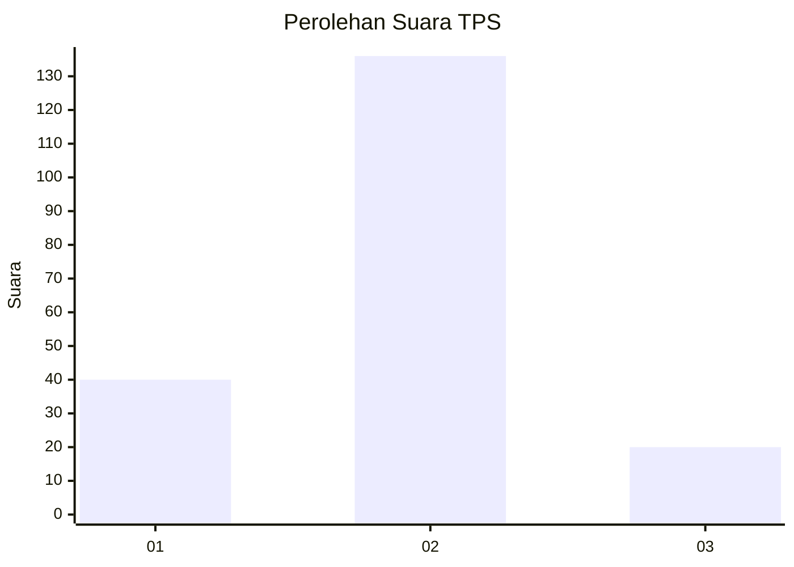

# Hasil

## Grafik

## Tabel

| No. | Nama Paslon    | Suara | Suara (raw) | Persentase |
|:--- |:-------------- | -----:| -----------:| ----------:|
| 1   | ANIES MUHAIMIN | 40    | [40][p-1]   | 20,41      |
| 2   | PRABOWO GIBRAN | 136   | [136][p-2]  | 69,39      |
| 3   | GANJAR MAHFUD  | 20    | [20][p-3]   | 10,20      |

[p-1]: https://github.com/gigit-pemilu/pemilu-2024/blob/main/pilpres/hitung-suara/sub/35-jawa-timur/sub/13-probolinggo/sub/22-wonomerto/sub/2001-sumberkare/sub/003-tps/sub/paslon-1.txt
[p-2]: https://github.com/gigit-pemilu/pemilu-2024/blob/main/pilpres/hitung-suara/sub/35-jawa-timur/sub/13-probolinggo/sub/22-wonomerto/sub/2001-sumberkare/sub/003-tps/sub/paslon-2.txt
[p-3]: https://github.com/gigit-pemilu/pemilu-2024/blob/main/pilpres/hitung-suara/sub/35-jawa-timur/sub/13-probolinggo/sub/22-wonomerto/sub/2001-sumberkare/sub/003-tps/sub/paslon-3.txt

## Foto C Plano

https://sirekap-obj-formc.kpu.go.id/5105/pemilu/ppwp/35/13/22/20/01/3513222001003-20240215-114526--d26e4e92-6a3c-46a3-a586-e4ea9785e152.jpg

https://sirekap-obj-formc.kpu.go.id/5105/pemilu/ppwp/35/13/22/20/01/3513222001003-20240215-114623--0fe762a4-5fe0-4f01-ad15-163afef6b765.jpg

https://sirekap-obj-formc.kpu.go.id/5105/pemilu/ppwp/35/13/22/20/01/3513222001003-20240215-114653--3c6e2cfb-b3b6-4ecb-b44c-3d65d2069172.jpg

## Metadata

| Key        | Value               |
| ---------- | ------------------- |
| Time Stamp | 2024-02-24 22:31:28 |

