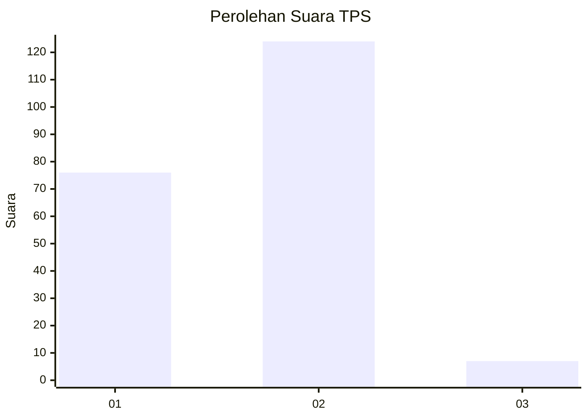
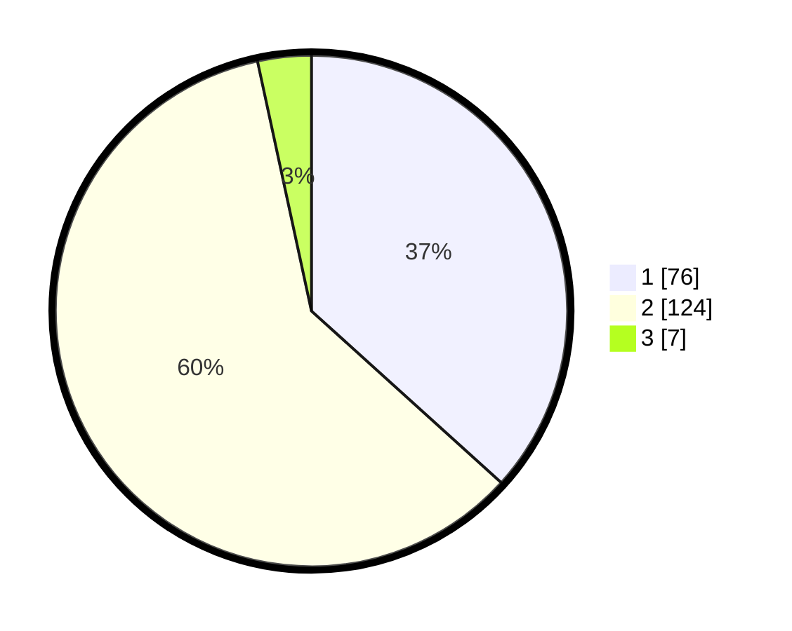

# Hasil

## Grafik

## Tabel

| No. | Nama Paslon    | Suara | Suara (raw) | Persentase |
|:--- |:-------------- | -----:| -----------:| ----------:|
| 1   | ANIES MUHAIMIN | 76    | [76][p-1]   | 36,71      |
| 2   | PRABOWO GIBRAN | 124   | [124][p-2]  | 59,90      |
| 3   | GANJAR MAHFUD  | 7     | [7][p-3]    | 3,38       |

[p-1]: https://github.com/gigit-pemilu/pemilu-2024/blob/main/pilpres/hitung-suara/sub/35-jawa-timur/sub/13-probolinggo/sub/22-wonomerto/sub/2001-sumberkare/sub/005-tps/sub/paslon-1.txt
[p-2]: https://github.com/gigit-pemilu/pemilu-2024/blob/main/pilpres/hitung-suara/sub/35-jawa-timur/sub/13-probolinggo/sub/22-wonomerto/sub/2001-sumberkare/sub/005-tps/sub/paslon-2.txt
[p-3]: https://github.com/gigit-pemilu/pemilu-2024/blob/main/pilpres/hitung-suara/sub/35-jawa-timur/sub/13-probolinggo/sub/22-wonomerto/sub/2001-sumberkare/sub/005-tps/sub/paslon-3.txt

## Foto C Plano

https://sirekap-obj-formc.kpu.go.id/56aa/pemilu/ppwp/35/13/22/20/01/3513222001005-20240215-200344--147ff024-8c6a-4892-9691-9d9a7cd67629.jpg

https://sirekap-obj-formc.kpu.go.id/56aa/pemilu/ppwp/35/13/22/20/01/3513222001005-20240215-200637--c0c629b3-f1a0-4a88-9df6-bb72baed1ec5.jpg

https://sirekap-obj-formc.kpu.go.id/56aa/pemilu/ppwp/35/13/22/20/01/3513222001005-20240215-200724--130eba87-2f8d-4635-a4b4-48ef84ca3850.jpg

## Metadata

| Key        | Value               |
| ---------- | ------------------- |
| Time Stamp | 2024-02-25 14:00:00 |

