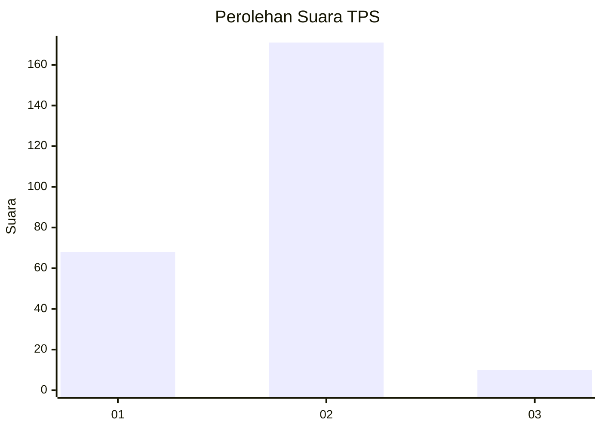
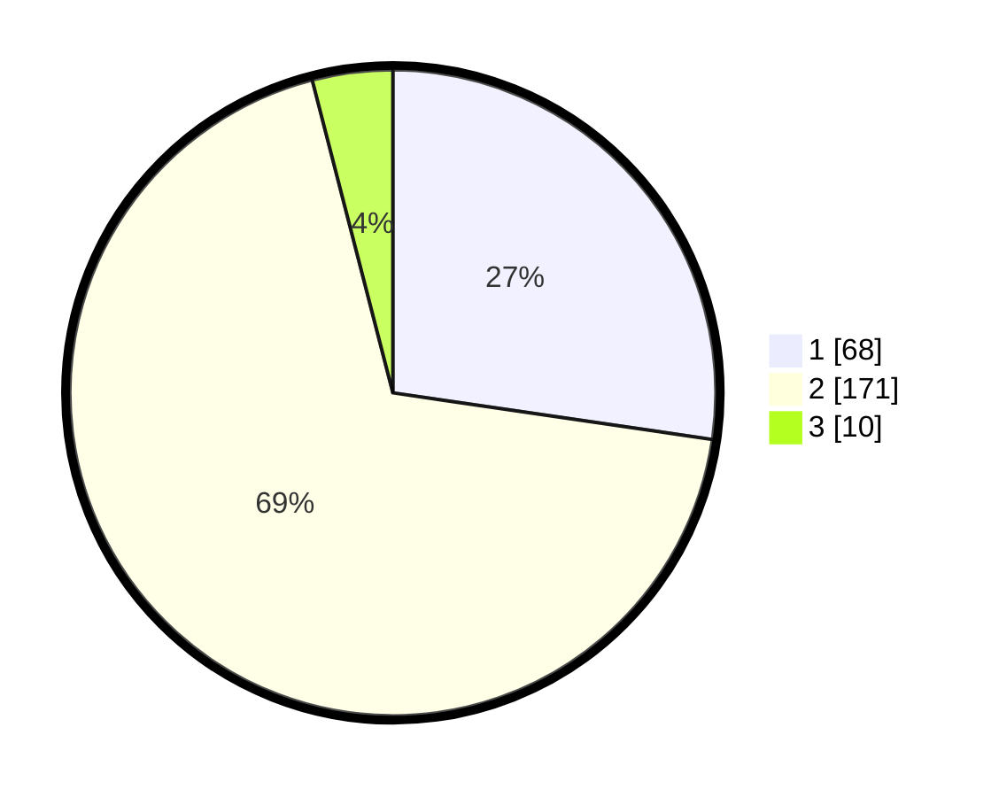

# Hasil

## Grafik

## Tabel

| No. | Nama Paslon    | Suara | Suara (raw) | Persentase |
|:--- |:-------------- | -----:| -----------:| ----------:|
| 1   | ANIES MUHAIMIN | 68    | [68][p-1]   | 27,31      |
| 2   | PRABOWO GIBRAN | 171   | [171][p-2]  | 68,67      |
| 3   | GANJAR MAHFUD  | 10    | [10][p-3]   | 4,02       |

[p-1]: https://github.com/gigit-pemilu/pemilu-2024/blob/main/pilpres/hitung-suara/sub/35-jawa-timur/sub/13-probolinggo/sub/22-wonomerto/sub/2002-patalan/sub/004-tps/sub/paslon-1.txt
[p-2]: https://github.com/gigit-pemilu/pemilu-2024/blob/main/pilpres/hitung-suara/sub/35-jawa-timur/sub/13-probolinggo/sub/22-wonomerto/sub/2002-patalan/sub/004-tps/sub/paslon-2.txt
[p-3]: https://github.com/gigit-pemilu/pemilu-2024/blob/main/pilpres/hitung-suara/sub/35-jawa-timur/sub/13-probolinggo/sub/22-wonomerto/sub/2002-patalan/sub/004-tps/sub/paslon-3.txt

## Foto C Plano

https://sirekap-obj-formc.kpu.go.id/6aa8/pemilu/ppwp/35/13/22/20/02/3513222002004-20240215-110736--4147ffcd-48d4-4735-9220-aec8eadbebbc.jpg

https://sirekap-obj-formc.kpu.go.id/6aa8/pemilu/ppwp/35/13/22/20/02/3513222002004-20240214-221338--c5d01721-6a38-44fa-828f-2868a7b99ebe.jpg

https://sirekap-obj-formc.kpu.go.id/6aa8/pemilu/ppwp/35/13/22/20/02/3513222002004-20240215-111100--12ed12fa-f9b5-4876-ad08-4212aa751e6e.jpg

## Metadata

| Key        | Value               |
| ---------- | ------------------- |
| Time Stamp | 2024-02-24 22:31:28 |

