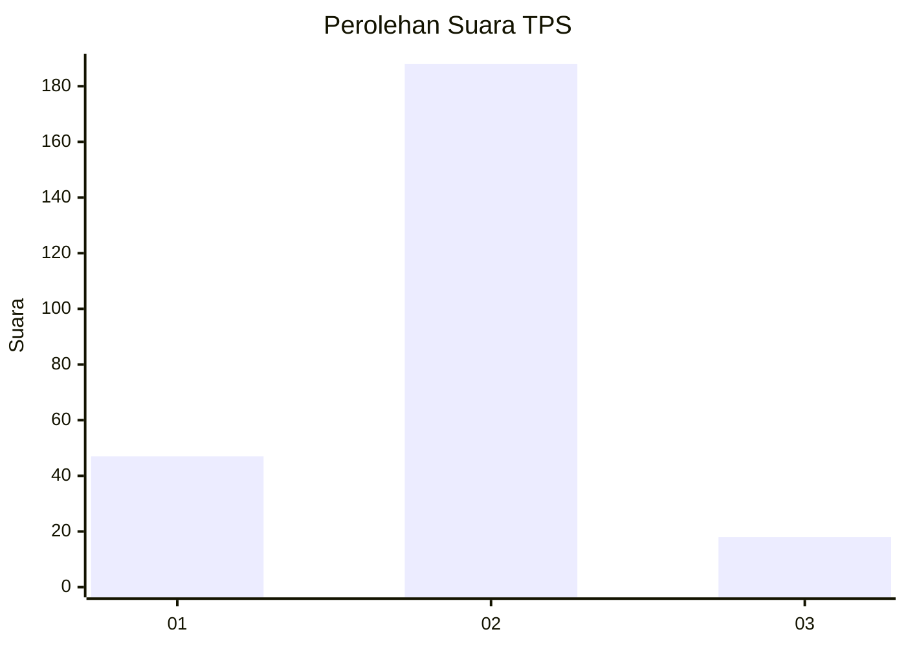
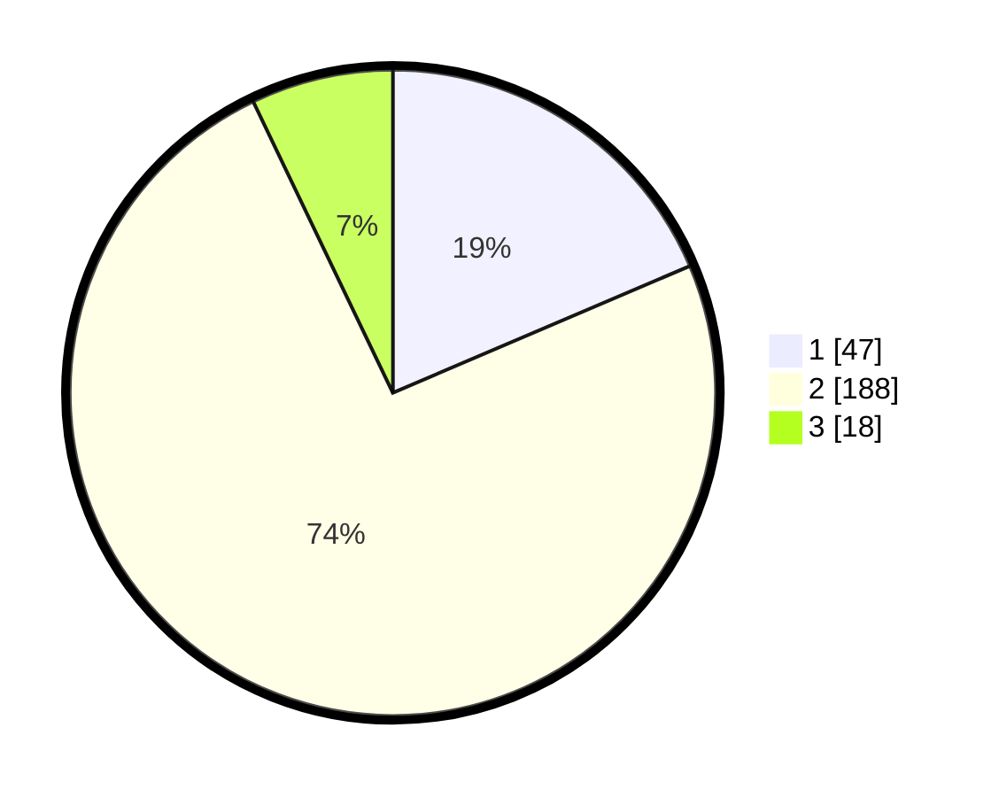

# Hasil

## Grafik

## Tabel

| No. | Nama Paslon    | Suara | Suara (raw) | Persentase |
|:--- |:-------------- | -----:| -----------:| ----------:|
| 1   | ANIES MUHAIMIN | 47    | [47][p-1]   | 18,58      |
| 2   | PRABOWO GIBRAN | 188   | [188][p-2]  | 74,31      |
| 3   | GANJAR MAHFUD  | 18    | [18][p-3]   | 7,11       |

[p-1]: https://github.com/gigit-pemilu/pemilu-2024-35-jawa-timur/blob/main/pilpres/hitung-suara/sub/35-jawa-timur/sub/13-probolinggo/sub/22-wonomerto/sub/2002-patalan/sub/005-tps/sub/paslon-1.txt
[p-2]: https://github.com/gigit-pemilu/pemilu-2024-35-jawa-timur/blob/main/pilpres/hitung-suara/sub/35-jawa-timur/sub/13-probolinggo/sub/22-wonomerto/sub/2002-patalan/sub/005-tps/sub/paslon-2.txt
[p-3]: https://github.com/gigit-pemilu/pemilu-2024-35-jawa-timur/blob/main/pilpres/hitung-suara/sub/35-jawa-timur/sub/13-probolinggo/sub/22-wonomerto/sub/2002-patalan/sub/005-tps/sub/paslon-3.txt

## Foto C Plano

https://sirekap-obj-formc.kpu.go.id/6ca5/pemilu/ppwp/35/13/22/20/02/3513222002005-20240214-220721--c1b6a0e4-ba55-47d1-90e8-be2af8685857.jpg

https://sirekap-obj-formc.kpu.go.id/6ca5/pemilu/ppwp/35/13/22/20/02/3513222002005-20240214-220852--7dda2870-8543-4ced-99ff-bc27962eb182.jpg

https://sirekap-obj-formc.kpu.go.id/6ca5/pemilu/ppwp/35/13/22/20/02/3513222002005-20240214-221007--86ef078d-abbd-4320-8172-693122479a85.jpg

## Metadata

| Key        | Value               |
| ---------- | ------------------- |
| Time Stamp | 2024-02-25 14:00:00 |

