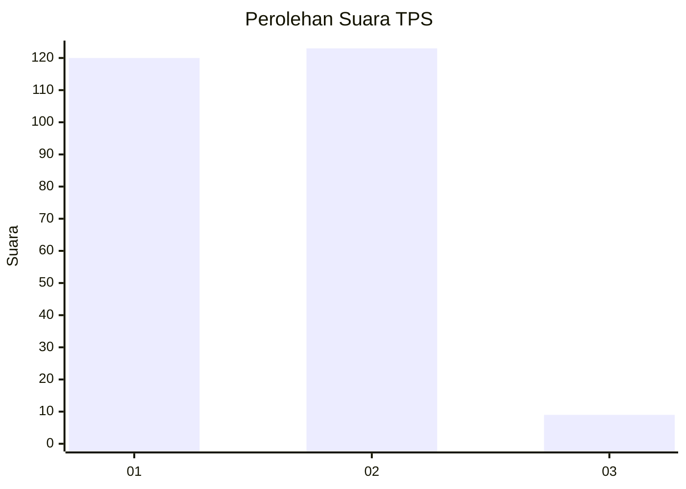
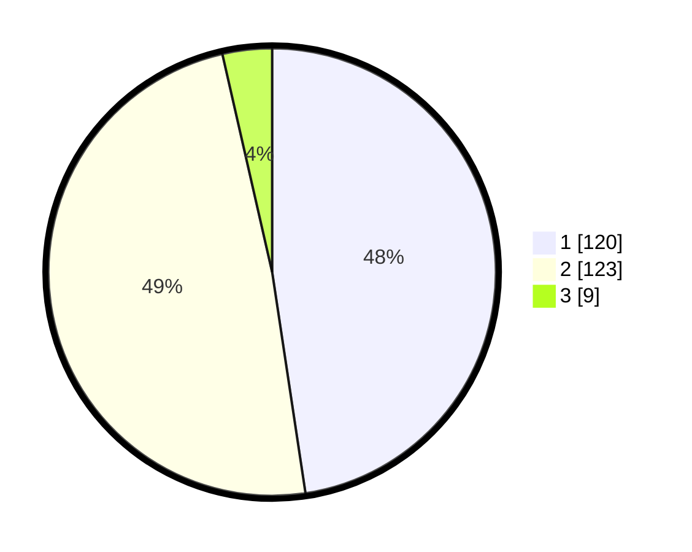

# Hasil

## Grafik

## Tabel

| No. | Nama Paslon    | Suara | Suara (raw) | Persentase |
|:--- |:-------------- | -----:| -----------:| ----------:|
| 1   | ANIES MUHAIMIN | 120   | [120][p-1]  | 47,62      |
| 2   | PRABOWO GIBRAN | 123   | [123][p-2]  | 48,81      |
| 3   | GANJAR MAHFUD  | 9     | [9][p-3]    | 3,57       |

[p-1]: https://github.com/gigit-pemilu/pemilu-2024-35-jawa-timur/blob/main/pilpres/hitung-suara/sub/35-jawa-timur/sub/13-probolinggo/sub/22-wonomerto/sub/2002-patalan/sub/009-tps/sub/paslon-1.txt
[p-2]: https://github.com/gigit-pemilu/pemilu-2024-35-jawa-timur/blob/main/pilpres/hitung-suara/sub/35-jawa-timur/sub/13-probolinggo/sub/22-wonomerto/sub/2002-patalan/sub/009-tps/sub/paslon-2.txt
[p-3]: https://github.com/gigit-pemilu/pemilu-2024-35-jawa-timur/blob/main/pilpres/hitung-suara/sub/35-jawa-timur/sub/13-probolinggo/sub/22-wonomerto/sub/2002-patalan/sub/009-tps/sub/paslon-3.txt

## Foto C Plano

https://sirekap-obj-formc.kpu.go.id/40fe/pemilu/ppwp/35/13/22/20/02/3513222002009-20240214-224606--c71b0cab-97f0-4230-b2c5-b154cfb9448f.jpg

https://sirekap-obj-formc.kpu.go.id/40fe/pemilu/ppwp/35/13/22/20/02/3513222002009-20240214-224652--071d992f-e0b0-430a-8607-79ddf6e6696e.jpg

https://sirekap-obj-formc.kpu.go.id/40fe/pemilu/ppwp/35/13/22/20/02/3513222002009-20240214-210814--0d82c4d1-eae0-432e-9320-409b57e57c78.jpg

## Metadata

| Key        | Value               |
| ---------- | ------------------- |
| Time Stamp | 2024-02-25 17:00:00 |

