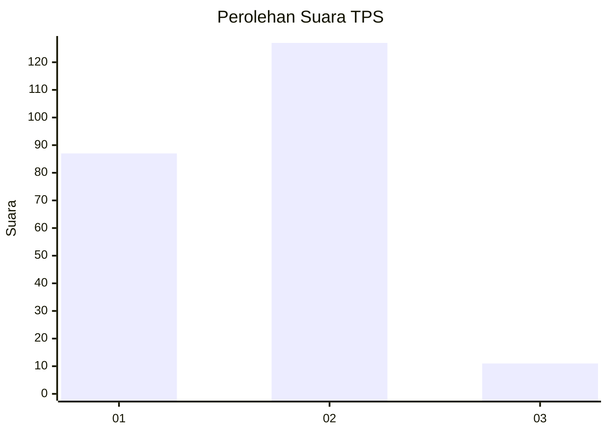
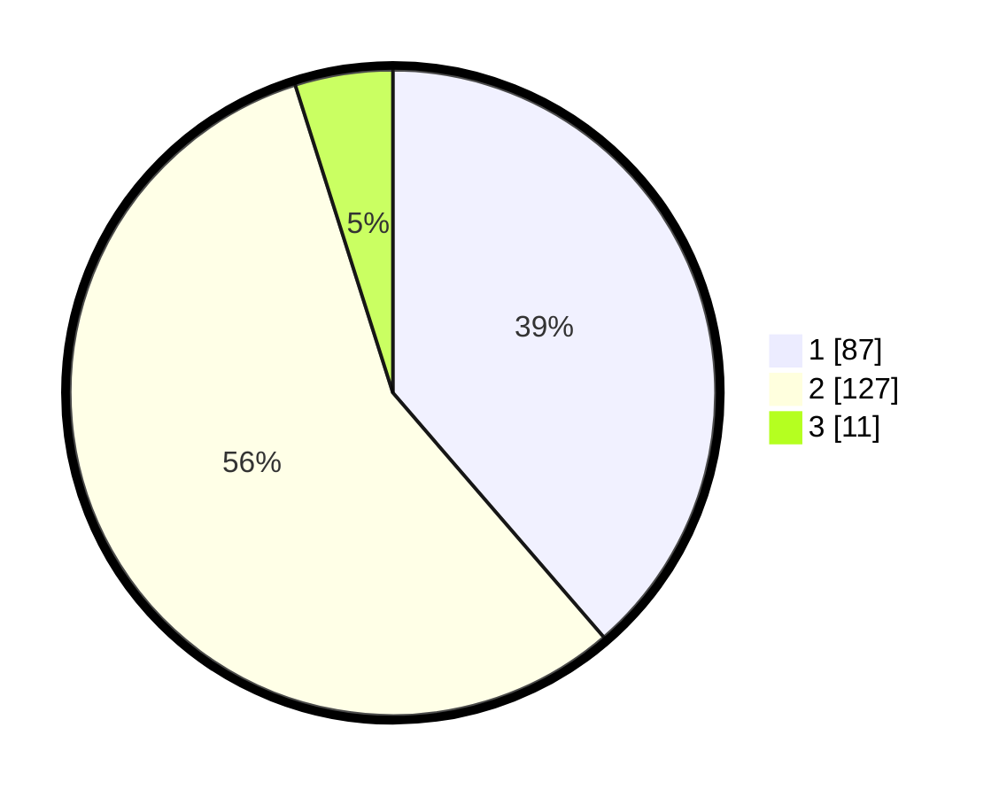

# Hasil

## Grafik

## Tabel

| No. | Nama Paslon    | Suara | Suara (raw) | Persentase |
|:--- |:-------------- | -----:| -----------:| ----------:|
| 1   | ANIES MUHAIMIN | 87    | [87][p-1]   | 38,67      |
| 2   | PRABOWO GIBRAN | 127   | [127][p-2]  | 56,44      |
| 3   | GANJAR MAHFUD  | 11    | [11][p-3]   | 4,89       |

[p-1]: https://github.com/gigit-pemilu/pemilu-2024-35-jawa-timur/blob/main/pilpres/hitung-suara/sub/35-jawa-timur/sub/13-probolinggo/sub/22-wonomerto/sub/2002-patalan/sub/012-tps/sub/paslon-1.txt
[p-2]: https://github.com/gigit-pemilu/pemilu-2024-35-jawa-timur/blob/main/pilpres/hitung-suara/sub/35-jawa-timur/sub/13-probolinggo/sub/22-wonomerto/sub/2002-patalan/sub/012-tps/sub/paslon-2.txt
[p-3]: https://github.com/gigit-pemilu/pemilu-2024-35-jawa-timur/blob/main/pilpres/hitung-suara/sub/35-jawa-timur/sub/13-probolinggo/sub/22-wonomerto/sub/2002-patalan/sub/012-tps/sub/paslon-3.txt

## Foto C Plano

https://sirekap-obj-formc.kpu.go.id/9b5c/pemilu/ppwp/35/13/22/20/02/3513222002012-20240217-181005--9aa9dcd5-86c7-4e84-872c-55a0a24032ab.jpg

https://sirekap-obj-formc.kpu.go.id/9b5c/pemilu/ppwp/35/13/22/20/02/3513222002012-20240217-181146--b4c5ce8d-a33c-4a88-83bd-ea4ed8b13571.jpg

https://sirekap-obj-formc.kpu.go.id/9b5c/pemilu/ppwp/35/13/22/20/02/3513222002012-20240217-181429--fc3643cd-460b-4fc2-b301-6089c4b6da46.jpg

## Metadata

| Key        | Value               |
| ---------- | ------------------- |
| Time Stamp | 2024-02-25 15:00:00 |

