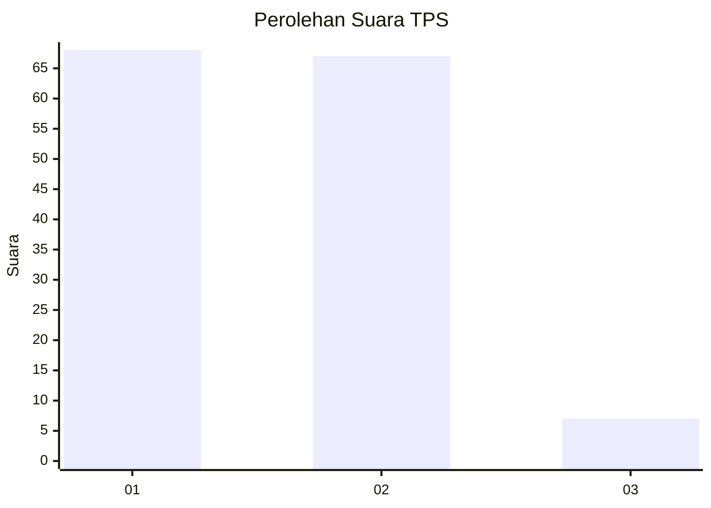
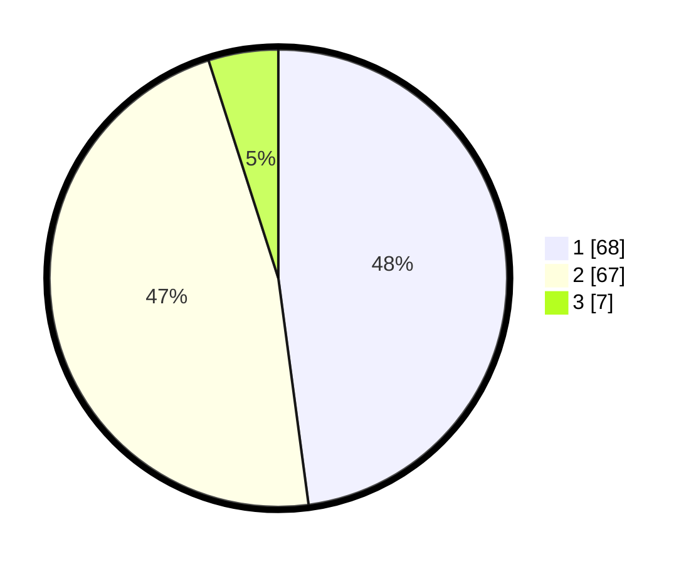

# Hasil

## Grafik

## Tabel

| No. | Nama Paslon    | Suara | Suara (raw) | Persentase |
|:--- |:-------------- | -----:| -----------:| ----------:|
| 1   | ANIES MUHAIMIN | 68    | [68][p-1]   | 47,89      |
| 2   | PRABOWO GIBRAN | 67    | [67][p-2]   | 47,18      |
| 3   | GANJAR MAHFUD  | 7     | [7][p-3]    | 4,93       |

[p-1]: https://github.com/gigit-pemilu/pemilu-2024/blob/main/pilpres/hitung-suara/sub/35-jawa-timur/sub/13-probolinggo/sub/22-wonomerto/sub/2003-jrebeng/sub/003-tps/sub/paslon-1.txt
[p-2]: https://github.com/gigit-pemilu/pemilu-2024/blob/main/pilpres/hitung-suara/sub/35-jawa-timur/sub/13-probolinggo/sub/22-wonomerto/sub/2003-jrebeng/sub/003-tps/sub/paslon-2.txt
[p-3]: https://github.com/gigit-pemilu/pemilu-2024/blob/main/pilpres/hitung-suara/sub/35-jawa-timur/sub/13-probolinggo/sub/22-wonomerto/sub/2003-jrebeng/sub/003-tps/sub/paslon-3.txt

## Foto C Plano

https://sirekap-obj-formc.kpu.go.id/257c/pemilu/ppwp/35/13/22/20/03/3513222003003-20240215-164852--06d581aa-9d6a-44d2-93f2-aa721634ebf2.jpg

https://sirekap-obj-formc.kpu.go.id/257c/pemilu/ppwp/35/13/22/20/03/3513222003003-20240214-214502--b8e11304-5670-4e0c-ae16-41d4dbc7ff96.jpg

https://sirekap-obj-formc.kpu.go.id/257c/pemilu/ppwp/35/13/22/20/03/3513222003003-20240214-214619--74420f27-e6cd-460a-9fed-81e2a67823ef.jpg

## Metadata

| Key        | Value               |
| ---------- | ------------------- |
| Time Stamp | 2024-02-26 13:00:00 |

