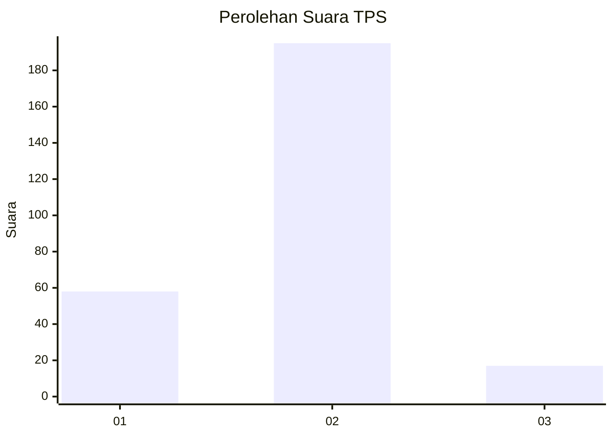

# Hasil

## Grafik

## Tabel

| No. | Nama Paslon    | Suara | Suara (raw) | Persentase |
|:--- |:-------------- | -----:| -----------:| ----------:|
| 1   | ANIES MUHAIMIN | 58    | [58][p-1]   | 21,48      |
| 2   | PRABOWO GIBRAN | 195   | [195][p-2]  | 72,22      |
| 3   | GANJAR MAHFUD  | 17    | [17][p-3]   | 6,30       |

[p-1]: https://github.com/gigit-pemilu/pemilu-2024/blob/main/pilpres/hitung-suara/sub/35-jawa-timur/sub/13-probolinggo/sub/22-wonomerto/sub/2003-jrebeng/sub/004-tps/sub/paslon-1.txt
[p-2]: https://github.com/gigit-pemilu/pemilu-2024/blob/main/pilpres/hitung-suara/sub/35-jawa-timur/sub/13-probolinggo/sub/22-wonomerto/sub/2003-jrebeng/sub/004-tps/sub/paslon-2.txt
[p-3]: https://github.com/gigit-pemilu/pemilu-2024/blob/main/pilpres/hitung-suara/sub/35-jawa-timur/sub/13-probolinggo/sub/22-wonomerto/sub/2003-jrebeng/sub/004-tps/sub/paslon-3.txt

## Foto C Plano

https://sirekap-obj-formc.kpu.go.id/04ee/pemilu/ppwp/35/13/22/20/03/3513222003004-20240215-101211--26201112-ea30-471b-bb40-4985df85479b.jpg

https://sirekap-obj-formc.kpu.go.id/04ee/pemilu/ppwp/35/13/22/20/03/3513222003004-20240215-101452--7650159e-85e1-4398-89ab-2c4dd104418a.jpg

https://sirekap-obj-formc.kpu.go.id/04ee/pemilu/ppwp/35/13/22/20/03/3513222003004-20240214-235552--c6e6b35e-c6dc-46ff-98d2-71d2e4df35ae.jpg

## Metadata

| Key        | Value               |
| ---------- | ------------------- |
| Time Stamp | 2024-02-25 17:00:00 |

