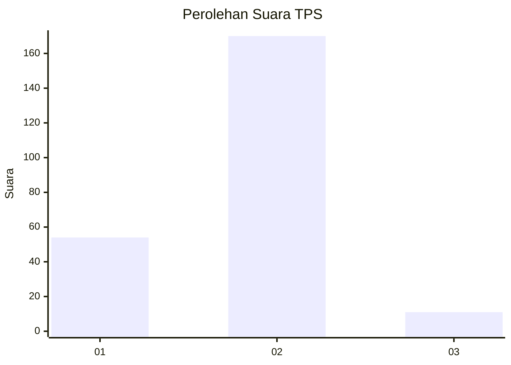
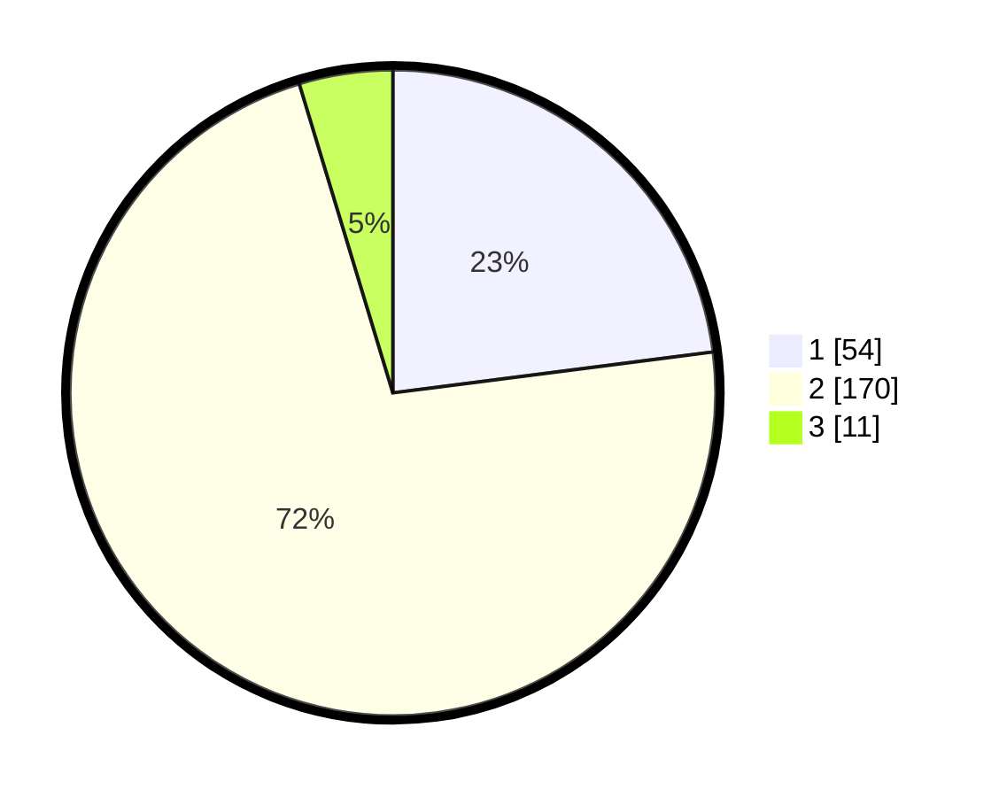

# Hasil

## Grafik

## Tabel

| No. | Nama Paslon    | Suara | Suara (raw) | Persentase |
|:--- |:-------------- | -----:| -----------:| ----------:|
| 1   | ANIES MUHAIMIN | 54    | [54][p-1]   | 22,98      |
| 2   | PRABOWO GIBRAN | 170   | [170][p-2]  | 72,34      |
| 3   | GANJAR MAHFUD  | 11    | [11][p-3]   | 4,68       |

[p-1]: https://github.com/gigit-pemilu/pemilu-2024-35-jawa-timur/blob/main/pilpres/hitung-suara/sub/35-jawa-timur/sub/13-probolinggo/sub/22-wonomerto/sub/2007-pohsangit-lor/sub/001-tps/sub/paslon-1.txt
[p-2]: https://github.com/gigit-pemilu/pemilu-2024-35-jawa-timur/blob/main/pilpres/hitung-suara/sub/35-jawa-timur/sub/13-probolinggo/sub/22-wonomerto/sub/2007-pohsangit-lor/sub/001-tps/sub/paslon-2.txt
[p-3]: https://github.com/gigit-pemilu/pemilu-2024-35-jawa-timur/blob/main/pilpres/hitung-suara/sub/35-jawa-timur/sub/13-probolinggo/sub/22-wonomerto/sub/2007-pohsangit-lor/sub/001-tps/sub/paslon-3.txt

## Foto C Plano

https://sirekap-obj-formc.kpu.go.id/ca1c/pemilu/ppwp/35/13/22/20/07/3513222007001-20240215-200945--54726dbd-6e6e-4ad8-b6a0-91b13e5161b7.jpg

https://sirekap-obj-formc.kpu.go.id/ca1c/pemilu/ppwp/35/13/22/20/07/3513222007001-20240215-201029--b9411687-9cbe-4eef-8844-c3dd8c42e559.jpg

https://sirekap-obj-formc.kpu.go.id/ca1c/pemilu/ppwp/35/13/22/20/07/3513222007001-20240215-201112--ed53a709-b911-46c4-ad5f-3fc29b52f19e.jpg

## Metadata

| Key        | Value               |
| ---------- | ------------------- |
| Time Stamp | 2024-02-24 22:31:28 |

