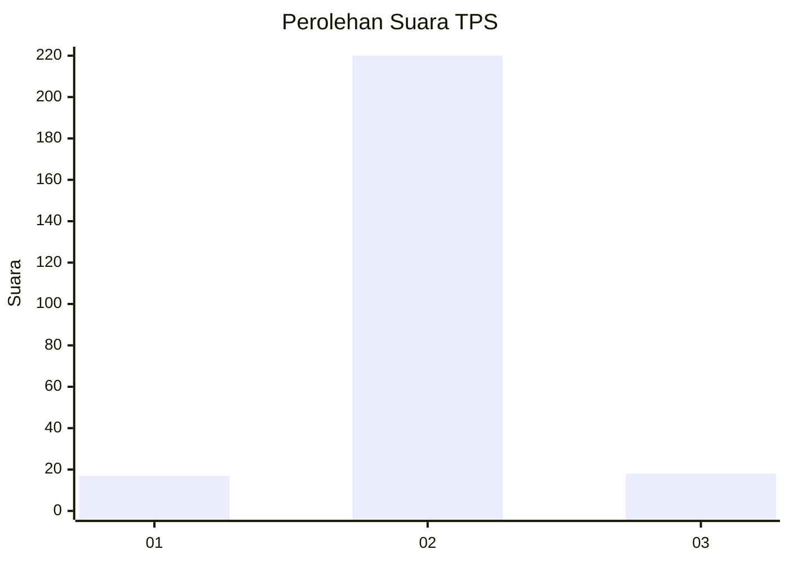
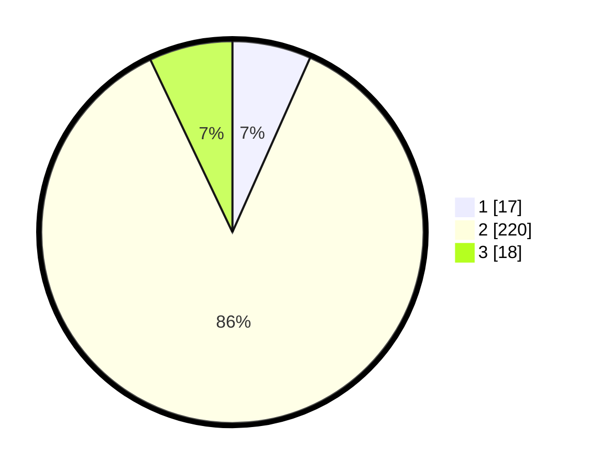

# Hasil

## Grafik

## Tabel

| No. | Nama Paslon    | Suara | Suara (raw) | Persentase |
|:--- |:-------------- | -----:| -----------:| ----------:|
| 1   | ANIES MUHAIMIN | 17    | [17][p-1]   | 6,67       |
| 2   | PRABOWO GIBRAN | 220   | [220][p-2]  | 86,27      |
| 3   | GANJAR MAHFUD  | 18    | [18][p-3]   | 7,06       |

[p-1]: https://github.com/gigit-pemilu/pemilu-2024-35-jawa-timur/blob/main/pilpres/hitung-suara/sub/35-jawa-timur/sub/13-probolinggo/sub/22-wonomerto/sub/2008-pohsangit-ngisor/sub/005-tps/sub/paslon-1.txt
[p-2]: https://github.com/gigit-pemilu/pemilu-2024-35-jawa-timur/blob/main/pilpres/hitung-suara/sub/35-jawa-timur/sub/13-probolinggo/sub/22-wonomerto/sub/2008-pohsangit-ngisor/sub/005-tps/sub/paslon-2.txt
[p-3]: https://github.com/gigit-pemilu/pemilu-2024-35-jawa-timur/blob/main/pilpres/hitung-suara/sub/35-jawa-timur/sub/13-probolinggo/sub/22-wonomerto/sub/2008-pohsangit-ngisor/sub/005-tps/sub/paslon-3.txt

## Foto C Plano

https://sirekap-obj-formc.kpu.go.id/537a/pemilu/ppwp/35/13/22/20/08/3513222008005-20240215-193840--e39c0af8-b616-401c-a53d-487d40b37f40.jpg

https://sirekap-obj-formc.kpu.go.id/537a/pemilu/ppwp/35/13/22/20/08/3513222008005-20240215-193221--cff6a4f5-c565-4c84-a822-8059260d2495.jpg

https://sirekap-obj-formc.kpu.go.id/537a/pemilu/ppwp/35/13/22/20/08/3513222008005-20240215-193314--bf78107d-3a10-46c2-b0ab-958afe85be31.jpg

## Metadata

| Key        | Value               |
| ---------- | ------------------- |
| Time Stamp | 2024-02-24 22:31:28 |

