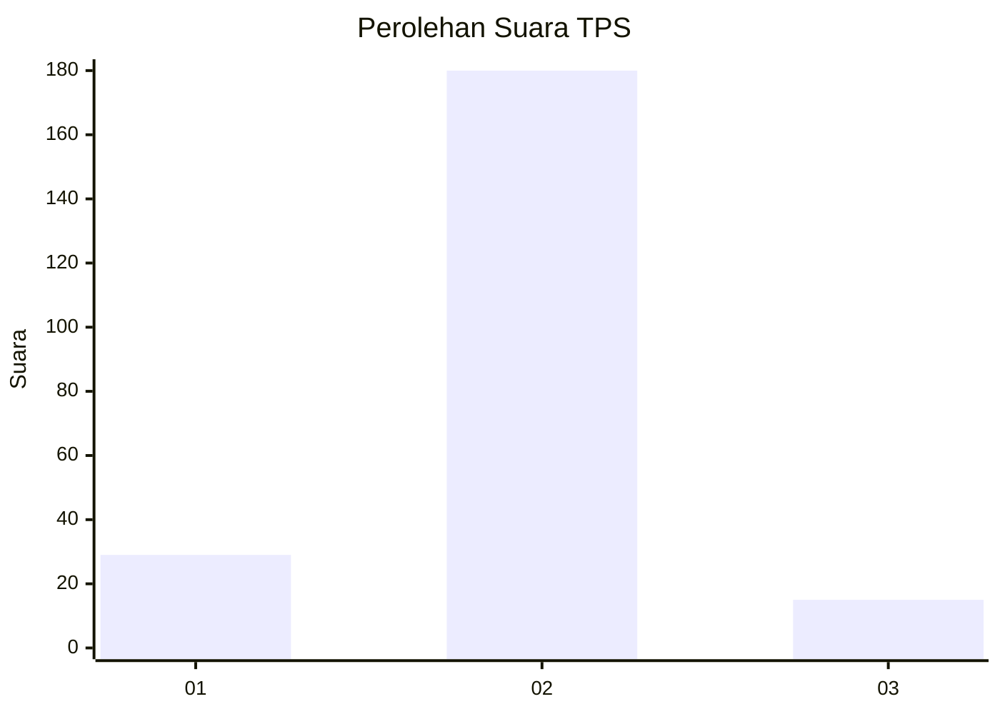
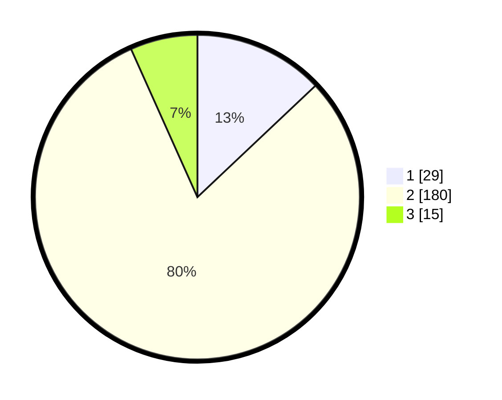

# Hasil

## Grafik

## Tabel

| No. | Nama Paslon    | Suara | Suara (raw) | Persentase |
|:--- |:-------------- | -----:| -----------:| ----------:|
| 1   | ANIES MUHAIMIN | 29    | [29][p-1]   | 12,95      |
| 2   | PRABOWO GIBRAN | 180   | [180][p-2]  | 80,36      |
| 3   | GANJAR MAHFUD  | 15    | [15][p-3]   | 6,70       |

[p-1]: https://github.com/gigit-pemilu/pemilu-2024/blob/main/pilpres/hitung-suara/sub/35-jawa-timur/sub/13-probolinggo/sub/22-wonomerto/sub/2009-sepuhgembol/sub/003-tps/sub/paslon-1.txt
[p-2]: https://github.com/gigit-pemilu/pemilu-2024/blob/main/pilpres/hitung-suara/sub/35-jawa-timur/sub/13-probolinggo/sub/22-wonomerto/sub/2009-sepuhgembol/sub/003-tps/sub/paslon-2.txt
[p-3]: https://github.com/gigit-pemilu/pemilu-2024/blob/main/pilpres/hitung-suara/sub/35-jawa-timur/sub/13-probolinggo/sub/22-wonomerto/sub/2009-sepuhgembol/sub/003-tps/sub/paslon-3.txt

## Foto C Plano

https://sirekap-obj-formc.kpu.go.id/c5b6/pemilu/ppwp/35/13/22/20/09/3513222009003-20240215-204523--2d94202b-7d2e-41ea-ad65-8391cdb25b64.jpg

https://sirekap-obj-formc.kpu.go.id/c5b6/pemilu/ppwp/35/13/22/20/09/3513222009003-20240215-204855--62179a3d-5d6d-47e2-b930-db0a54d22758.jpg

https://sirekap-obj-formc.kpu.go.id/c5b6/pemilu/ppwp/35/13/22/20/09/3513222009003-20240215-204659--9c8db45d-4e35-417b-9360-69c1bbb0f583.jpg

## Metadata

| Key        | Value               |
| ---------- | ------------------- |
| Time Stamp | 2024-02-15 22:00:27 |

