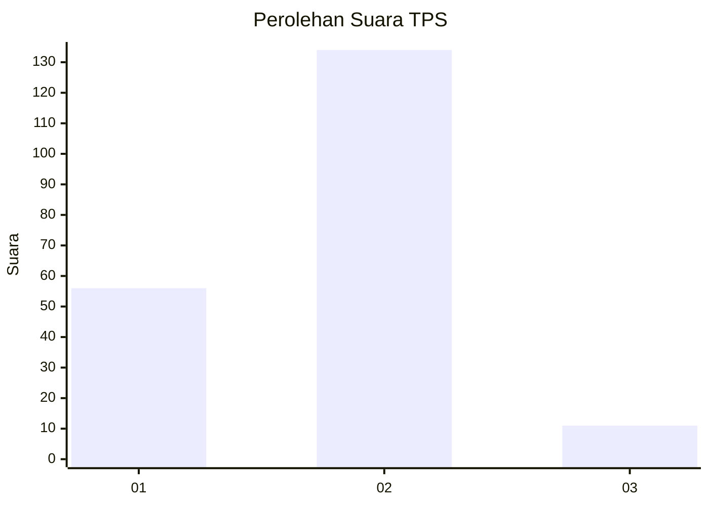
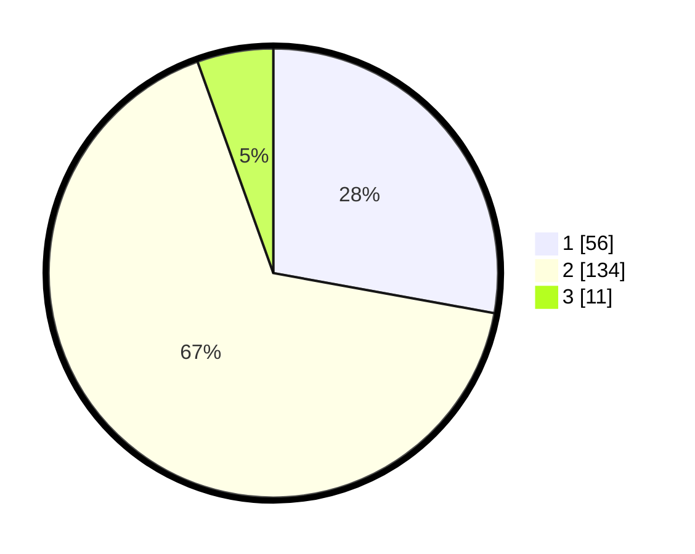

# Hasil

## Grafik

## Tabel

| No. | Nama Paslon    | Suara | Suara (raw) | Persentase |
|:--- |:-------------- | -----:| -----------:| ----------:|
| 1   | ANIES MUHAIMIN | 56    | [56][p-1]   | 27,86      |
| 2   | PRABOWO GIBRAN | 134   | [134][p-2]  | 66,67      |
| 3   | GANJAR MAHFUD  | 11    | [11][p-3]   | 5,47       |

[p-1]: https://github.com/gigit-pemilu/pemilu-2024/blob/main/pilpres/hitung-suara/sub/35-jawa-timur/sub/13-probolinggo/sub/22-wonomerto/sub/2011-kedungsupit/sub/003-tps/sub/paslon-1.txt
[p-2]: https://github.com/gigit-pemilu/pemilu-2024/blob/main/pilpres/hitung-suara/sub/35-jawa-timur/sub/13-probolinggo/sub/22-wonomerto/sub/2011-kedungsupit/sub/003-tps/sub/paslon-2.txt
[p-3]: https://github.com/gigit-pemilu/pemilu-2024/blob/main/pilpres/hitung-suara/sub/35-jawa-timur/sub/13-probolinggo/sub/22-wonomerto/sub/2011-kedungsupit/sub/003-tps/sub/paslon-3.txt

## Foto C Plano

https://sirekap-obj-formc.kpu.go.id/2c80/pemilu/ppwp/35/13/22/20/11/3513222011003-20240214-234736--9ab9b797-f121-47fe-a334-7b292632dc8b.jpg

https://sirekap-obj-formc.kpu.go.id/2c80/pemilu/ppwp/35/13/22/20/11/3513222011003-20240214-234835--e7d8f0df-0faf-43e7-8228-eab1d2502ac9.jpg

https://sirekap-obj-formc.kpu.go.id/2c80/pemilu/ppwp/35/13/22/20/11/3513222011003-20240214-234904--691bb990-765e-4702-a663-765708d978f0.jpg

## Metadata

| Key        | Value               |
| ---------- | ------------------- |
| Time Stamp | 2024-02-24 22:31:28 |

