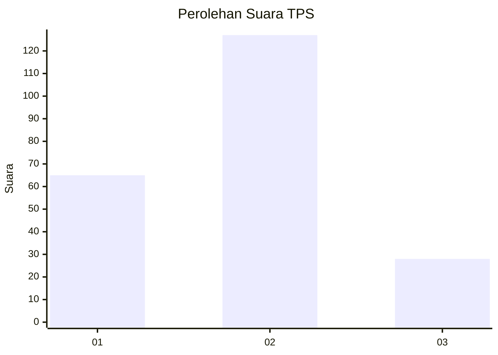
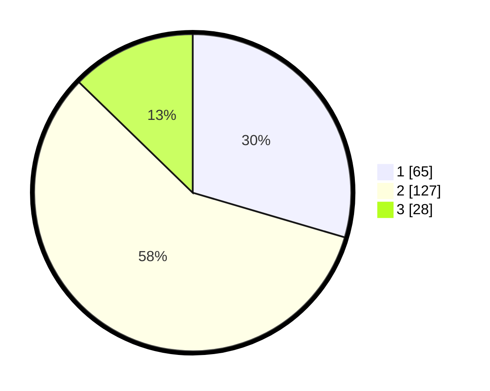

# Hasil

## Grafik

## Tabel

| No. | Nama Paslon    | Suara | Suara (raw) | Persentase |
|:--- |:-------------- | -----:| -----------:| ----------:|
| 1   | ANIES MUHAIMIN | 65    | [65][p-1]   | 29,55      |
| 2   | PRABOWO GIBRAN | 127   | [127][p-2]  | 57,73      |
| 3   | GANJAR MAHFUD  | 28    | [28][p-3]   | 12,73      |

[p-1]: https://github.com/gigit-pemilu/pemilu-2024-35-jawa-timur/blob/main/pilpres/hitung-suara/sub/35-jawa-timur/sub/13-probolinggo/sub/23-tongas/sub/2001-sumberrejo/sub/001-tps/sub/paslon-1.txt
[p-2]: https://github.com/gigit-pemilu/pemilu-2024-35-jawa-timur/blob/main/pilpres/hitung-suara/sub/35-jawa-timur/sub/13-probolinggo/sub/23-tongas/sub/2001-sumberrejo/sub/001-tps/sub/paslon-2.txt
[p-3]: https://github.com/gigit-pemilu/pemilu-2024-35-jawa-timur/blob/main/pilpres/hitung-suara/sub/35-jawa-timur/sub/13-probolinggo/sub/23-tongas/sub/2001-sumberrejo/sub/001-tps/sub/paslon-3.txt

## Foto C Plano

https://sirekap-obj-formc.kpu.go.id/6db8/pemilu/ppwp/35/13/23/20/01/3513232001001-20240221-224127--321d1009-0ded-4fcd-87fa-b1dd0010e5fe.jpg

https://sirekap-obj-formc.kpu.go.id/6db8/pemilu/ppwp/35/13/23/20/01/3513232001001-20240221-223921--d0e09baf-a55b-4517-9d76-a4ed6b544431.jpg

https://sirekap-obj-formc.kpu.go.id/6db8/pemilu/ppwp/35/13/23/20/01/3513232001001-20240221-224011--fee72718-2759-45a7-a8af-34fb8ee316ee.jpg

## Metadata

| Key        | Value               |
| ---------- | ------------------- |
| Time Stamp | 2024-02-25 18:00:00 |

